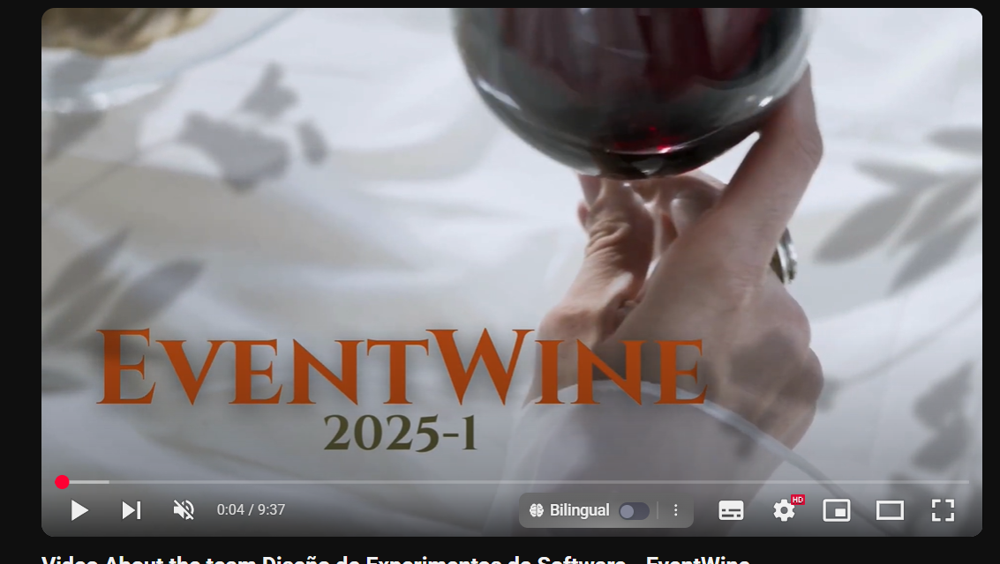

# Universidad Peruana De Ciencias Aplicadas
## 4441 Diseño de Experimentos de Ingeniería de Software - Ingeniería de Software

 </img> 

# "Informe de Trabajo Final"
## Julio Manuel Noriega Melendez
## Startup: EventWine
## Producto: EventWine

 

## Relación de integrantes:

* **Moises Rodolfo Donayre Peña   U202216021**
* **Deybbi Anderson Crisanto Calle       U202120569**
* **July Zelmira Paico Calderon     U20211D760**
* **Gustavo Esau Huanca Navarro     U202215285**

### 2025 - 01

---

 

## Registro de Versiones del Informe

| Versión | Fecha    | Autor                         | Descripción de Modificación                                                                 |
|---------|----------|-------------------------------|----------------------------------------------------------------------------------------------|
| 1.0     | 24/04/25 | Donayre Peña Moises Rodolfo   | Creación de la estructura inicial del documento e integración del contexto de arquitectura. |
| 1.1     | 25/04/25 | Paico Calderon July Zelmira   | Redacción del Capítulo I (Startup Profile y Solution Profile).                              |
| 1.2     | 25/04/25 | Huanca Navarro Gustavo Esau   | Análisis competitivo y benchmark con plataformas similares (Capítulo II).                   |
| 1.3     | 25/04/25 | Crisanto Calle Deybbi Anderson| Redacción y definición del Lean UX Canvas y Hypothesis Statements.                          |
| 1.4     | 25/04/25 | Paico Calderon July Zelmira   | Desarrollo de User Personas, Empathy Map y User Journey Mapping.                            |
| 1.5     | 25/04/25 | Huanca Navarro Gustavo Esau   | Diseño UX/UI y prototipado de la versión web (Landing Page y Frontend).                     |
| 1.6     | 25/04/25 | Donayre Peña Moises Rodolfo   | Implementación técnica de la arquitectura backend y contenedores Docker.                    |
| 1.7     | 25/04/25 | Crisanto Calle Deybbi Anderson| Desarrollo y validación de experimentos + análisis de resultados (Capítulo VIII).           |
| 1.8     | 25/04/25 | Paico Calderon July Zelmira   | Documentación del Shareback y de la auditoría de UX.                                        |
| 1.9     | 25/04/25 | Todo el equipo                | Revisión final del documento, conclusiones, recomendaciones y referencias bibliográficas.   |

## Project Report Collaboration Insights

**URL del repositorio para el reporte del proyecto:** https://github.com/EventWine/EventWine-upc-pre-202501-1asi0732-4441-EventWine-report

Github Collaboration Insights proporciona un cronograma que muestra las principales ramas y los procesos de fusión que han ocurrido. Todas las ramas se han generado siguiendo los principios de GitFlow, lo que garantiza una organización efectiva al utilizar un sistema de control de versiones.

* Moises Rodolfo Donayre Peña  (MoisesD19)
* Deybbi Anderson Crisanto Calle (Dacc03)
* July Zelmira Paico Calderon(u20211d760)
* Gustavo Esau Huanca Navarro (petitavo)

Se dividieron las siguientes ramas para la colaboración en el proyecto:

* main
* capitulo-I
* capitulo-II
* capitulo-III
* capitulo-IV
* capitulo-VI
* capitulo-VII
* capitulo-VIII
* develop

### Entregable TB1

A continuación se presentan los gráficos de colaboración de los integrantes del equipo en el repositorio de nuestro primer sprint. Estos gráficos ofrecen una representación visual de la cantidad de contribuciones realizadas por cada miembro del equipo, junto con la fecha en que se llevaron a cabo. Además, se presenta información sobre la cantidad de líneas de código que se han modificado en cada uno de los commits.

**Gráficos de colaboración de los integrantes del equipo**

## Contenido

# Capítulo I: Introducción

## 1.1. Startup Profile
### 1.1.1. Descripción de la Startup
### 1.1.2. Perfiles de integrantes del equipo
## 1.2. Solution Profile
### 1.2.1. Antecedentes y problemática
### 1.2.2. Lean UX Process
#### 1.2.2.1. Lean UX Problem Statements
#### 1.2.2.2. Lean UX Assumptions
#### 1.2.2.3. Lean UX Hypothesis Statements
#### 1.2.2.4. Lean UX Canvas
## 1.3. Segmentos objetivo

# Capítulo II: Requirements Elicitation & Analysis

## 2.1. Competidores
### 2.1.1. Análisis competitivo
### 2.1.2. Estrategias y tácticas frente a competidores
## 2.2. Entrevistas
### 2.2.1. Diseño de entrevistas
### 2.2.2. Registro de entrevistas
### 2.2.3. Análisis de entrevistas
## 2.3. Needfinding
### 2.3.1. User Personas
### 2.3.2. User Task Matrix
### 2.3.3. User Journey Mapping
### 2.3.4. Empathy Mapping
### 2.3.5. As-is Scenario Mapping
## 2.4. Ubiquitous Language

# Capítulo III: Requirements Specification

## 3.1. To-Be Scenario Mapping
## 3.2. User Stories
## 3.3. Product Backlog
## 3.4. Impact Mapping

# Capítulo IV: Product Design

## 4.1. Style Guidelines
### 4.1.1. General Style Guidelines
### 4.1.2. Web Style Guidelines
### 4.1.3. Mobile Style Guidelines
#### 4.1.3.1. iOS Mobile Style Guidelines
#### 4.1.3.2. Android Mobile Style Guidelines
## 4.2. Information Architecture
### 4.2.1. Organization Systems
### 4.2.2. Labeling Systems
### 4.2.3. SEO Tags and Meta Tags
### 4.2.4. Searching Systems
### 4.2.5. Navigation Systems
## 4.3. Landing Page UI Design
### 4.3.1. Landing Page Wireframe
### 4.3.2. Landing Page Mock-up
## 4.4. Mobile Applications UX/UI Design
### 4.4.1. Mobile Applications Wireframes
### 4.4.2. Mobile Applications Wireflow Diagrams
### 4.4.3. Mobile Applications Mock-ups
### 4.4.4. Mobile Applications User Flow Diagrams
## 4.5. Mobile Applications Prototyping
### 4.5.1. Android Mobile Applications Prototyping
### 4.5.2. iOS Mobile Applications Prototyping
## 4.6. Web Applications UX/UI Design
### 4.6.1. Web Applications Wireframes
### 4.6.2. Web Applications Wireflow Diagrams
### 4.6.3. Web Applications Mock-ups
### 4.6.4. Web Applications User Flow Diagrams
## 4.7. Web Applications Prototyping
## 4.8. Domain-Driven Software Architecture
### 4.8.1. Software Architecture Context Diagram
### 4.8.2. Software Architecture Container Diagrams
### 4.8.3. Software Architecture Components Diagrams
## 4.9. Software Object-Oriented Design
### 4.9.1. Class Diagrams
### 4.9.2. Class Dictionary
## 4.10. Database Design
### 4.10.1. Relational/Non-Relational Database Diagram

# Capítulo V: Product Implementation

## 5.1. Software Configuration Management
### 5.1.1. Software Development Environment Configuration
### 5.1.2. Source Code Management
### 5.1.3. Source Code Style Guide & Conventions
### 5.1.4. Software Deployment Configuration
## 5.2. Product Implementation & Deployment
### 5.2.1. Sprint Backlogs
### 5.2.2. Implemented Landing Page Evidence
### 5.2.3. Implemented Frontend-Web Application Evidence
### 5.2.4. Acuerdo de Servicio - SaaS
### 5.2.5. Implemented Native-Mobile Application Evidence
### 5.2.6. Implemented RESTful API and/or Serverless Backend Evidence
### 5.2.7. RESTful API documentation
### 5.2.8. Team Collaboration Insights
## 5.3. Video About-the-Product

# Capítulo VI: Product Verification & Validation

## 6.1. Testing Suites & Validation
### 6.1.1. Core Entities Unit Tests
### 6.1.2. Core Integration Tests
### 6.1.3. Core Behavior-Driven Development
### 6.1.4. Core System Tests
## 6.2. Static testing & Verification
### 6.2.1. Static Code Analysis
#### 6.2.1.1. Coding standard & Code conventions
#### 6.2.1.2. Code Quality & Code Security
### 6.2.2. Reviews
## 6.3. Validation Interviews
### 6.3.1. Diseño de Entrevistas
### 6.3.2. Registro de Entrevistas
### 6.3.3. Evaluaciones según heurísticas
## 6.4. Auditoría de Experiencias de Usuario
### 6.4.1. Auditoría realizada
#### 6.4.1.1. Información del grupo auditado
#### 6.4.1.2. Cronograma de auditoría realizada
#### 6.4.1.3. Contenido de auditoría realizada
### 6.4.2. Auditoría recibida
#### 6.4.2.1. Información del grupo auditor
#### 6.4.2.2. Cronograma de auditoría recibida
#### 6.4.2.3. Contenido de auditoría recibida
#### 6.4.2.4. Resumen de modificaciones para subsanar hallazgos

# Capítulo VII: DevOps Practices

## 7.1. Continuous Integration
### 7.1.1. Tools and Practices
### 7.1.2. Build & Test Suite Pipeline Components
## 7.2. Continuous Delivery
### 7.2.1. Tools and Practices
### 7.2.2. Stages Deployment Pipeline Components
## 7.3. Continuous Deployment
### 7.3.1. Tools and Practices
### 7.3.2. Production Deployment Pipeline Components
## 7.4. Continuous Monitoring
### 7.4.1. Tools and Practices
### 7.4.2. Monitoring Pipeline Components
### 7.4.3. Alerting Pipeline Components
### 7.4.4. Notification Pipeline Components

# Capítulo VIII: Experiment-Driven Development

## 8.1. Experiment Planning
### 8.1.1. As-Is Summary
### 8.1.2. Raw Material: Assumptions, Knowledge Gaps, Ideas, Claims
### 8.1.3. Experiment-Ready Questions
### 8.1.4. Question Backlog
### 8.1.5. Experiment Cards
## 8.2. Experiment Design
### 8.2.1. Hypotheses
### 8.2.2. Measures
### 8.2.3. Conditions
### 8.2.4. Scale Calculations and Decisions
### 8.2.5. Methods Selection
### 8.2.6. Data Analytics: Goals, KPIs and Metrics Selection
### 8.2.7. Web and Mobile Tracking Plan
## 8.3. Experimentation
### 8.3.1. To-Be User Stories
### 8.3.2. To-Be Product Backlog
### 8.3.3. Pipeline-supported, Experiment-Driven To-Be Software Platform Lifecycle
#### 8.3.3.1. To-Be Sprint Backlogs
#### 8.3.3.2. Implemented To-Be Landing Page Evidence
#### 8.3.3.3. Implemented To-Be Frontend-Web Application Evidence
#### 8.3.3.4. Implemented To-Be Native-Mobile Application Evidence
#### 8.3.3.5. Implemented To-Be RESTful API and/or Serverless Backend Evidence
#### 8.3.3.6. Team Collaboration Insights
### 8.3.4. To-Be Validation Interviews
#### 8.3.4.1. Diseño de Entrevistas
#### 8.3.4.2. Registro de Entrevistas
## 8.4. Experiment Aftermath & Analysis
### 8.4.1. Analysis and Interpretation of Results
### 8.4.2. Re-scored and Re-prioritized Question Backlog
## 8.5. Continuous Learning
### 8.5.1. Shareback Session Artifacts: Learning Workflow
## 8.6. To-Be Software Platform Pre-launch
### 8.6.1. About-the-Product Intro Video

# Conclusiones y recomendaciones
## Conclusiones
A lo largo del desarrollo del laboratorio se logró comprender a fondo la importancia de aplicar el enfoque Experiment-Driven Product Development (EDPD) en el proceso de mejora de una plataforma tecnológica. Este enfoque permitió identificar hipótesis clave sobre el comportamiento de los usuarios y validar de forma estructurada las decisiones de diseño e implementación de nuevas funcionalidades.

Asimismo, se evidenció la necesidad de formular experimentos medibles, con métricas claras y objetivos bien definidos, lo cual facilitó la evaluación de los cambios propuestos y su impacto real en los usuarios. La integración de herramientas como Figma para el prototipado y la documentación rigurosa mediante tarjetas de hipótesis fortaleció la toma de decisiones centrada en evidencia.

En el plano técnico, la práctica de contenerización a través de Docker permitió adquirir competencias fundamentales para el despliegue eficiente y replicable de aplicaciones en ambientes controlados. Esta experiencia aportó valor tanto en el aspecto práctico del desarrollo como en la preparación para entornos productivos reales.

En resumen, la aplicación conjunta de técnicas de experimentación orientadas al usuario y herramientas de infraestructura modernas refuerza la necesidad de un enfoque integral para el diseño y validación de productos digitales, poniendo al usuario en el centro sin descuidar la escalabilidad y calidad técnica del software.

## Recomendaciones
1. Continuar aplicando el enfoque EDPD de manera iterativa: Se recomienda seguir utilizando el ciclo de experimentación para futuras mejoras de la plataforma, validando cada cambio con métricas específicas y feedback real de los usuarios.

2. Ampliar la base de usuarios para la validación: Las entrevistas y experimentos deben incluir una muestra más diversa de usuarios para obtener insights más representativos y asegurar que la plataforma cubre distintos perfiles y contextos de uso.

3. Incorporar herramientas de analítica continua: Es recomendable integrar soluciones de monitoreo y analítica de comportamiento (como Hotjar, Google Analytics, entre otros) para complementar la experimentación con datos reales de uso en producción.

4. Mejorar los procesos de documentación de experimentos: Documentar de forma más estandarizada las hipótesis, resultados y aprendizajes facilitará el traspaso de conocimiento y permitirá mantener la trazabilidad de las decisiones tomadas.

5. Explorar automatización en el despliegue y validación: Invertir en pipelines de CI/CD más robustos y en pruebas automatizadas contribuirá a reducir errores humanos y mejorar la calidad de los entregables de software.

7. Fomentar la formación del equipo en metodologías centradas en el usuario: Se recomienda que los miembros del equipo continúen capacitándose en UX Research, métricas de producto y metodologías ágiles para fortalecer el enfoque centrado en el usuario y la entrega de valor continuo.

# Video About-the-Team
https://youtu.be/M4WplmHk2gQ 

# Bibliografía
- Gothelf, J. (2022). *Lean UX: Designing Great Products with Agile Teams* (3ra ed.). O'Reilly Media.

- Ries, E. (2011). *The Lean Startup: How Today’s Entrepreneurs Use Continuous Innovation to Create Radically Successful Businesses*. Crown Business.

- Krug, S. (2014). *Don't Make Me Think, Revisited: A Common Sense Approach to Web Usability* (3ra ed.). New Riders.

- Nielsen, J., & Molich, R. (1990). Heuristic Evaluation of User Interfaces. En *Proceedings of the SIGCHI Conference on Human Factors in Computing Systems* (pp. 249–256). ACM. https://doi.org/10.1145/97243.97281

- Docker, Inc. (2024). *Docker Documentation*. Recuperado de https://docs.docker.com/

- ISO/IEC/IEEE 29148:2018. (2018). *Systems and software engineering — Life cycle processes — Requirements engineering*. International Organization for Standardization.

- Pressman, R. S., & Maxim, B. R. (2020). *Software Engineering: A Practitioner’s Approach* (9na ed.). McGraw-Hill Education.

# Anexos
## Anexo A. Products Deployed.

Eventify Landing Page: https://eventwine.github.io/EventWine-Landing-Page/

## Anexo B. Web Tools.

Figma Landing Page: [Landing Page - EventWine](https://shorturl.at/Lx5IR)

Web Application Prototyping: https://shorturl.at/Lx5IR

Web Application Wireframes and Mockups: https://shorturl.at/Lx5IR

## Anexo C. Github Repositories.

Organization EventWine Url: https://github.com/AngelDevs-Open

| Repositories             | Repository Url                                                                          |
|--------------------------|-----------------------------------------------------------------------------------------|
| EventWine Project Report | https://github.com/EventWine/EventWine-upc-pre-202501-1asi0732-4441-EventWine-report.git |
| EventWine Landing page   | https://github.com/EventWine/EventWine-Landing-Page.git                                 |
| EventWine Frontend       | https://github.com/EventWine/EventWine-FrontEnd.git                                     |
| EventWine Backend          | https://github.com/EventWine/EventWine-Platform-.NET.git                                |

## Student Outcome

| Criterio Específico                                                                                                                                    | Acciones Realizadas                                                                                                                                                                                                                                                                                                                                                                                                                 | Conclusiones         |
|--------------------------------------------------------------------------------------------------------------------------------------------------------|-------------------------------------------------------------------------------------------------------------------------------------------------------------------------------------------------------------------------------------------------------------------------------------------------------------------------------------------------------------------------------------------------------------------------------------|----------------------|
| Reconoce responsabilidad ética y profesional en situaciones de ingeniería de software                                                                  | **Moises Rodolfo Donayre Peña**    **Presentable del TB1:** En el desarrollo de EventWine, comprendí que mi responsabilidad ética implicaba asegurar que los datos de los productores se gestionaran de forma segura, sin exponer información sensible. Trabajé siguiendo buenas prácticas de desarrollo seguro para proteger la confianza que los usuarios depositarán en nuestra plataforma.    **Presentable del TF:** Implementé la app móvil (8.3.3.4) y el backend (8.3.3.5), aplicando principios de desarrollo seguro y modular para garantizar privacidad y robustez del sistema.    **Deybbi Anderson Crisanto Calle**    **Presentable del TB1:** Durante la creación de EventWine, reconocí que la ética profesional requería que el software fuera transparente en su funcionamiento, especialmente en el manejo de inventarios e informes. Me esforcé por diseñar funcionalidades que ofrecieran información veraz y precisa.   **Presentable del TF:** Me enfoqué en la Landing Page (8.3.3.2) y el video final (8.6.1), asegurando una presentación ética y clara de la información hacia los usuarios.    **July Zelmira Paico Calderon**    **Presentable del TB1:** En este proyecto, identifiqué la importancia de actuar responsablemente al integrar soluciones tecnológicas. Entendí que cada componente de EventWine debía respetar la integridad y el respeto por el usuario.   **Presentable del TF:** Coordiné el Sprint Backlog (8.3.3.1), los insights colaborativos (8.3.3.6) y el Shareback (8.5.1), fomentando una cultura ética basada en colaboración y aprendizaje continuo.    **Gustavo Esau Huanca Navarro**    **Presentable del TB1:** Trabajar en EventWine me llevó a asumir una postura ética frente al desarrollo, garantizando que el software no explotara las operaciones del productor.   **Presentable del TF:** Desarrollé el frontend web (8.3.3.3) y diseñé entrevistas (8.3.4.1) centradas en claridad comunicacional y toma de decisiones informada. | Comprendimos que actuar con ética profesional en ingeniería de software significa cuidar los datos de los usuarios, ser transparentes, fomentar la equidad y siempre priorizar el respeto y bienestar de quienes utilizan nuestras soluciones. |
| Emite juicios informados considerando el impacto de las soluciones de ingeniería de software en contextos globales, económicos, ambientales y sociales | **Moises Rodolfo Donayre Peña**    **Presentable del TB1:** Consideré que nuestra solución debía ser económicamente accesible para pequeños productores. Analicé modelos de monetización que no generaran carga financiera excesiva.   **Presentable del TF:** Implementé componentes técnicos (8.3.3.4 y 8.3.3.5) con visión modular, pensados para escalar sin excluir a comunidades con menor infraestructura digital.    **Deybbi Anderson Crisanto Calle**    **Presentable del TB1:** Evalué el impacto ambiental del software en cuanto al consumo de recursos tecnológicos, proponiendo eficiencia y bajo consumo.   **Presentable del TF:** En la Landing Page (8.3.3.2) y el video (8.6.1), enfoqué los mensajes en accesibilidad e inclusión, promoviendo claridad para distintos perfiles de usuarios.    **July Zelmira Paico Calderon**    **Presentable del TB1:** Reflexioné sobre el contexto global de la vitivinicultura y propuse que el software fuera modular y adaptable.   **Presentable del TF:** Diseñé el Sprint Backlog (8.3.3.1) desde una perspectiva adaptable a distintas realidades socioeconómicas, integrando buenas prácticas sostenibles en gestión de equipo (8.3.3.6).    **Gustavo Esau Huanca Navarro**    **Presentable del TB1:** Consideré el impacto social del software en comunidades rurales y propuse interfaces fáciles de usar.   **Presentable del TF:** El diseño del frontend (8.3.3.3) y las entrevistas (8.3.4.1) estuvieron centrados en mejorar la accesibilidad digital de usuarios con baja experiencia tecnológica. | Reconocimos que emitir juicios informados en ingeniería de software implica analizar los efectos económicos, ambientales, sociales y globales, promoviendo soluciones inclusivas, sostenibles y adaptables para distintos contextos. |

