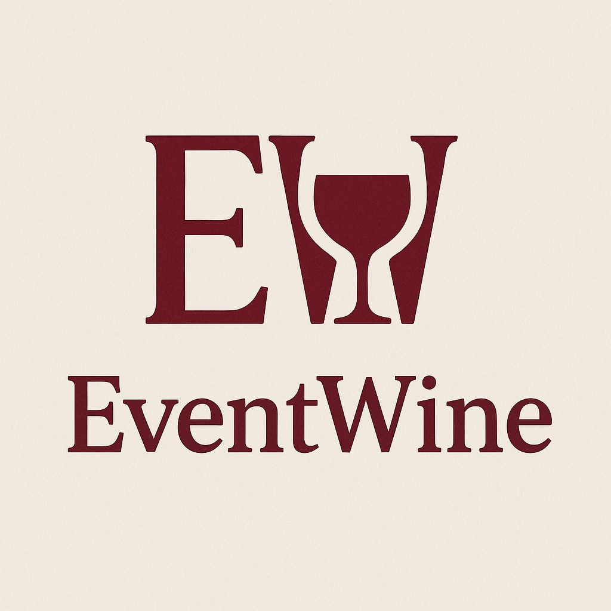
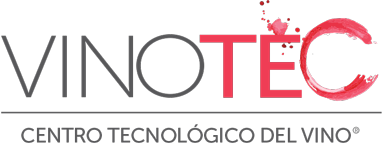
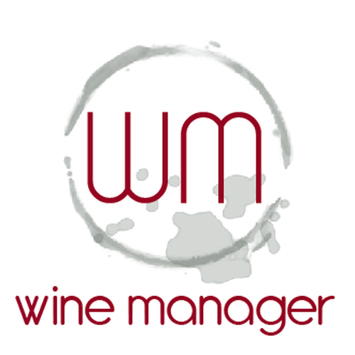
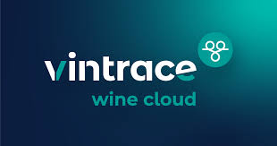
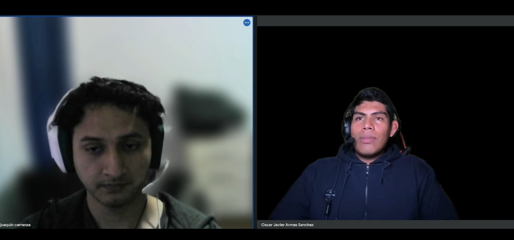
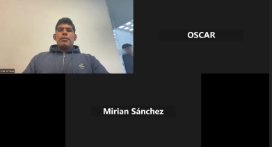
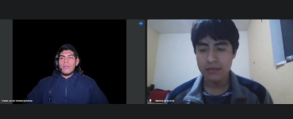
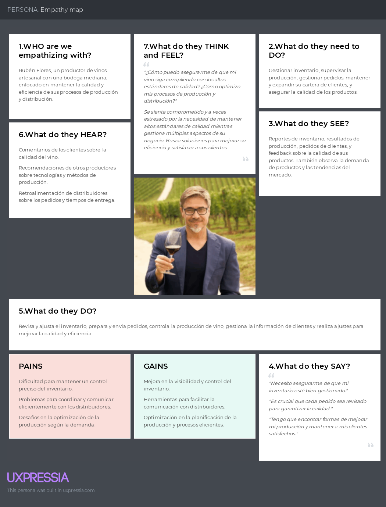
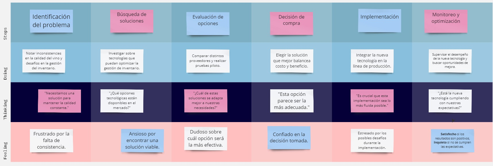

# Capítulo II: Requirements Elicitation & Analysis

## 2.1. Competidores

En este punto el equipo realizó investigaciones sobre los potenciales competidores en el mercado de soluciones tecnológicas para la producción vinícola. El análisis se centra en plataformas que ofrecen herramientas para la gestión integral del proceso productivo (desde la recepción de lotes hasta el embotellado), enfocándose exclusivamente en las necesidades del vinicultor.

### 2.1.1. Análisis competitivo

Se realizó un análisis competitivo de las 3 principales plataformas identificadas para, posteriormente, plantear estrategias que permitan obtener una ventaja competitiva. La siguiente tabla muestra el **Competitive Analysis Landscape**, en donde se describen el perfil, ventajas y limitaciones de cada competidor.

<table>  
    <thead>
        <tr>
            <th colspan="6">Competitive Analysis Landscape</th>
        </tr>
        <tr>
            <th colspan="2">Competitive Analysis Landscape</th>
            <td colspan="4" style="text-align: justify">
                Se realiza con el objetivo de reconocer y comprender mejor las fortalezas, debilidades y estrategias de los principales competidores enfocados en la producción vinícola, identificando oportunidades y amenazas para desarrollar estrategias que permitan obtener una ventaja competitiva.
            </td>
        </tr>
    </thead>
    <tbody style="text-align: center">
        <tr>
            <th colspan="2"></th>
            <th>  </th>
            <th></th>
            <th></th>
            <th></th>
        </tr>
        <!-- PERFIL -->
        <tr>
            <th rowspan="2"> <strong> Perfil </strong> </th>
            <td>Overview</td>
            <td>
                ElixirControl es una solución integral diseñada para la gestión del proceso productivo de vinos. Ofrece herramientas avanzadas para la administración de la producción, optimizando recursos y facilitando la toma de decisiones, dirigido especialmente a vinicultores que desean digitalizar y centralizar sus procesos.
            </td>
            <td>
                Vinotec es un software que optimiza la producción vinícola y la gestión de ventas, enfocado en mejorar el seguimiento del proceso productivo mediante informes y análisis, aunque con menor profundidad en etapas específicas.
            </td>
            <td>
                WineManager ofrece soluciones integradas para la industria vitivinícola y análisis de ventas. Su fortaleza reside en la integración de datos, aunque puede resultar complejo para pequeños productores.
            </td>
            <td>
                VinTrace se especializa en la trazabilidad y el control de calidad en la producción vinícola, proporcionando herramientas para la planificación agrícola y la documentación detallada, con un enfoque específico en el cumplimiento normativo.
            </td>
        </tr>
        <tr>
            <td>Ventaja competitiva ¿Qué valor ofrece a los clientes?</td>
            <td>
                Ofrece una solución integral que abarca todas las etapas de la producción, permitiendo un control exhaustivo del proceso productivo.
            </td>
            <td>
                Se centra en la optimización del proceso productivo con herramientas analíticas, aunque carece de módulos muy especializados para el seguimiento detallado de cada fase.
            </td>
            <td>
                Su integración de datos facilita el análisis estratégico, proporcionando informes completos, pero su complejidad puede ser una barrera para el productor artesanal.
            </td>
            <td>
                Su especialización en trazabilidad y control de calidad es ideal para productores que priorizan estos aspectos, aunque su oferta limitada en gestión operativa integral puede restringir otras funcionalidades.
            </td>
        </tr>
        <!-- PERFIL DE MARKETING -->
        <tr>
            <th rowspan="2"> <strong> Perfil de Marketing </strong> </th>
            <td>Mercado objetivo</td>
            <td colspan="4">
                Vinicultores artesanales y productores de vino que buscan optimizar cada etapa del proceso de producción a través de soluciones digitales integrales.
            </td>
        </tr>
        <tr>
            <td>Estrategias de Marketing</td>
            <td colspan="4">
                Se posiciona como una solución integral, enfatizando su adaptabilidad y facilidad de uso para productores. Se promoverá mediante marketing de contenido, demostraciones prácticas y alianzas estratégicas con instituciones del sector vitivinícola.
            </td>
        </tr>
        <!-- PERFIL DEL PRODUCTO -->
        <tr>
            <th rowspan="3"> <strong> Perfil del producto </strong> </th>
            <td>Producto & Servicios</td>
            <td>
                Incluye gestión de clientes y herramientas para la vinificación y gestión integral del viñedo, abarcando desde la recepción de lotes, fermentación, clarificación, prensado, añejamiento y embotellado.
            </td>
            <td>
                Ofrece herramientas para la gestión de la producción con énfasis en ventas, pero con menor cobertura en el detalle de procesos críticos de vinificación.
            </td>
            <td>
                Proporciona soluciones integradas con fuerte capacidad analítica, aunque su interfaz puede resultar compleja para productores con operaciones más tradicionales.
            </td>
            <td>
                Se especializa en la trazabilidad y control de calidad, ideal para vinicultores que buscan asegurar altos estándares en la producción, pero con un enfoque limitado en la gestión operativa completa.
            </td>
        </tr>
        <tr>
            <td>Precio y Costos</td>
            <td>
                Ofrece tres planes de pago (Básico, Intermedio, Avanzado) ajustados a las necesidades de productores de vino, permitiendo flexibilidad según el tamaño de la operación.
            </td>
            <td>
                Modelo de suscripción con precios variables según las funcionalidades requeridas, ideal para productores en crecimiento.
            </td>
            <td>
                Precios basados en la cantidad de usuarios y funcionalidades, con énfasis en la personalización, aunque puede representar una barrera para microproductores.
            </td>
            <td>
                Modelo de suscripción con precios fijos, orientado a productores que requieren funciones específicas de trazabilidad y control de calidad.
            </td>
        </tr>
        <tr>
            <td>Canales de distribución (Web y/o móvil)</td>
            <td>
                Disponible en web y dispositivos móviles, facilitando el acceso en campo.
            </td>
            <td>
                Principalmente en web, con algunas funcionalidades móviles, ideales para operaciones centralizadas.
            </td>
            <td>
                Plataforma web robusta, aunque con menor optimización para dispositivos móviles.
            </td>
            <td>
                Enfocado en web, con diseño amigable y experiencia de usuario simplificada para productores.
            </td> 
        </tr>
        <!-- ANÁLISIS SWOT -->
        <tr>
            <th rowspan="4"> <strong> Análisis SWOT </strong> </th>
            <td>Fortalezas</td>
            <td>
                Solución integral y adaptativa, interfaz amigable y enfoque en la eficiencia operativa en cada etapa de la vinificación.
            </td>
            <td>
                Optimización integral del proceso productivo y capacidad analítica, facilitando la toma de decisiones estratégicas.
            </td>
            <td>
                Integración robusta de datos que respalda el control y seguimiento de cada fase del proceso.
            </td>
            <td>
                Especialización en trazabilidad y control de calidad, elementos cruciales para los productores.
            </td>
        </tr>
        <tr>
            <td>Debilidades</td>
            <td>
                Dependencia en la tecnología, lo que puede generar resistencia en productores tradicionales.
            </td>
            <td>
                Falta de módulos muy especializados en ciertas etapas de producción, limitando la aplicabilidad para algunos productores.
            </td>
            <td>
                Interfaz compleja para usuarios no técnicos, dificultando el aprovechamiento total de sus funcionalidades.
            </td>
            <td>
                Enfoque muy acotado en la trazabilidad, dejando de lado otros aspectos operativos integrales.
            </td>
        </tr>
        <tr>
            <td>Oportunidades</td>
            <td colspan="4">
                - Creciente demanda de digitalización en la producción vinícola. 
                - Potencial expansión a mercados internacionales. 
                - Innovaciones tecnológicas que permitan actualizar continuamente la herramienta. 
                - Alianzas estratégicas con instituciones y bodegas para capacitaciones.
            </td>
        </tr>
        <tr>
            <td>Amenazas</td>
            <td colspan="4">
                - Aparición de nuevas plataformas con tecnologías de vanguardia. 
                - Cambios regulatorios en la industria vitivinícola. 
                - Riesgos de seguridad cibernética y vulnerabilidad de datos. 
                - Competencia en precios y facilidad de integración con otros sistemas.
            </td>
        </tr>
    </tbody>
</table>

### 2.1.2. Estrategias y tácticas frente a competidores

Luego de analizar la situación competitiva, se definieron estrategias y tácticas para sobresalir en el mercado:

<table>
    <thead>
        <tr>
            <th colspan="3">Matriz CAME para el desarrollo de estrategias en base al análisis FODA</th>
        </tr>
    </thead>
    <tbody>
        <tr>
            <th rowspan="2">Análisis FODA cruzado</th>
            <th>Oportunidades</th>
            <th>Amenazas</th>
        </tr>
        <tr>
            <td>
                1. Mayor demanda de digitalización en la producción vinícola. 
                2. Posibilidad de expandirse a nuevos mercados internacionales. 
                3. Mejora continua de la tecnología y experiencia del usuario. 
                4. Alianzas estratégicas con bodegas e instituciones educativas.
            </td>
            <td>
                1. Aparición de nuevas plataformas tecnológicas con funciones avanzadas. 
                2. Cambios normativos en la industria. 
                3. Riesgos de seguridad cibernética. 
                4. Competencia en precios y dificultades en la integración con otros sistemas.
            </td>
        </tr>
        <tr>
            <th>Fortalezas</th>
            <th>Estrategia (FO) - Enfocar y Expandir</th>
            <th>Estrategia (FA) - Proteger y Adaptar</th>
        </tr>
        <tr>
            <td>
                1. Interfaz amigable y solución integral. 
                2. Control en tiempo real de cada etapa del proceso. 
                3. Integración robusta de datos para análisis.
            </td>
            <td>
                1. Aprovechar la creciente demanda mediante campañas de marketing digital. 
                2. Expandir la oferta en mercados internacionales. 
                3. Invertir en I+D para mejorar la experiencia del usuario.
            </td>
            <td>
                1. Implementar medidas avanzadas de seguridad. 
                2. Establecer alianzas estratégicas que respalden la integración de sistemas. 
                3. Ajustar precios competitivos sin sacrificar calidad.
            </td>
        </tr>
        <tr>
            <th>Debilidades</th>
            <th>Estrategia (DO) - Reorientar</th>
            <th>Estrategia (DA) - Supervivencia</th>
        </tr>
        <tr>
            <td>
                1. Dependencia en métodos tradicionales. 
                2. Resistencia al cambio en productores conservadores.
            </td>
            <td>
                1. Desarrollar programas de capacitación y casos de éxito para ganar confianza. 
                2. Adaptar la solución para ser intuitiva para productores con menos experiencia digital.
            </td>
            <td>
                1. Mantener comunicación constante con clientes para ajustar el servicio. 
                2. Crear planes de contingencia y soporte continuo.
            </td>
        </tr>
    </tbody>
</table>

## 2.2. Entrevistas

El equipo realizó entrevistas dirigidas exclusivamente a productores de vinos para conocer a fondo sus necesidades, desafíos y la forma en que gestionan actualmente sus procesos productivos.

### 2.2.1. Diseño de entrevistas (Productores de Vinos)

**1. Introducción (30 segundos)**
- Saludo y presentación.
- Breve introducción personal y del propósito de la entrevista.
- Garantizar confidencialidad y explicar el tiempo estimado.

**2. Aspectos Demográficos (1 minuto)**  
_Datos Básicos_
- ¿Cuál es tu nombre y el nombre de tu viñedo?
- ¿Cuál es tu rol específico en la producción?

_Ubicación_
- ¿Dónde está ubicado tu viñedo o área de producción?

_Experiencia_
- ¿Cuánto tiempo llevas en la industria de la producción de vinos?

**3. Información General sobre el Negocio (1 minuto)**  
_Tipo de Producto_
- ¿Qué tipo de vinos produces?

_Proceso de Producción_
- ¿Cuál es la etapa del proceso que consideras más desafiante?

**4. Desafíos y Necesidades (1 minuto)**  
_Desafíos_
- ¿Cuál es el mayor desafío que enfrentas en la producción?

_Necesidades_
- ¿Qué tipo de apoyo o recursos te ayudarían a superar estos desafíos?

**5. Uso de Tecnología (1 minuto)**  
_Tecnología Actual_
- ¿Qué herramientas o tecnologías utilizas actualmente en tu producción?

_Interés en Nuevas Herramientas_
- ¿Estarías interesado en una solución digital que te permita gestionar integralmente tu proceso de vinificación? ¿Qué características valoras más?

**6. Cierre (30 segundos)**
- Agradecer al entrevistado por su tiempo.
- Preguntar si estaría dispuesto a participar en futuras investigaciones o pruebas de producto.

### 2.2.2. Registro de entrevistas (Productores de Vinos)

#### Segmento objetivo 1: Productores de Vinos Artesanales

<table>
    <thead>
        <tr>
            <th>Entrevistado 1</th>
            <th>Joaquín Enrique Carranza Tesén</th>
        </tr>
        <tr>
            <th>Entrevistador</th>
            <th>Oscar Javier Armas Sánchez</th>
        </tr>
    </thead>
    <tbody>
        <tr>
            <td>Edad</td>
            <td>25 años</td>
        </tr>
        <tr>
            <td>Distrito</td>
            <td>Chorrillos</td>
        </tr>
        <tr>
            <td>
                
            </td>
            <td>
                <strong>Resumen:</strong> 
                El entrevistado, asistente de bodega en Lunahuaná, utiliza Excel y cuadernos para registrar datos de inventario. Mostró interés en una solución que permita almacenar y controlar dichos datos de forma automatizada.
            </td>
        </tr>
        <tr>
            <td>Tiempo que empieza</td>
            <td>0:00 minutos</td>
        </tr>
        <tr>
            <td>Tiempo de la entrevista</td>
            <td>5:30 minutos</td>
        </tr>
        <tr>
            <td>URL de la entrevista</td>
            <td>https://upcedupe-my.sharepoint.com/:v:/g/personal/u201923571_upc_edu_pe/Ee84qx8cO_RLuiQAY5NyaSEBlDSvwnXt1bqG67H7Ie0IlA?...</td>
        </tr>
    </tbody>
</table>

<table>
    <thead>
        <tr>
            <th>Entrevistado 2</th>
            <th>Mirian Sánchez</th>
        </tr>
        <tr>
            <th>Entrevistador</th>
            <th>Oscar Javier Armas Sánchez</th>
        </tr>
    </thead>
    <tbody>
        <tr>
            <td>Edad</td>
            <td>58 años</td>
        </tr>
        <tr>
            <td>Distrito</td>
            <td>Pacarán</td>
        </tr>
        <tr>
            <td>
                
            </td>
            <td>
                <strong>Resumen:</strong> 
                La entrevistada, dueña de un viñedo con más de 50 años de tradición familiar, gestiona manualmente sus cuentas y registros utilizando Excel y cuadernos, y manifestó interés en la digitalización de sus procesos.
            </td>
        </tr>
        <tr>
            <td>Tiempo que empieza</td>
            <td>0:05 minutos</td>
        </tr>
        <tr>
            <td>Tiempo de la entrevista</td>
            <td>8:13 minutos</td>
        </tr>
        <tr>
            <td>URL de la entrevista</td>
            <td>https://upcedupe-my.sharepoint.com/:v:/g/personal/u201923571_upc_edu_pe/EUJRH1TnmRZIq13cyEp07RsB6ixOH6U_eU9az7MytczEXw?...</td>
        </tr>
    </tbody>
</table>

<table>
    <thead>
        <tr>
            <th>Entrevistado 3</th>
            <th>Fabricio Candela</th>
        </tr>
        <tr>
            <th>Entrevistador</th>
            <th>Oscar Javier Armas Sánchez</th>
        </tr>
    </thead>
    <tbody>
        <tr>
            <td>Edad</td>
            <td>26 años</td>
        </tr>
        <tr>
            <td>Distrito</td>
            <td>San Juan de Miraflores</td>
        </tr>
        <tr>
            <td>
                
            </td>
            <td>
                <strong>Resumen:</strong> 
                Trabaja como asistente en una bodega en Lunahuaná, registrando el inventario mediante Excel y cuadernos. Está interesado en una solución que integre y automatice el control de datos en el proceso productivo.
            </td>
        </tr>
        <tr>
            <td>Tiempo que empieza</td>
            <td>0:04 minutos</td>
        </tr>
        <tr>
            <td>Tiempo de la entrevista</td>
            <td>4:21 minutos</td>
        </tr>
        <tr>
            <td>URL de la entrevista</td>
            <td>https://upcedupe-my.sharepoint.com/:v:/g/personal/u201923571_upc_edu_pe/EfZVpAdvdvxGjOuLCSm8PuIBtXUHGDLTcAcdAZowxFqyJA?...</td>
        </tr>
    </tbody>
</table>

### 2.2.3. Análisis de entrevistas

#### Análisis del segmento: Productores de Vinos Artesanales

A partir de las entrevistas realizadas a productores de vinos artesanales, se identificó un uso predominante de herramientas básicas como Excel y registros manuales en cuadernos para la gestión de inventarios y control de procesos productivos. Todos los entrevistados demostraron receptividad hacia la adopción de una solución digital que permita centralizar, automatizar y optimizar sus operaciones, destacando como necesidades principales la facilidad de uso, la visibilidad en tiempo real y la reducción de errores asociados a métodos tradicionales. Además, dos de los tres entrevistados manifestaron explícito interés en adoptar nuevas herramientas tecnológicas, evidenciando una oportunidad clara para introducir soluciones digitales adaptadas a sus contextos productivos y culturales.

## 2.3. Needfinding

La identificación profunda de las necesidades del vinicultor es crucial para el éxito de ElixirLine. A través de observaciones y entrevistas, se han identificado los siguientes puntos críticos:

- **Necesidad de Centralización:** Los productores requieren un sistema único que integre el seguimiento de cada etapa del proceso productivo.
- **Automatización y Visibilidad:** Existe demanda de automatización en la gestión de datos y la obtención de reportes en tiempo real para mejorar la toma de decisiones.
- **Facilidad de Uso:** Se valora una interfaz intuitiva que permita a los productores utilizar la herramienta sin la necesidad de conocimientos técnicos avanzados.

### 2.3.1. User Persona

**Rubén Flores** es el vinicultor artesanal que necesita optimizar la producción sin perder la esencia de su tradición. Su objetivo es mejorar la eficiencia operacional y tener control en tiempo real de cada etapa del proceso, sin depender de métodos manuales dispersos.

.png)

### 2.3.2. User Task Matrix

| Tarea                                  | Frecuencia | Importancia |
|----------------------------------------|------------|-------------|
| Control de calidad de uvas             | Alta       | Alta        |
| Supervisión de fermentación            | Alta       | Alta        |
| Documentación de clarificación         | Media      | Alta        |
| Control del proceso de prensado         | Media      | Alta        |
| Monitoreo del añejamiento              | Alta       | Alta        |
| Gestión del embotellado                 | Alta       | Alta        |

### 2.3.3. User Journey Mapping

Desde la recepción de los lotes de uva hasta el embotellado, Rubén requiere una herramienta que le permita:
- Planificar y ejecutar cada etapa del proceso productivo.
- Recibir alertas en tiempo real sobre posibles incidencias.
- Generar reportes personalizados que faciliten la toma de decisiones.

### 2.3.4. Empathy Mapping

- **Piensa y Siente:** Preocupación por mantener la calidad del vino y la eficiencia en la producción.
- **Escucha:** Consejos de otros productores sobre la digitalización, buscando simplificar procesos.
- **Dice y Hace:** Actualmente utiliza Excel y cuadernos, pero está abierto a herramientas digitales que centralicen la gestión.
- **Ve:** Procesos manuales que generan errores y una limitada integración de la información.

### 2.3.5. As-is Scenario Mapping

Actualmente, Rubén utiliza métodos tradicionales (Excel y cuadernos) de forma fragmentada, lo que ocasiona duplicación de esfuerzos, errores en el registro de datos y una visibilidad limitada del proceso completo.

## 2.4. Ubiquitous Language

El uso de un lenguaje común es fundamental para asegurar la coherencia en el desarrollo y la comunicación del sistema. A continuación, se definen algunos términos clave:

| Término           | Definición                                                                 |
|-------------------|---------------------------------------------------------------------------|
| **Gestión**       | Registro y control de insumos, materias primas y productos terminados.    |
| **Control de Calidad del Vino** | Verificación de parámetros para asegurar que el vino cumpla con estándares óptimos en cada etapa. |
| **Fermentación**  | Etapa en la que se transforman los azúcares en alcohol; requiere monitoreo constante. |
| **Clarificación** | Proceso de filtrado y estabilización para eliminar impurezas del vino.    |
| **Prensado**      | Extracción del jugo de la uva para maximizar el rendimiento y eficiencia.  |
| **Añejamiento**   | Período de almacenamiento controlado para el desarrollo de aromas y sabores.|
| **Embotellado**   | Fase final que prepara el vino para su comercialización, garantizando trazabilidad. |
| **Reportes Personalizados** | Informes adaptados a las necesidades del productor para el análisis y mejora del proceso. |
| **Validadores de Formulario** | Mecanismos que aseguran la correcta entrada de datos en la aplicación.      |
| **Experiencia de Usuario** | Facilidad e intuición en la interacción con la aplicación.                 |
| **Búsqueda**      | Funcionalidad para localizar información y registros dentro del sistema.   |
