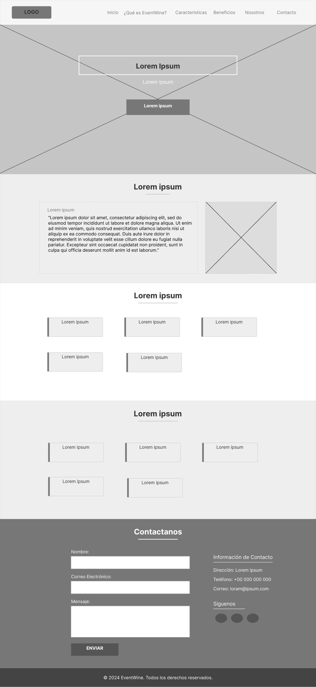
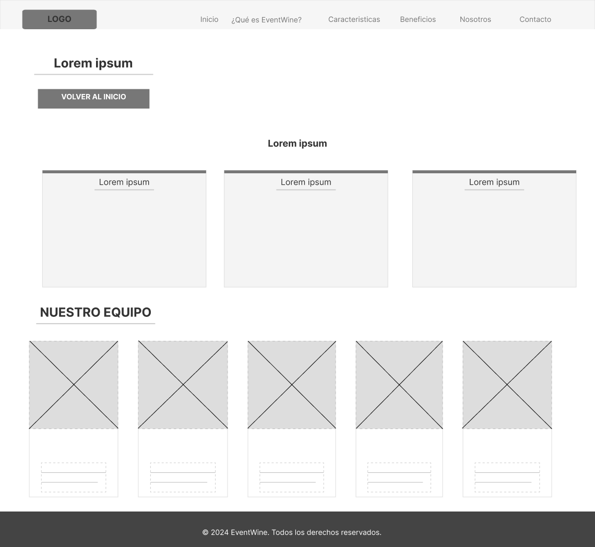
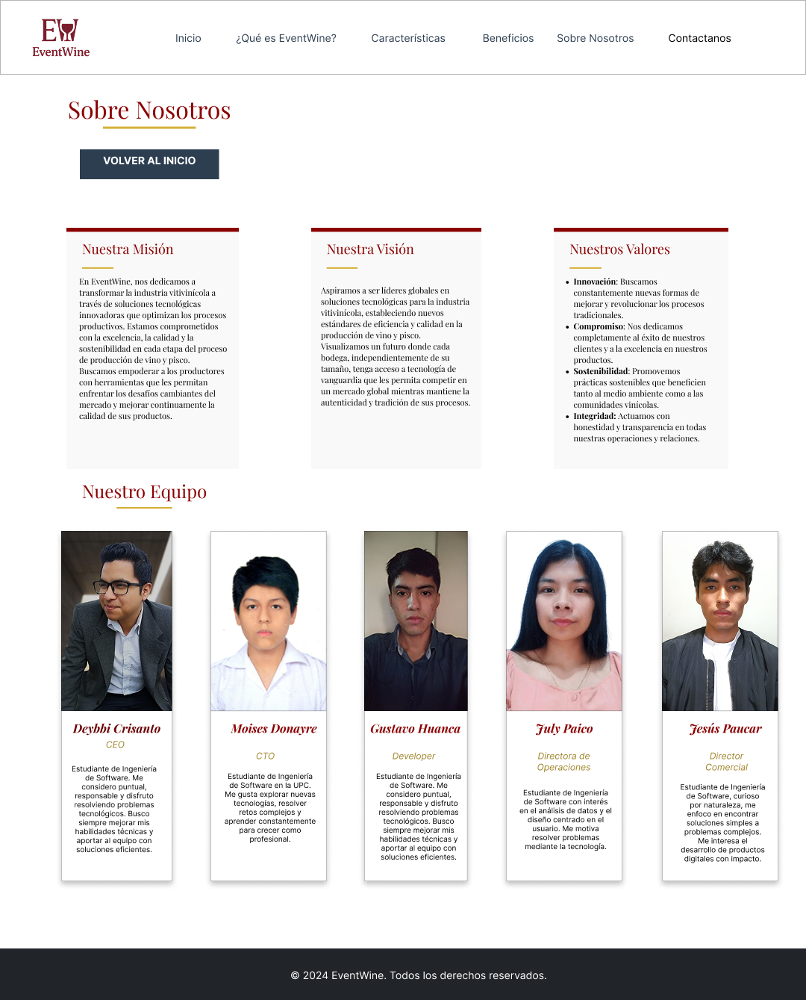

# Capítulo IV: Product Design

## 4.1. Style Guidelines.

### 4.1.1. General Style Guidelines.

**1) Branding**

- **Logo y Marca:** El logo se mostrará en la parte superior izquierda de la pantalla de manera clara y visualmente agradable, tal como se ve en las pantallas del login.
- **Paleta de Colores:**
    - **Primarios:**
        - **Vino Tinto (#8B0000):** Dominante en el diseño, utilizado en los encabezados, bordes principales y títulos principales.
        - **Verde Oliva (#556B2F):** Utilizado para botones de acción (Principal, secundaria y de navegación), tales como "Agregar cliente", "Guardar", "Ver pedidos", etc.
        - **Beige Suave (#F5F5DC):** Color principal de fondo, brindando una apariencia clara y minimalista.
        - **Marrón bodega (#5D4037):** Color utilizado en el pie de página o footer, también en bordes de botones.
        - **Dorado Metálico (#DAA520):** Se utiliza para destacar elementos importantes o de acento, como botones de acción.
    - **Secundarios:**
        - **Rojo (#FF6347):** Color de advertencia o para resaltar elementos interactivos.
        - **Gris Pizarra (#708090):** Se utiliza para áreas de fondo secundarias o inactivas.
        - **Oro Antiguo (#CFAE75):** Para detalles elegantes y áreas de énfasis.
    - **Neutrales:** Blanco (#FFFFFF) para fondo y Gris medio (#333333) para textos.

**2) Typography**
- **Fuente Principal:**
    - **Nombre:** Lora (Serif) - Se utilizará para encabezados y textos de cuerpo. Da la sensación de elegancia y tradición, adecuada para el tema del viñedo.
    - **Tamaños:**
        - H1: 80px
        - H2: 50px
        - H3: 35px
        - Texto de cuerpo: 25px
        - Subtítulos y textos menores: 16px
- **Fuente Secundaria:**
    - **Nombre:** Open Sans (Sans-Serif) - Se utilizará para textos secundarios, botones, y etiquetas.

**3) Colors**
- **Backgrounds:**
    - Principal: Blanco (#FFFFFF) para la mayoría de las páginas.
    - Secundario: Beige Suave (#F5F5DC) para secciones diferenciadas.
- **Textos:**
    - Primario: Vino Tinto (#8B0000) para el contenido principal.
    - Secundario: Negro (#000000) para subtítulos y textos complementarios.
- **Elementos Interactivos:**
    - Botones: Oro Antiguo (#CFAE75) con texto en Marrón Bodega (#5D4037).
    - Hover: Burdeos (#800020) para resaltar interacciones.

**4) Spacing**
- **Margenes y Padding:**
    - Margen general de 16px alrededor del contenido.
    - Espaciado de 8px entre elementos relacionados.
    - Uso de espacio en blanco para asegurar una lectura cómoda y evitar la saturación visual.

**5) Tono de Comunicación y Lenguaje**
- **Tono:** Formal y Respetuoso, reflejando la seriedad y profesionalismo en la gestión del viñedo.
- **Lenguaje:** Claro y Preciso, evitando tecnicismos innecesarios pero manteniendo la profesionalidad.

**6) Assets**
- **Iconos:**
    - **Set de Iconos:** Se usarán set de iconos de un proveedor de iconos open source como Font Awesome o Material Icons. Se tratará en lo posible buscar un estilo lineal y minimalista.
    - **Formato:** Los iconos estarán en formato SVG para asegurar la escalabilidad y la calidad en diferentes resoluciones.
    - **Nombres de Archivos:** Los iconos serán nombrados de manera coherente y descriptiva para facilitar su uso y referencia dentro del equipo (por ejemplo, `icon-tractor.svg`, `icon-grape.svg`).

- **Imágenes:**
    - **Banco de Imágenes:** Las imagenes serán almacenadas en un repositorio de manera organizada. Estás estarán optimizadas para web en formatos de JPEG o WebP.
    - **Resolución:** Asegurar que las imágenes de alta calidad tengan una resolución adecuada para pantallas retina (2x) y no retina.
    - **Carpetas:** Organizar las imágenes en carpetas según su uso (por ejemplo, `/assets/images/landscape`, `/assets/images/products`).
    - **Nombres de Archivos:** Se nombrarán las imágenes de manera clara y coherente para facilitar su búesqueda y reutilización (por ejemplo, `vineyard-sunset.jpg`, `grape-cluster.webp`).

- **Logo:**
    - **Variantes de Logo:** Se incluirá versiones del logo para fondos claroa y oscuros en los formatos PNG y SVG.

- **Componentes de UI:**
    - **Design System:** Se implementará un sistema de diseño que incluirá componentes reutilizables como botones, tarjetas, formularios, etc., con su correspondiente documentación.
    - **Formato:** Los componentes estarán disponibles en formato Sketch, Figma o Adobe XD.
    -
**7) Fonts**
- **Fuentes Primarias:**
    - **Lora:** Esta fuente se utilizará para títulos y textos principales.
    - **Open Sans:** Se utilizará para textos secundarios, menús y etiquetas.

- **Implementación Web:**
    - **CDN:** Podremos incluir las fuentes usando Content Delivery Network (CDN) como Google Fonts.
    - **Cargas Locales:** Contaremos con una opción para poder cargar las fuentes localmente desde el servidor.
- **Jerarquía Tipográfica:**
    - Se definirán tamaños y pesos específicos para cada tipo de texto (h1, h2, párrafos).

### 4.1.2. Web Style Guidelines.

**1) Layout**
- **Sistema de Grid:** Basado en un layout de columnas para garantizar flexibilidad y adaptabilidad en diferentes tamaños de pantalla.
- **Headers y Footers:** Fijos en la parte superior e inferior de la pantalla con espacio para navegación principal, búsqueda, y acceso rápido a secciones clave.
- **Cards:** Usados para mostrar módulos individuales como  con sombras y bordes redondeados para un aspecto moderno.

**2) Responsive Design**
- **Desktop:** Columnas de contenido principal, con menús laterales y una barra de búsqueda.
- **Tablet:** Columnas de contenido, con navegación accesible desde un menú desplegable y expandido para adaptarse a la pantalla extendida.
- **Mobile:** Columnas de contenido, navegación a través de un menú desplegable.

**3) Interaction Design**
- **Botones:** Grandes y fáciles de interactuar, con animaciones para indicar interactividad.
- **Formularios:** Campos claros y espaciados, con validación en tiempo real y mensajes de error amigables.

**4) Images and Icons**
- **Imágenes:** De alta calidad y representativas del viñedo y sus operaciones, optimizadas para web.
- **Íconos:** Set de íconos de estilo lineal y minimalista.

**5) Repositorio Central**
- **Organización:**
    - **Carpeta de Estilos:** Se creará una carpeta donde se almacenen todos los archivos CSS y SASS.
    - **Repositorio de Assets:** Todos los activos visuales como imágenes, iconos y logos estarán centralizados en una carpeta con subcarpetas organizadas por tipo.
    - **Versionado:** Se usará Git para rastrear cambios en los archivos de estilos y para asegurarse de que todos los miembros del equipo trabajen con la versión más reciente.

## 4.2. Information Architecture.

### 4.2.1. Organization Systems.

- **Jerarquía de Contenidos:**
    - La información se organiza en niveles jerárquicos que van de lo general a lo específico, facilitando la navegación progresiva.
    - **Secciones Principales:** Incluyen áreas clave, como por ejemplo "Gestión del Viñedo", "Inventario", "Planificación", y "Reportes".
    - **Subsecciones:** Cada sección principal se divide en subsecciones más específicas, por ejemplo dentro de "Gestión del Viñedo" se pueden encontrar "Mantenimiento", "Cosecha", "Riego", etc.

- **Agrupación de Contenidos:**
    - El contenido relacionado se agrupa en módulos o categorías claras, facilitando la comprensión del usuario.
    - Se prioriza la coherencia y la lógica en la agrupación, evitando redundancias y asegurando que cada elemento esté en el lugar más intuitivo posible.

### 4.2.2. Labeling Systems.

- **Nomenclatura:**
    - Se utiliza un lenguaje claro y directo, evitando tecnicismos y jergas que puedan confundir al usuario.
    - Los nombres de secciones, botones y enlaces son descriptivos, reflejando exactamente lo que el usuario encontrará al hacer clic.

- **Consistencia:**
    - Se mantiene una nomenclatura uniforme en toda la aplicación, evitando la confusión que podría generar el uso de términos diferentes para referirse al mismo concepto.

- **Lenguaje Adaptativo:**
    - El lenguaje utilizado se adapta al contexto del usuario, asegurando que sea fácil de entender tanto para usuarios nuevos como experimentados.

### 4.2.3. SEO Tags and Meta Tags

- **Title Tags:**
    - **Landing Page:** "Gestión del Viñedo - Optimiza tu Producción y Control"
    - **Web Application:** "Panel de Control - Gestión Integral del Viñedo"

- **Meta Description:**
    - **Landing Page:** "Optimiza la producción y gestión de tu viñedo con nuestra aplicación web, diseñada para simplificar la administración y mejorar la eficiencia operativa."
    - **Web Application:** "Accede a todas las herramientas necesarias para la gestión integral de tu viñedo, desde la planificación agrícola hasta la monitorización en tiempo real."

- **Keywords:**
    - **Landing Page:** "gestión de viñedo, administración de viñedo, software agrícola, producción de vino, optimización agrícola"
    - **Web Application:** "panel de control viñedo, herramientas de gestión viñedo, software de viñedo, administración de cosechas, planificación agrícola"

- **Meta Author:**
    - **Landing Page y Web Application:** "Equipo de Desarrollo de Aplicaciones para la Gestión de Viñedos"

- **Meta Charset:**
    - `"UTF-8"`

- **Meta Viewport:**
    - `"width=device-width, initial-scale=1.0"`

### 4.2.4. Searching Systems.

- **Barra de Búsqueda:**
    - La barra de búsqueda estará ubicada de manera prominente en el header, accesible desde cualquier página.
    - Se implementará un sistema de búsqueda predictiva que sugiere resultados mientras el usuario escribe, mejorando la velocidad y precisión de las búsquedas.

- **Filtros y Facetas:**
    - Los usuarios podrán refinar sus resultados de búsqueda mediante filtros y facetas, permitiendo una búsqueda más dirigida y efectiva.

- **Historial de Búsqueda:**
    - Se incluirá una función de historial de búsqueda para que los usuarios puedan acceder rápidamente a búsquedas anteriores.

- **Resultados Relevantes:**
    - Los resultados de búsqueda se ordenarán por relevancia, basados en la frecuencia de uso y la importancia del contenido.

### 4.2.5. Navigation Systems.

- **Navegación Global:**
    - Un menú principal ubicado en el header proporcionará acceso a las secciones clave de la aplicación.
    - El menú estará siempre visible en dispositivos de escritorio.

- **Navegación Contextual:**
    - Menús y enlaces contextuales dentro de cada sección permitirán al usuario profundizar en tareas específicas sin perder la orientación dentro de la aplicación.

- **Navegación Secundaria:**
    - En la barra lateral se presentarán opciones de navegación adicionales, como accesos directos a herramientas y recursos utilizados frecuentemente.

## 4.3. Landing Page UI Design.

El landing page juega un papel esencial en atraer la atención de los visitantes y guiarlos hacia acciones concretas, como inscribirse, adquirir un producto o informarse sobre un servicio. En este apartado, se tratará el diseño de la interfaz de usuario del landing page, enfocándose en los elementos clave que optimizan la experiencia del usuario, creando una página interactiva y fácil de usar.

### 4.3.1. Landing Page Wireframe.
En esta sección se presentan las representaciones de bajo nivel (wireframes) del landing page, diseñadas para dispositivos móviles y de escritorio.  [Wireframe - EvenWine](https://www.figma.com/design/8Z5H7EbcYVg6pBjgebw6eW/Sin-t%C3%ADtulo?node-id=2-29)

**Desktop Web Browser**

Seccion "Sobre Nosotros"

### 4.3.2. Landing Page Mock-up.
**Landing Page Mock-up de nuestra Web Application**
 

En esta sección se muestran los mock-ups del landing page, que sirven como una representación visual de alta fidelidad para anticipar cómo se verá y funcionará la interfaz final. Están diseñados tanto para dispositivos móviles como para escritorio.  [Wireframe - EvenWine](https://www.figma.com/design/8Z5H7EbcYVg6pBjgebw6eW/Sin-t%C3%ADtulo?node-id=2-29)

Seccion "**Sobre Nosotros**"

### 4.4. Mobile Applications UX/UI Design.
### 4.4.1. Mobile Applications Wireframes.
### 4.4.2. Mobile Applications Wireflow Diagrams.
### 4.4.3. Mobile Applications Mock-ups.

### 4.4.4. Mobile Applications User Flow Diagrams.
### 4.5. Mobile Applications Prototyping.
### 4.5.1. Android Mobile Applications Prototyping.
### 4.5.2. iOS Mobile Applications Prototyping.

## 4.6. Web Applications UX/UI Design.

El objetivo de esta sección Web Applications UX/UI Design es detallar el enfoque y las estrategias utilizadas en el diseño de la experiencia y la interfaz de usuario para la aplicación web. Se busca explicar cómo las decisiones tomadas en términos de diseño visual y funcionalidad contribuyen a mejorar la usabilidad, accesibilidad y satisfacción del usuario final. Además, se pretende mostrar cómo estos elementos de diseño ayudan a cumplir los objetivos comerciales del proyecto, asegurando una interacción fluida y eficiente para los usuarios en diferentes dispositivos.

### 4.6.1. Web Applications Wireframes.

En esta sección se muestran los wireframes realizados para nuestro Web Application.

**Login - EventWine**

En este apartado se deberá mostrar opciones de inicio de sesión, las dos formas de inicio de sesión son como productor y asistente.

**Inicio de sesión - Productor EventWine**

En el caso del login de productor de vinos y piscos artesanales, se deberá mostrar un formulario de inicio de sesión con los campos email y contraseña.

 

**Login - Asistente - EventWine**

En el caso del login de asistente, se deberá mostrar un formulario de inicio de sesión con los campos negocio al que se encuentra asociado y código de usuario.

**Registrar - Productor  - EventWine**

En esta sección se deberá mostrar un formulario para registrar nuevos productores de vinos y piscos artesanales, con campos para ingresar información personal, de contacto y de la empresa.

**Historial Pedido - EventWine**

Este apartado deberá mostrar el historial de pedidos realizados por los distribuidores asociados, con la opción de ver detalles de cada pedido, actualizar el estado del mismo y eliminar pedidos.

**Registrar pedidos - EventWine**

En este apartado se deberá mostrar un formulario para registrar nuevos pedidos, con campos para ingresar información del cliente, productos solicitados y detalles de entrega.

**Inventario - EventWine**

En este apartado el productor podrá visualizar el inventario de productos disponibles, con la opción de agregar, editar o eliminar productos, así como ver detalles de cada producto.

**Mis Clientes - EventWine**

En esta sección se deberá mostrar una lista de clientes asociados al productor, con la opción de ver detalles de cada cliente, editar la información y eliminar clientes.

**Agregar - Editar - Clientes - EventWine**

En esta sección se deberá mostrar un formulario para agregar o editar clientes, con campos para ingresar información personal, de contacto y de la empresa.

**Detalle Clientes - EventWine**

En este apartado se deberá mostrar los detalles de un cliente específico, con la opción de editar la información, ver historial de pedidos y eliminar el cliente.

**Detalle del Pedido - EventWine**

En esta sección se deberá mostrar los detalles de un pedido específico, con la opción de actualizar el estado del pedido, ver información del cliente y productos solicitados.

<!-- falta wireframe version mobile-->

### 4.6.2. Web Applications Wireflow Diagrams.

Los Wireflows se emplean principalmente en el diseño de la experiencia de usuario (UX) y son especialmente útiles para aplicaciones que incluyen flujos de trabajo e interacciones complejas.

.png>)

### 4.6.3. Web Applications Mock-ups.

En esta sección se muestran los mock-ups realizados para nuestro Web Application.

**Login - EventWine**

En esta sección se muestra el diseño del login de la aplicación web, con opciones para iniciar sesión como asistente o productor de vinos y piscos artesanales.

**Login -Distribuidor - EventWine**

En el caso del login de distribuidor, se muestra un formulario de inicio de sesión con los campos negocio al que se encuentra asociado y código de usuario.

**Historial Pedido - EventWine**

En esta sección se muestra el historial de pedidos realizados por los distribuidores asociados, con la opción de ver detalles de cada pedido, actualizar el estado del mismo y eliminar pedidos.

**Realizar pedidos - EventWine**

Aquí se muestra el formulario para realizar pedidos de productos, con la opción de seleccionar el producto, cantidad y fecha de entrega, forma de transporte, medio de pago, etc.

**Inicio de sesión- Productor EventWine**

En el caso del login de productor de vinos y piscos artesanales, se muestra un formulario de inicio de sesión con los campos email y contraseña.

**Registrar - Productor  - EventWine**

En esta sección se muestra un formulario para registrar nuevos productores de vinos y piscos artesanales, con campos para ingresar información personal, de contacto y de la empresa.

**Inventario - EventWine**

Aquí el productor puede visualizar el inventario de insumos disponibles para el proceso productivo, con la opción de agregar, editar o eliminar productos, así como ver detalles de cada producto.

**Mis Clientes - EventWine**

En esta sección se muestra una lista de clientes asociados al productor, con la opción de ver detalles de cada cliente, editar la información y eliminar clientes.

**Agregar - Editar - Clientes - EventWine**

En esta sección se muestra un formulario para agregar o editar clientes, con campos para ingresar información personal, de contacto y de la empresa.

Detalle Clientes - EventWine

En este apartado se muestra los detalles de un cliente específico, con la opción de editar la información, ver historial de pedidos y eliminar el cliente.

Mis Pedidos - EventWine

En esta sección se muestra el historial de pedidos realizados por los distribuidores asociados, con la opción de ver detalles de cada pedido, actualizar el estado del mismo y eliminar pedidos.

Detalle del Pedido - EventWine

En esta sección se muestra los detalles de un pedido específico, con la opción de actualizar el estado del pedido, ver información del cliente y productos solicitados.

### 4.6.4. Web Applications User Flow Diagrams.

## 4.7. Web Applications Prototyping.

El prototipado de aplicaciones web es esencial porque permite visualizar y probar el diseño y la funcionalidad de una aplicación antes de su desarrollo completo. Este proceso es clave para detectar posibles problemas de usabilidad y asegurar que el producto final cumpla con las expectativas de los usuarios y clientes.

Enlace del video:
[Prototype EventWine - MetaSoft](https://upcedupe-my.sharepoint.com/:v:/g/personal/u201923571_upc_edu_pe/EQ3ShXzJBlJAllrQ9SJ3yY8Bacs6SF9dXo-7o_dXhgiZYw?e=6Lgnwd&nav=eyJyZWZlcnJhbEluZm8iOnsicmVmZXJyYWxBcHAiOiJTdHJlYW1XZWJBcHAiLCJyZWZlcnJhbFZpZXciOiJTaGFyZURpYWxvZy1MaW5rIiwicmVmZXJyYWxBcHBQbGF0Zm9ybSI6IldlYiIsInJlZmVycmFsTW9kZSI6InZpZXcifX0%3D)

Enlace figma: https://www.figma.com/proto/Y3N76wEYD84NW2D4C51ezz/2190&node-type=CANVAS&t=qUWLH78JsfTLa3Pl-1&scaling=min-zoom&content-scaling=fixed&page-id=1%3A2&starting-point-node-id=352%3A2190

## 4.8. Domain-Driven Software Architecture.

Se trata de un enfoque en el diseño de software que pone énfasis en la comprensión y diseño profundo del área de aplicación. Su objetivo es desarrollar software que satisfaga las necesidades del negocio de manera precisa. 

## 4.8.1. Software Architecture Context Diagram.

El esquema de contexto ofrece una perspectiva general de las interacciones entre el sistema de software EventWine, los usuarios y sistemas externos.

  

 <em> Fuente: Elaboración propia. </em> 

### 4.8.2. Software Architecture Container Diagrams.

El diagrama de contenedores ofrece una visión general de las conexiones entre aplicaciones y fuentes de datos en el sistema ElixirControl. Muestra cómo interactúan y dependen entre sí para su funcionamiento.

  

 <em> Fuente: Elaboración propia. </em> 

### 4.8.3. Software Architecture Components Diagrams.

El diagrama de componentes proporciona una visión detallada de los componentes individuales dentro de cada contenedor del sistema ElixirControl. Muestra cómo se organizan y cómo interactúan entre sí.

  

 <em> Fuente: Elaboración propia. </em> 

## 4.9. Software Object-Oriented Design.

El diseño orientado a objetos es un enfoque de programación que utiliza objetos y clases para estructurar el código. Este enfoque permite una mejor organización, reutilización y mantenimiento del software.
A continuación se presenta el diagrama de clases y el diccionario de clases, que describen la estructura y los atributos de las clases utilizadas en el sistema.

### 4.9.1. Class Diagrams.
**Despliegue del diagrama de clase de "Usuarios"**

  

**Despliegue del diagrama de clase de "Inventario"**

  

**Despliegue del diagrama de clase de "Pedidos"**

  

**Despliegue del diagrama de clase de "Proceso de Vinificacion"**

  

**Despliegue del diagrama de clase del "Cliente"**

  

**Despliegue del diagrama de clase de EventWine**

  

### 4.9.2. Class Dictionary.

A continuación se presenta el código en formato markdown con las clases, atributos y métodos correspondientes:

### User
| Atributos           | Tipos    |
|---------------------|----------|
| id                  | Integer  |
| firstName           | String   |
| lastName            | String   |
| password            | String   |
| status              | Char     |

| Métodos             | Descripción                            |
|---------------------|----------------------------------------|
| login(username, password) | Verifica las credenciales del usuario. Devuelve true si la autenticación es exitosa. |
| register()         | Registra un nuevo usuario con la información proporcionada. |
| updateProfile()    | Actualiza la información del perfil del usuario. |
| changePassword(oldPassword, newPassword) | Cambia la contraseña del usuario si la contraseña antigua es correcta. |

---

### Client
| Atributos           | Tipos    |
|---------------------|----------|
| id                  | Integer  |
| firstName           | String   |
| lastName            | String   |
| dni                 | String   |
| email               | String   |

| Métodos             | Descripción                            |
|---------------------|----------------------------------------|
| createClient(firstName, lastName, dni, email) | Crea un nuevo cliente con la información proporcionada. |
| updateClient(id, firstName, lastName, dni, email) | Actualiza la información de un cliente existente. |
| deleteClient(id)   | Elimina un cliente identificado por su ID. |
| getClient(id)      | Recupera los detalles de un cliente por su ID. |
| searchClient(criteria) | Busca clientes según un criterio específico (ej. nombre o DNI). |
| listClients()      | Lista todos los clientes registrados. |

---

### ClientList
| Atributos           | Tipos    |
|---------------------|----------|
| id                  | Integer  |
| firstName           | String   |
| lastName            | String   |
| dni                 | String   |
| email               | String   |

| Métodos             | Descripción                            |
|---------------------|----------------------------------------|
| addClient(firstName, lastName, dni, email) | Agrega un nuevo cliente a la lista. |
| updateClient(id, firstName, lastName, dni, email) | Actualiza la información de un cliente existente. |
| deleteClient(id)   | Elimina un cliente identificado por su ID. |
| getClient(id)      | Recupera los detalles de un cliente por su ID. |
| searchClient(criteria) | Busca clientes según un criterio específico (ej. nombre o DNI). |
| listClients()      | Lista todos los clientes registrados. |

---

### Order
| Atributos           | Tipos    |
|---------------------|----------|
| id                  | Integer  |
| clientId            | Integer  |
| orderDate           | DateTime |
| totalAmount         | Decimal  |

| Métodos             | Descripción                            |
|---------------------|----------------------------------------|
| createOrder(clientId, orderDate, totalAmount) | Crea un nuevo pedido con la información proporcionada. |
| updateOrder(id, clientId, orderDate, totalAmount) | Actualiza la información de un pedido existente. |
| deleteOrder(id)    | Elimina un pedido identificado por su ID. |
| getOrder(id)       | Recupera los detalles de un pedido por su ID. |
| listOrdersByClient(clientId) | Lista todos los pedidos asociados a un cliente específico. |

---

### OrderHistory
| Atributos           | Tipos    |
|---------------------|----------|
| id                  | Integer  |
| orderId             | Integer  |
| changeDate          | DateTime |
| status              | String   |

| Métodos             | Descripción                            |
|---------------------|----------------------------------------|
| addHistory(orderId, changeDate, status) | Agrega un nuevo registro al historial de pedidos. |
| getHistory(id)     | Recupera los detalles del historial de un pedido por su ID. |
| deleteHistory(id)  | Elimina un registro del historial identificado por su ID. |
---

### Product
| Atributos           | Tipos    |
|---------------------|----------|
| id                  | Integer  |
| name                | String   |
| description         | String   |
| price               | Decimal  |
| stockQuantity       | Integer  |
| productTypeId       | Integer  |
| supplierId          | Integer  |

| Métodos             | Descripción                            |
|---------------------|----------------------------------------|
| createProduct(name, description, price, stockQuantity, productTypeId, supplierId) | Crea un nuevo producto con la información proporcionada. |
| updateProduct(id, name, description, price, stockQuantity, productTypeId, supplierId) | Actualiza la información de un producto existente. |
| deleteProduct(id)   | Elimina un producto identificado por su ID. |
| getProduct(id)      | Recupera los detalles de un producto por su ID. |

---

### ProductType
| Atributos           | Tipos    |
|---------------------|----------|
| id                  | Integer  |
| typeName            | String   |

| Métodos             | Descripción                            |
|---------------------|----------------------------------------|
| createProductType(typeName) | Crea un nuevo tipo de producto. |
| updateProductType(id, typeName) | Actualiza la información de un tipo de producto existente. |
| deleteProductType(id)   | Elimina un tipo de producto identificado por su ID. |
| getProductType(id)      | Recupera los detalles de un tipo de producto por su ID. |

---

### Supplier
| Atributos           | Tipos    |
|---------------------|----------|
| id                  | Integer  |
| name                | String   |
| contactInformation   | String   |

| Métodos             | Descripción                            |
|---------------------|----------------------------------------|
| addSupplier(name, contactInformation) | Agrega un nuevo proveedor con la información proporcionada. |
| updateSupplier(id, name, contactInformation) | Actualiza la información de un proveedor existente. |
| deleteSupplier(id)   | Elimina un proveedor identificado por su ID. |
| getSupplier(id)      | Recupera los detalles de un proveedor por su ID. |

---

### Inventory
| Atributos           | Tipos    |
|---------------------|----------|
| id                  | Integer  |
| productId           | Integer  |
| quantityAvailable    | Integer  |
| entryDate           | DateTime |
| location            | String   |

| Métodos             | Descripción                            |
|---------------------|----------------------------------------|
| addInventory(productId, quantityAvailable, entryDate, location) | Agrega un nuevo registro de inventario. |
| updateInventory(id, quantityAvailable) | Actualiza la cantidad disponible de un inventario existente. |
| deleteInventory(id)   | Elimina un registro de inventario identificado por su ID. |
| getInventoryDetails(productId) | Recupera los detalles del inventario asociado a un producto específico. |

---

### Support
| Atributos           | Tipos    |
|---------------------|----------|
| id                  | Integer  |
| clientId            | Integer  |
| requestDate         | DateTime |
| issueDescription    | String   |
| status              | String   |

| Métodos             | Descripción                            |
|---------------------|----------------------------------------|
| createSupportRequest(clientId, requestDate, issueDescription) | Crea una nueva solicitud de soporte. |
| updateSupportRequest(id, status) | Actualiza el estado de una solicitud de soporte existente. |
| deleteSupportRequest(id)   | Elimina una solicitud de soporte identificada por su ID. |
| getSupportRequest(id)      | Recupera los detalles de una solicitud de soporte por su ID. |

---

### Subscription
| Atributos           | Tipos    |
|---------------------|----------|
| id                  | Integer  |
| clientId            | Integer  |
| startDate           | DateTime |
| endDate             | DateTime |
| subscriptionType    | String   |

| Métodos             | Descripción                            |
|---------------------|----------------------------------------|
| createSubscription(clientId, startDate, endDate, subscriptionType) | Crea una nueva suscripción para un cliente. |
| updateSubscription(id, startDate, endDate, subscriptionType) | Actualiza la información de una suscripción existente. |
| deleteSubscription(id)   | Elimina una suscripción identificada por su ID. |
| getSubscription(id)      | Recupera los detalles de una suscripción por su ID. |
---

### FreeFeature
| Atributos           | Tipos   |
|---------------------|---------|
| id                  | int     |
| access              | Boolean |
| viewReports         | Boolean |

| Métodos             | Descripción                            |
|---------------------|----------------------------------------|
| enable()            | Activa las funcionalidades gratuitas.  |
| disable()           | Desactiva las funcionalidades gratuitas. |

---

### BasicFeature
| Atributos           | Tipos   |
|---------------------|---------|
| id                  | int     |
| access              | Boolean |
| viewReports         | Boolean |
| manageInventory     | Boolean |

| Métodos             | Descripción                            |
|---------------------|----------------------------------------|
| enable()            | Activa las funcionalidades básicas.    |
| disable()           | Desactiva las funcionalidades básicas. |

---

### PremiumFeature
| Atributos           | Tipos   |
|---------------------|---------|
| id                  | int     |
| access              | Boolean |
| viewReports         | Boolean |
| manageInventory     | Boolean |
| advancedAnalysis    | Boolean |

| Métodos             | Descripción                            |
|---------------------|----------------------------------------|
| enable()            | Activa las funcionalidades premium.    |
| disable()           | Desactiva las funcionalidades premium. |

---

### Proceso de Vinificación
| Atributos           | Tipos           |
|---------------------|-----------------|
| id                  | Integer         |
| grapeVariety        | String          |
| harvestDate         | DateTime        |
| fermentationDate     | DateTime        |
| agingDate           | DateTime        |
| bottlingDate        | DateTime        |

| Métodos             | Descripción                            |
|---------------------|----------------------------------------|
| startVinification() | Inicia el proceso de vinificación.     |
| monitorFermentation()| Monitorea el proceso de fermentación.  |
| racking()           | Realiza el trasiego del vino.         |
| bottleWine()        | Embotella el vino terminado.          |

---

### Distributor
| Atributos           | Tipos           |
|---------------------|-----------------|
| id                  | Integer         |
| name                | String          |
| contactInformation   | String          |

| Métodos             | Descripción                            |
|---------------------|----------------------------------------|
| addDistributor(name, contactInformation) | Agrega un nuevo distribuidor. |
| updateDistributor(id, name, contactInformation) | Actualiza la información de un distribuidor existente. |
| deleteDistributor(id)   | Elimina un distribuidor identificado por su ID. |
| getDistributor(id)      | Recupera los detalles de un distribuidor por su ID. |

---

### Producer
| Atributos           | Tipos           |
|---------------------|-----------------|
| id                  | Integer         |
| name                | String          |
| location            | String          |

| Métodos             | Descripción                            |
|---------------------|----------------------------------------|
| addProducer(name, location) | Agrega un nuevo productor.        |
| updateProducer(id, name, location) | Actualiza la información de un productor existente. |
| deleteProducer(id)   | Elimina un productor identificado por su ID. |
| getProducer(id)      | Recupera los detalles de un productor por su ID. |

---

### Lot
| Atributos           | Tipos    |
|---------------------|----------|
| idLot               | Integer  |
| grapeVariety        | String   |
| harvestDate         | DateTime |
| grapeQuantity       | Integer  |
| vineyardOrigin      | String   |
| currentStatus       | String   |
| processStartDate    | DateTime |
| finalVolume         | Decimal  |

| Métodos             | Descripción                            |
|---------------------|----------------------------------------|
| createLot(grapeVariety, harvestDate, grapeQuantity, vineyardOrigin, currentStatus, processStartDate, finalVolume) | Crea un nuevo lote con la información proporcionada. |
| updateLot(idLot, grapeVariety, harvestDate, grapeQuantity, vineyardOrigin, currentStatus, processStartDate, finalVolume) | Actualiza la información de un lote existente. |
| deleteLot(idLot)   | Elimina un lote identificado por su ID. |
| getLot(idLot)      | Recupera los detalles de un lote por su ID. |

---

### Fermentation
| Atributos           | Tipos    |
|---------------------|----------|
| idFermentation       | Integer  |
| idLot                | Integer  |
| startDate            | DateTime |
| endDate              | DateTime |
| averageTemperature    | Decimal  |
| initialDensity       | Decimal  |
| finalDensity         | Decimal  |
| initialPH            | Decimal  |
| finalPH              | Decimal  |
| residualSugar        | Decimal  |

| Métodos             | Descripción                            |
|---------------------|----------------------------------------|
| startFermentation(idLot, startDate) | Inicia el proceso de fermentación para un lote específico. |
| endFermentation(idFermentation, endDate) | Finaliza el proceso de fermentación. |
| getFermentationDetails(idFermentation) | Recupera los detalles de la fermentación por su ID. |

---

### Pressing
| Atributos           | Tipos    |
|---------------------|----------|
| idPressing          | Integer  |
| idLot               | Integer  |
| pressingDate        | DateTime |
| mustVolume          | Decimal  |
| pressType           | String   |
| appliedPressure      | Decimal  |

| Métodos             | Descripción                            |
|---------------------|----------------------------------------|
| performPressing(idLot, pressingDate, mustVolume, pressType, appliedPressure) | Realiza el proceso de prensado para un lote específico. |
| getPressingDetails(idPressing)   | Recupera los detalles del prensado por su ID. |

---

### ClarificationAndFiltration
| Atributos           | Tipos    |
|---------------------|----------|
| idClarification     | Integer  |
| idLot               | Integer  |
| clarificationDate   | DateTime |
| productsUsed        | String   |
| clarificationMethod  | String   |
| filtrationDate      | DateTime |
| clarityLevel        | Decimal  |

| Métodos             | Descripción                            |
|---------------------|----------------------------------------|
| startClarification(idLot, clarificationDate, productsUsed, clarificationMethod) | Inicia el proceso de clarificación para un lote específico. |
| performFiltration(idClarification, filtrationDate, clarityLevel)   | Realiza el proceso de filtración y actualiza el nivel de claridad. |

---

### Aging
| Atributos           | Tipos    |
|---------------------|----------|
| idAging             | Integer  |
| idLot               | Integer  |
| barrelType          | String   |
| startDate           | DateTime |
| endDate             | DateTime |
| agingTimeInMonths   | Integer  |
| inspectionsPerformed  | Integer  |
| inspectionResults    | String   |

| Métodos             | Descripción                            |
|---------------------|----------------------------------------|
| startAging(idLot, barrelType, startDate)   | Inicia el proceso de envejecimiento para un lote específico. |
| endAging(idAging, endDate)                 | Finaliza el proceso de envejecimiento. |
| recordInspection(idAging, inspectionResults)      | Registra los resultados de una inspección durante el envejecimiento. |

---

### Bottling
| Atributos           | Tipos    |
|---------------------|----------|
| idBottling          | Integer  |
| idLot               | Integer  |
| bottlingDate        | DateTime |
| bottleQuantity      | Integer  |
| bottleType          | String   |
| closureType         | String   |
| totalVolume         | Decimal  |

| Métodos             | Descripción                            |
|---------------------|----------------------------------------|
| performBottling(idLot, bottlingDate, bottleQuantity, bottleType, closureType)   | Realiza el proceso de embotellado para un lote específico. |
| getBottlingDetails(idBottling)            | Recupera los detalles del embotellado por su ID. |

---

### ProductionHistory
| Atributos           | Tipos    |
|---------------------|----------|
| idHistory           | Integer  |
| idLot               | Integer  |
| harvestDate         | DateTime |
| fermentationDate     | DateTime |
| pressingDate        | DateTime |
| clarificationDate   | DateTime |
| agingDate           | DateTime |
| bottlingDate        | DateTime |

| Métodos             | Descripción                            |
|---------------------|----------------------------------------|
| createProductionHistory(idLot, harvestDate, fermentationDate, pressingDate, clarificationDate, agingDate, bottlingDate) | Crea un nuevo historial de producción para un lote específico. |
| getProductionHistory(idHistory)            | Recupera los detalles del historial de producción por su ID. |

---

## 4.10. Database Design.

El diseño de la base de datos es un aspecto crucial en el desarrollo de software, ya que define cómo se estructuran y almacenan los datos. A continuación se presenta el diagrama de la base de datos, que ilustra las tablas, sus atributos y las relaciones entre ellas.

### 4.10.1. Database Diagram

**Data Base de la sección de Usuarios**

  

**Data Base de la sección de Clientes**

  

**Data Base de la sección de Pedidos**

  

**Data Base de la sección del Proceso de Vinificación**

  

**Data Base de la sección de Inventario**

  

**Despliegue total del Data Base Diagram de EventWine**

  

 

