# Chapter V: Product Implementation
La implementación, validación y despliegue del producto son esenciales para asegurar que la visión del producto se convierta en una realidad funcional y accesible para nuestros usuarios.

## 5.1. Software Configuration Management.
En esta sección se describen y explican los productos empleados en el proyecto digital, especificando su finalidad, la forma de acceso y respetando las restricciones establecidas.

1. Project Management:
Para la administración del proyecto se utilizaron herramientas de comunicación y control de versiones. Se creó una organización en GitHub para gestionar el código y las versiones del proyecto. Asimismo, se utilizaron plataformas como Google Meet y Discord para coordinar reuniones de equipo y mantener la comunicación interna.

- GitHub: https://github.com/

- Google Meet: https://meet.google.com/

- Discord: https://discord.com/download

2. Requirement Management:
La recopilación, organización y priorización de requisitos se realizó utilizando herramientas específicas. Se utilizó Trello como una solución visual para la organización de tareas mediante tableros personalizados, mientras que Pivotal Tracker se empleó para gestionar y dar seguimiento al Product Backlog del proyecto.

Trello: https://trello.com/es

Pivotal Tracker: https://www.pivotaltracker.com/

3. Product UX/UI Design:
Para el diseño de la experiencia de usuario (UX) y la interfaz de usuario (UI), se utilizó Figma, permitiendo la creación de wireframes, mockups y prototipos interactivos que ayudaron a validar el diseño antes de su desarrollo. Además, UXPressia se empleó para desarrollar User Personas, Empathy Maps, Journey Maps e Impact Maps, mientras que Miro fue utilizado para diseñar los escenarios As-Is y To-Be.

Figma: https://www.figma.com/downloads/

UXPressia: https://uxpressia.com/

Miro: https://miro.com/es/

4. Software Development:
Para construir la Landing Page de la startup se utilizaron HTML5, CSS3 y JavaScript. En cuanto a la Web Application, se optó por Vue.js en el Frontend y ASP.NET Core Framework con C# en el Backend. Para el desarrollo se utilizaron los siguientes entornos de programación, por último para el desarrollo movil se utilizó Flutter.

- Visual Studio Code: Usado principalmente para el desarrollo de la Landing Page y el desarrollo movil, con diversas extensiones que facilitaron la productividad.

- JetBrains Toolbox: Proporcionó un entorno robusto para el desarrollo web, con funcionalidades avanzadas de edición y depuración.

- Visual Studio Code: https://code.visualstudio.com/

- JetBrains Toolbox: https://www.jetbrains.com/toolbox-app/

5. Software Documentation:
La documentación técnica del proyecto se elaboró y almacenó en GitHub, aprovechando su funcionalidad como plataforma de control de versiones y alojamiento de documentación. Se crearon repositorios específicos, utilizando archivos en formato Markdown para facilitar la edición y colaboración entre los miembros del equipo.

GitHub: https://github.com/
### 5.1.1. Software Development Environment Configuration.
### 5.1.2. Source Code Management.
En este proyecto, emplearemos GitHub como plataforma principal y sistema de control de versiones para gestionar el código fuente de las distintas partes del proyecto dentro de una organización.

**Repositorios en GitHub**
- Organización: https://github.com/EventWine
- Landing Page: https://github.com/EventWine/EventWine-Landing-Page   
- Report : https://github.com/EventWine/EventWine-upc-pre-202501-1asi0732-4441-EventWine-report
- Backend: https://github.com/EventWine/EventWine-Platform-.NET
- ForntEnd Web: https://github.com/EventWine/EventWine-FrontEnd 
- FrontEnd Mobile:

### 5.1.3. Source Code Style Guide & Conventions.
En esta sección se definen las convenciones y prácticas que adoptaremos para el nombramiento de elementos y la programación en los lenguajes y tecnologías utilizados en el proyecto: HTML, CSS, JavaScript, Vue.js, C#, Gherkin y Flutter. Todas las convenciones emplearán nomenclatura en inglés y se basarán en estándares reconocidos de codificación.

1. HTML y CSS:
- Siguiendo las recomendaciones del W3C y buenas prácticas de la comunidad, se establecerán reglas para el nombramiento de elementos HTML y la escritura de estilos en CSS.

- Se adoptarán las guías de estilo de Google para HTML y CSS, que incluyen el uso de indentación de 2 espacios, comillas dobles en atributos y comentarios descriptivos.

- Se utilizará la metodología BEM (Bloque, Elemento, Modificador) para estructurar las clases de CSS, promoviendo modularidad y facilidad de mantenimiento.

-Se aplicará el uso semántico de las etiquetas HTML para describir correctamente el contenido del sitio web.

En el caso de Vue.js, se seguirán las convenciones de la comunidad, como el uso de PascalCase para componentes y camelCase para propiedades y métodos.

2. JavaScript:
- Se respetarán las directrices de codificación de MDN y las guías de estilo de Google, incluyendo:
    - Uso de camelCase para variables y funciones.

    - Declaración de variables preferiblemente con let y const.
    - Inclusión de punto y coma al final de las instrucciones.
    - Uso de comillas simples para strings y funciones flecha donde sea apropiado.

3. Vue.js:
- Se seguirán las buenas prácticas recomendadas por la comunidad de Vue, tales como:
    - Uso de abreviaturas en directivas v-bind y v-on.

    - Organización estructurada de componentes en carpetas basadas en su funcionalidad.

    - Correcta gestión del ciclo de vida de los componentes.

4. C# (ASP.NET Core):
- Se aplicarán las convenciones de codificación oficiales de Microsoft:

    - Nombres de clases y métodos en PascalCase.

    - Variables locales y parámetros en camelCase.

-   Documentación mediante comentarios XML.

Se promoverán buenas prácticas en ASP.NET Core, como la inyección de dependencias, separación de capas (Controller, Service, Repository) y el uso de ViewModels para la comunicación entre controladores y vistas.

5. Gherkin:
- Se utilizarán las convenciones recomendadas para escribir especificaciones claras en Gherkin:

    - Uso de palabras clave Given, When, Then.

    - Redacción sencilla, organizada en contexto, acción y resultado.

    - Reutilización de pasos de prueba y modularización de escenarios conforme a las mejores prácticas de Cucumber.

6. Flutter:
- Para el desarrollo de aplicaciones móviles en Flutter:

    - Se adoptarán las convenciones oficiales de Dart y Flutter, como:

    - Uso de camelCase para nombres de variables, funciones y parámetros.

    - Uso de PascalCase para clases, widgets y nombres de archivos de componentes.

    - Organización modular del código, separando widgets, servicios y modelos en carpetas específicas.

Se priorizará el uso de widgets reutilizables, buenas prácticas de manejo de estado y separación clara entre lógica de negocio y presentación.

Además de estas guías, se fomentará el uso de buenas prácticas de ingeniería de software, como modularidad, reutilización de componentes, legibilidad de código, optimización del rendimiento y medidas de seguridad.
Con estas convenciones buscamos garantizar la coherencia, calidad y facilidad de mantenimiento del proyecto a lo largo de su ciclo de vida.

### 5.1.4. Software Deployment Configuration.

En esta sección detallaremos la configuración requerida para llevar a cabo el despliegue exitoso de cada uno de los productos digitales de nuestra solución: la Landing Page, los Web Services (APIs) y las Frontend Web Applications.

- #### Pasos para el despliegue
**Landing Page:**

- Clonar o descargar el repositorio desde GitHub.

- Configurar el servidor web destinado a alojar la Landing Page.

-Transferir los archivos HTML, CSS y JavaScript al directorio correspondiente en el servidor.

-Asegurar la correcta instalación de cualquier dependencia adicional, como bibliotecas de JavaScript o recursos de imagen.

-Comprobar que la Landing Page se visualice adecuadamente en el navegador.

- #### Web Services (API):

- Preparar el código fuente de los servicios web, garantizando una estructura organizada y documentación adecuada.

- Configurar un entorno de desarrollo o pruebas donde se puedan realizar verificaciones exhaustivas antes del despliegue definitivo.

-   Implementar el servicio en un servidor configurado para producción.

- Establecer los mecanismos de seguridad y autenticación necesarios según los requerimientos del sistema.

- Documentar la API utilizando OpenAPI Specification, para facilitar su integración y uso por parte de otras aplicaciones o servicios.

- #### Frontend Web Applications:

- Clonar el repositorio correspondiente desde GitHub.

- Compilar y empaquetar las aplicaciones frontend. Dado que trabajamos con Vue.js, será necesario ejecutar los comandos de construcción (npm run build) para generar los archivos estáticos.

- Una vez generados, los archivos pueden ser alojados en un servidor de aplicaciones compatible con archivos estáticos, como Nginx, o plataformas como GitHub Pages en caso de proyectos estáticos más sencillos.

- Si se requiere, configurar las rutas en el servidor para que correspondan correctamente con las rutas definidas dentro de las aplicaciones frontend.

## 5.2. Product Implementation & Deployment.
### 5.2.1. Sprint Backlog 1
<table border="1">
    <tbody>
        <tr>
            <td>Sprint #</td>
            <td colspan="7">Sprint 2</td>
        </tr>
        <tr>
            <td colspan="2">User Story</td>
            <td colspan="6">Work-Item / Task</td>
        </tr>
        <tr>
            <td>Id</td>
            <td>Title</td>
            <td>Id</td>
            <td>Title</td>
            <td>Description</td>
            <td>Estimation (Hours)</td>
            <td>Assigned To</td>
            <td>Status(To-do / InProcess / ToReview / Done)</td>
        </tr>
        <tr>
            <td>US-01</td>
            <td>Hipervínculos en el encabezado</td>
            <td>T01</td>
            <td>Implementar navegación del encabezado</td>
            <td>Crear y enlazar los hipervínculos del encabezado a sus respectivas secciones.</td>
            <td>1</td>
            <td>Deybbi Crisanto</td>
            <td>Done</td>
        </tr>
        <tr>
            <td>US-02</td>
            <td>Información sobre beneficios de la aplicación</td>
            <td>T02</td>
            <td>Mostrar beneficios de la aplicación</td>
            <td>Diseñar e integrar la sección con la información de los beneficios.</td>
            <td>2</td>
            <td>July Paico</td>
            <td>Done</td>
        </tr>
        <tr>
            <td>US-03</td>
            <td>Información útil en el footer</td>
            <td>T03</td>
            <td>Implementar footer informativo</td>
            <td>Diseñar e integrar el footer con la información de contacto y enlaces relevantes.</td>
            <td>4</td>
            <td>Deybbi Crisanto</td>
            <td>Done</td>
        </tr>
        <tr>
            <td>US-05</td>
            <td>Registro del estado de clarificación</td>
            <td>T04</td>
            <td>Implementar registro de clarificación</td>
            <td>Crear el formulario y la lógica para registrar el estado de clarificación de lotes.</td>
            <td>6</td>
            <td>Moises Donayre</td>
            <td>Done</td>
        </tr>
        <tr>
            <td>US-06</td>
            <td>Registro del estado de prensado</td>
            <td>T05</td>
            <td>Implementar registro de prensado</td>
            <td>Crear el formulario y la lógica para registrar el estado de prensado de lotes.</td>
            <td>6</td>
            <td>Gustavo Huanca</td>
            <td>Done</td>
        </tr>
        <tr>
            <td>US-08</td>
            <td>Resgistro del estado de embotellado</td>
            <td>T06</td>
            <td>Implementar registro de embotellado</td>
            <td>Crear el formulario y la lógica para registrar el estado de embotellado.</td>
            <td>5</td>
            <td>Moises Donayre</td>
            <td>Done</td>
        </tr>
        <tr>
            <td>US-10</td>
            <td>Visualizar Home de la Plataforma</td>
            <td>T07</td>
            <td>Implementar Home de la Plataforma</td>
            <td>Desarrollar la página de inicio con sus elementos principales.</td>
            <td>7</td>
            <td>Gustavo Huanca</td>
            <td>Done</td>
        </tr>
        <tr>
            <td>US-04</td>
            <td>Registro del estado de fermentación</td>
            <td>T08</td>
            <td>Implementar registro de fermentación</td>
            <td>Crear el formulario y la lógica para registrar el estado de fermentación de lotes.</td>
            <td>7</td>
            <td>Moises Donayre</td>
            <td>Done</td>
        </tr>
        <tr>
            <td>US-07</td>
            <td>Registro del estado de añejamiento</td>
            <td>T09</td>
            <td>Implementar registro de añejamiento</td>
            <td>Crear el formulario y la lógica para registrar el estado de añejamiento de vinos.</td>
            <td>7</td>
            <td>Gustavo Huanca</td>
            <td>Done</td>
        </tr>
        <tr>
            <td>US-11</td>
            <td>Integración de Validadores en Formularios</td>
            <td>T10</td>
            <td>Implementar validaciones en formularios</td>
            <td>Integrar validadores para asegurar la correcta entrada de datos en los formularios.</td>
            <td>5</td>
            <td>Moises Donayre</td>
            <td>Done</td>
        </tr>
        <tr>
            <td>US-12</td>
            <td>Mejora de la Experiencia del Usuario</td>
            <td>T11</td>
            <td>Implementar mejoras de UX</td>
            <td>Realizar ajustes para mejorar la usabilidad e intuitividad de la aplicación.</td>
            <td>5</td>
            <td>Deybbi Crisanto</td>
            <td>Done</td>
        </tr>
        <tr>
            <td>US-13</td>
            <td>Implementación de Funcionalidad de Búsqueda</td>
            <td>T12</td>
            <td>Implementar funcionalidad de búsqueda</td>
            <td>Desarrollar la barra y la lógica para realizar búsquedas en la aplicación.</td>
            <td>6</td>
            <td>July Paico</td>
            <td>Done</td>
        </tr>
        <tr>
            <td>US-09</td>
            <td>Reportes Personalizados</td>
            <td>T13</td>
            <td>Implementar reportes personalizados</td>
            <td>Desarrollar la funcionalidad para crear y visualizar reportes personalizados.</td>
            <td>6</td>
            <td>Gustavo Huanca</td>
            <td>Done</td>
        </tr>
    </tbody>
</table>

### 5.2.2. Implemented Landing Page Evidence
Para la implementación de nuestro sitio web, optamos por utilizar GitHub Pages. En este proceso, creamos un repositorio en GitHub donde gestionamos el control de versiones.

Link del Landing Page: https://eventwine.github.io/EventWine-Landing-Page/index.html

### 5.2.3. Implemented Frontend-Web Application Evidence

La aplicación web fue desarrollada utilizando Vue.js, un framework progresivo para construir interfaces de usuario. La arquitectura de la aplicación se basa en componentes reutilizables, lo que facilita el mantenimiento y la escalabilidad.
La aplicación se divide en varias secciones, cada una de las cuales se encarga de una parte específica del proceso de vinificación. A continuación, se presentan algunas capturas de pantalla que ilustran la funcionalidad y el diseño de la aplicación.
Link de la Web App: https://event-wine-front.vercel.app/home/sign-in 

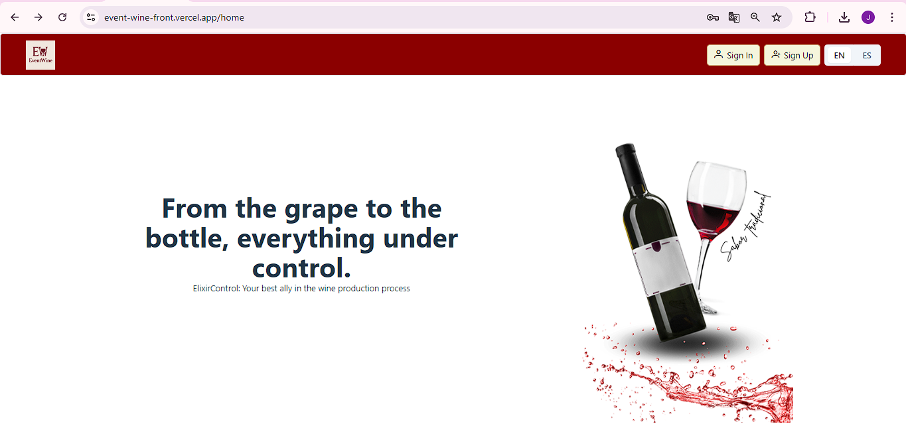 

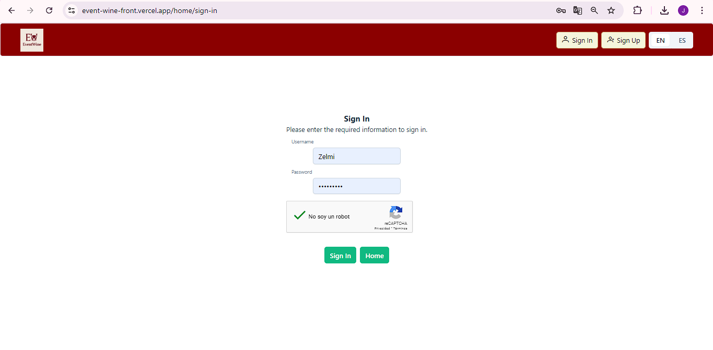

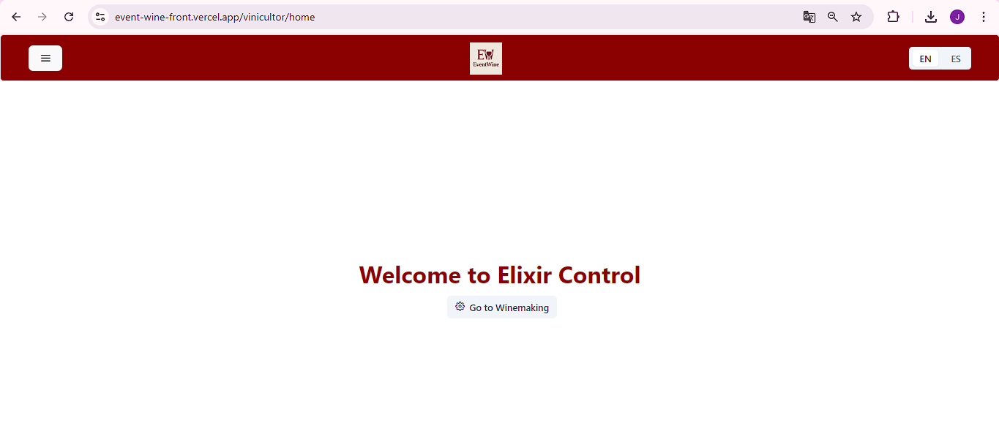

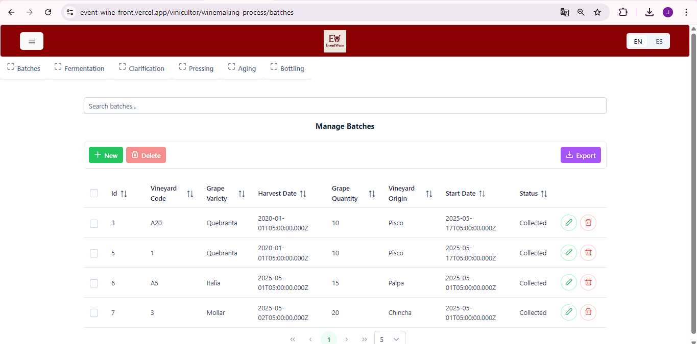

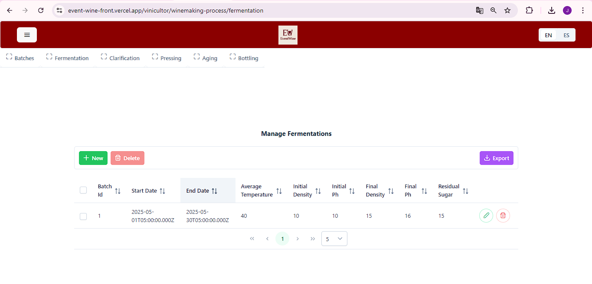

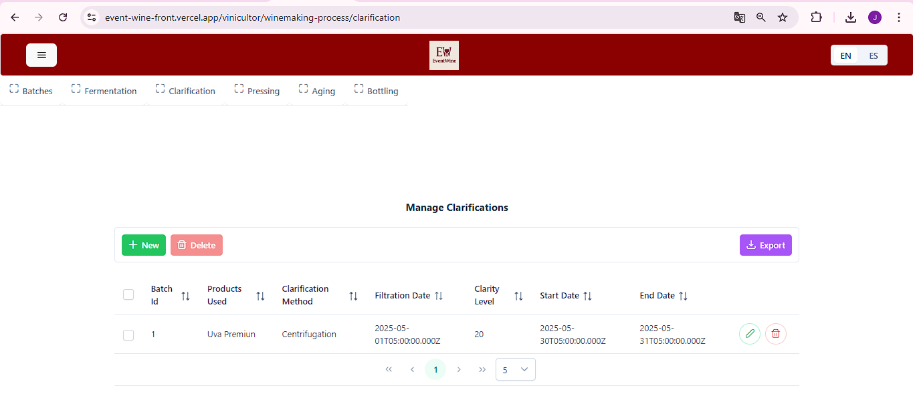

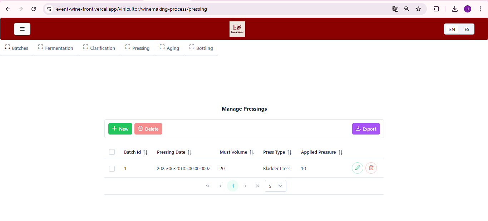

### 5.2.4. Acuerdo de Servicio - SaaS

**Objetivo y Alcance**
El presente Acuerdo de Servicio SaaS establece los términos y condiciones legales que rigen el uso de la plataforma EventWine, un software como servicio (SaaS) especializado en la gestión de procesos de vinificación. Este documento constituye un contrato legalmente vinculante entre EventWine (en adelante, "el Proveedor") y cualquier persona o entidad que acceda o utilice la plataforma (en adelante, "el Usuario").

**1. Descripción del Servicio**
   EventWine proporciona una plataforma de software como servicio (SaaS) para la gestión integral de procesos de vinificación. El servicio incluye herramientas para seguimiento de lotes, fermentación, clarificación, prensado, añejamiento y embotellado. La plataforma se proporciona "tal cual" y el Proveedor se reserva el derecho de modificar las funcionalidades ofrecidas, previa notificación a los Usuarios.

**2. Términos de Suscripción** 
   **2.1 Planes y Facturación**
   El servicio EventWine se ofrece mediante planes de suscripción con diferentes características y limitaciones. La facturación se realiza mensualmente, con la opción de pago anual con un descuento del 10%. Los precios están sujetos a modificaciones, con un preaviso mínimo de 30 días.

   **2.2 Período de Prueba**
   Los nuevos usuarios pueden acceder a un período de prueba de 14 días sin compromiso. Una vez finalizado este período, se requerirá la selección de un plan de suscripción para continuar utilizando la plataforma.

   **2.3 Modificación y Cancelación**
   Los Usuarios pueden cambiar de plan o cancelar su suscripción en cualquier momento. Los cambios de plan se aplicarán a partir del siguiente período de facturación. En caso de cancelación, el acceso a la plataforma se mantendrá hasta el final del período facturado.

**3. Privacidad y Datos** 
   **3.1 Confidencialidad**
   El Proveedor se compromete a mantener la confidencialidad de los datos proporcionados por los Usuarios. La información no será compartida con terceros sin consentimiento expreso, excepto cuando sea requerido por ley.

   **3.2 Propiedad de los Datos**
   Los datos ingresados por el Usuario en la plataforma son y permanecen propiedad del Usuario. El Proveedor no adquiere ningún derecho sobre dichos datos más allá de los necesarios para prestar el servicio.

   **3.3 Seguridad**
   El Proveedor implementa medidas de seguridad de nivel empresarial, incluyendo encriptación de 256 bits para todas las transmisiones de datos y copias de seguridad diarias. Sin embargo, ningún sistema puede garantizar una seguridad absoluta, por lo que se recomienda a los Usuarios mantener copias de seguridad de su información crítica.

**4. Responsabilidades del Usuario** 
   **4.1 Acceso y Credenciales**
   Los Usuarios son responsables de mantener la confidencialidad de sus credenciales de acceso y de todas las actividades realizadas bajo su cuenta. Cualquier uso no autorizado debe ser reportado inmediatamente al Proveedor.

   **4.2 Uso Autorizado**
   El Usuario se compromete a utilizar la plataforma de manera ética y legal, sin intentar acceder a funcionalidades no autorizadas o interferir con el funcionamiento normal del servicio.

   **4.3 Cumplimiento Normativo**
   El Usuario es responsable de asegurar que su uso de la plataforma cumple con todas las leyes y regulaciones aplicables en su jurisdicción, particularmente aquellas relacionadas con la industria vitivinícola.

**5. Propiedad Intelectual** 
   **5.1 Derechos del Proveedor**
   Todos los derechos de propiedad intelectual relacionados con la plataforma, incluyendo pero no limitado a software, diseño, logotipos y documentación, son propiedad exclusiva del Proveedor.

   **5.2 Licencia de Uso**
   El Proveedor otorga al Usuario una licencia no exclusiva, no transferible y revocable para utilizar la plataforma durante la vigencia de la suscripción, únicamente para los fines descritos en este Acuerdo.

**6. Limitación de Responsabilidad** 
   **6.1 Disponibilidad del Servicio**
   El Proveedor se esfuerza por mantener una disponibilidad del servicio del 99.9%, excluyendo mantenimientos programados. Sin embargo, no se garantiza el funcionamiento ininterrumpido de la plataforma.

   **6.2 Exención de Garantías**
   El servicio se proporciona "tal cual", sin garantías de ningún tipo, expresas o implícitas. El Proveedor no garantiza que el servicio satisfará los requisitos específicos del Usuario o que funcionará libre de errores.

   **6.3 Limitación de Daños**
   En ningún caso el Proveedor será responsable por daños indirectos, incidentales, especiales o consecuentes, incluyendo pérdida de beneficios o datos, incluso si ha sido advertido de la posibilidad de tales daños.

**7. Terminación** 
   **7.1 Por el Usuario**
   El Usuario puede terminar este Acuerdo en cualquier momento cancelando su suscripción desde su panel de control.

   **7.2 Por el Proveedor**
   El Proveedor puede suspender o terminar el acceso del Usuario a la plataforma sin previo aviso en caso de violación de los términos de este Acuerdo o por falta de pago.

   **7.3 Consecuencias**
   Tras la terminación, el Usuario perderá el acceso a la plataforma y a sus datos. El Proveedor mantendrá los datos por un período de 30 días, durante el cual el Usuario podrá solicitar una copia.

**8. Misceláneos** 
   **8.1 Ley Aplicable**
   Este Acuerdo se regirá e interpretará de acuerdo con las leyes del país donde el Proveedor tiene su sede principal, sin dar efecto a principios de conflicto de leyes.

   **8.2 Resolución de Disputas**
   Cualquier disputa derivada de este Acuerdo se resolverá mediante negociación de buena fe. Si no se alcanza una solución, las partes acuerdan someterse a mediación antes de iniciar acciones legales.

   **8.3 Modificaciones al Acuerdo**
   El Proveedor se reserva el derecho de modificar este Acuerdo en cualquier momento. Los cambios sustanciales serán notificados a los Usuarios con al menos 30 días de antelación. El uso continuado de la plataforma tras dicha notificación constituirá la aceptación de los nuevos términos.

### 5.2.5. Implemented Native-Mobile Application Evidence

### 5.2.6. Implemented RESTful API and/or Serverless Backend Evidence
En este proyecto, se optó por utilizar una API RESTful para la comunicación entre el frontend y el backend. Para ello, se utilizó el framework ASP.NET Core para el backend.

### 5.2.7. RESTful API documentation
Enlace al repositorio de la API RESTful: https://github.com/EventWine/EventWine-Platform-.NET

Enlace de Backend desplegado: https://eventwineplatform-gqg3e6btaybjarg3.canadacentral-01.azurewebsites.net/swagger/index.html 

- Batch

| Método | Endpoint | Descripción |
| --- | --- | --- |
| `GET` | `/api/v1/batch/{batchId}` | Obtiene un Batch por su ID |
| `DELETE` | `/api/v1/batch/{batchId}` | Elimina un Batch |
| `PUT` | `/api/v1/batch/{batchId}` | Actualiza un Batch por su ID |
| `POST` | `/api/v1/batch/profile/{profileId}` | Crea un Batch por Profile ID |
| `GET` | `/api/v1/batch/profile/{profileId}` | Obtiene todos los Batches por Profile ID |
| `GET` | `/api/v1/batch` | Obtiene todos los Batches |

- WinemakingProcessByBatch

| Método | Endpoint | Descripción |
| --- | --- | --- |
| `GET` | `/api/v1/winemakingProcess/batch/{batchId}/fermentation` | Obtiene la Fermentación de un Batch |
| `POST` | `/api/v1/winemakingProcess/{batchId}/fermentation` | Agrega una Fermentación a un Batch |
| `DELETE` | `/api/v1/winemakingProcess/{batchId}/fermentation` | Elimina la Fermentación de un Batch |
| `PUT` | `/api/v1/winemakingProcess/{batchId}/fermentation` | Actualiza la Fermentación de un Batch |
| `GET` | `/api/v1/winemakingProcess/batch/{batchId}/clarification` | Obtiene la Clarificación de un Batch |
| `POST` | `/api/v1/winemakingProcess/{batchId}/clarification` | Agrega una Clarificación a un Batch |
| `DELETE` | `/api/v1/winemakingProcess/{batchId}/clarification` | Elimina la Clarificación de un Batch |
| `PUT` | `/api/v1/winemakingProcess/{batchId}/clarification` | Actualiza la Clarificación de un Batch |
| `GET` | `/api/v1/winemakingProcess/batch/{batchId}/pressing` | Obtiene el Prensado de un Batch |
| `POST` | `/api/v1/winemakingProcess/{batchId}/pressing` | Agrega un Prensado a un Batch |
| `DELETE` | `/api/v1/winemakingProcess/{batchId}/pressing` | Elimina el Prensado de un Batch |
| `PUT` | `/api/v1/winemakingProcess/{batchId}/pressing` | Actualiza el Prensado de un Batch |
| `GET` | `/api/v1/winemakingProcess/batch/{batchId}/aging` | Obtiene el Añejamiento de un Batch |
| `POST` | `/api/v1/winemakingProcess/{batchId}/aging` | Agrega un Añejamiento a un Batch |
| `DELETE` | `/api/v1/winemakingProcess/{batchId}/aging` | Elimina el Añejamiento de un Batch |
| `PUT` | `/api/v1/winemakingProcess/{batchId}/aging` | Actualiza el Añejamiento de un Batch |
| `GET` | `/api/v1/winemakingProcess/batch/{batchId}/bottling` | Obtiene el Embotellado de un Batch |
| `POST` | `/api/v1/winemakingProcess/{batchId}/bottling` | Agrega un Embotellado a un Batch |
| `DELETE` | `/api/v1/winemakingProcess/{batchId}/bottling` | Elimina el Embotellado de un Batch |
| `PUT` | `/api/v1/winemakingProcess/{batchId}/bottling` | Actualiza el Embotellado de un Batch |

- Profiles

| Método | Endpoint | Descripción |
| --- | --- | --- |
| `GET` | `/api/v1/profiles/{profileId}` | Obtiene un Perfil por su ProfileId |
| `DELETE` | `/api/v1/profiles/{profileId}` | Elimina un Perfil |
| `POST` | `/api/v1/profiles/{userId}` | Crea un Perfil por User Id |
| `GET` | `/api/v1/profiles` | Obtiene todos los Perfiles |
| `GET` | `/api/v1/profiles/user/{userId}` | Obtiene un Perfil por su User Id  |

- Authentication

| Método | Endpoint | Descripción |
| --- | --- | --- |
| `POST` | `/api/v1/authentication/sign-in` | Inicia sesión del usuario |
| `POST` | `/api/v1/authentication/sign-up` | Registra un nuevo usuario |

- User

| Método | Endpoint | Descripción |
| --- | --- | --- |
| `GET` | `/api/v1/user/{id}` | Obtiene un Usuario por su Id |
| `GET` | `/api/v1/user` | Obtiene todos los Usuarios |

**Evidencias** 
Authentication Endpoints: 

Sign-Up (
/api/v1/authentication/sign-up):  
<table border="1">
	<tbody>
		<tr>
			<td>Método</td>
			<td>POST</td>
		</tr>
		<tr>
			<td>Parámetros</td>
			<td>Body: username, password</td>
		</tr>
		<tr>
			<td>Resultado</td>
			<td>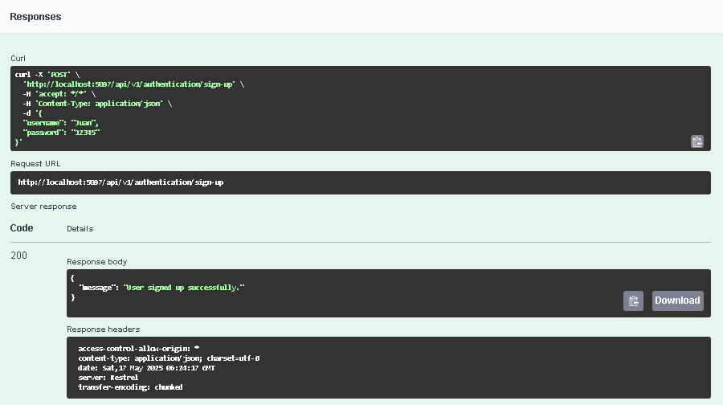</td>
		</tr>
	</tbody>
</table>

Sign-In (
/api/v1/authentication/sign-in):  
<table border="1">
	<tbody>
		<tr>
			<td>Método</td>
			<td>POST</td>
		</tr>
		<tr>
			<td>Parámetros</td>
			<td>Body: username, password</td>
		</tr>
		<tr>
			<td>Resultado</td>
			<td>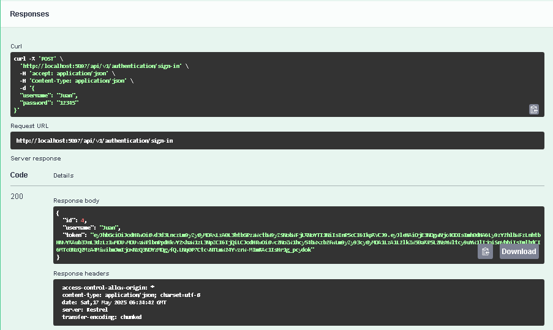</td>
		</tr>
	</tbody>
</table>

User Endpoints: 

<table border="1">
	<tbody>
		<tr>
			<td>Método</td>
			<td>GET {id}</td>
		</tr>
		<tr>
			<td>Parámetros</td>
			<td>{id}: id del usuario</td>
		</tr>
		<tr>
			<td>Resultado</td>
			<td>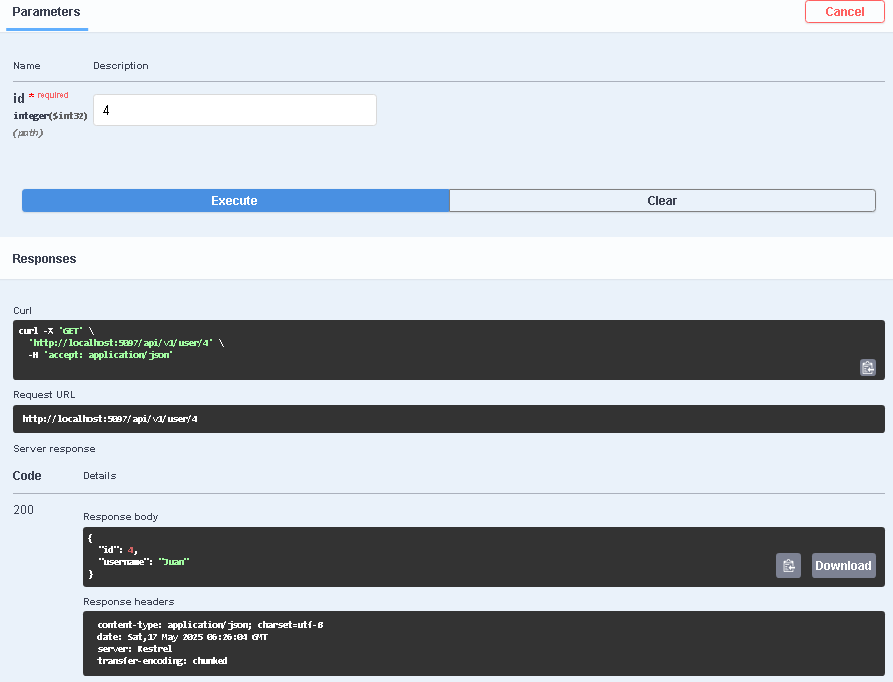</td>
		</tr>
	</tbody>
</table>

<table border="1">
	<tbody>
		<tr>
			<td>Método</td>
			<td>GET</td>
		</tr>
		<tr>
			<td>Parámetros</td>
			<td>Ninguno</td>
		</tr>
		<tr>
			<td>Resultado</td>
			<td>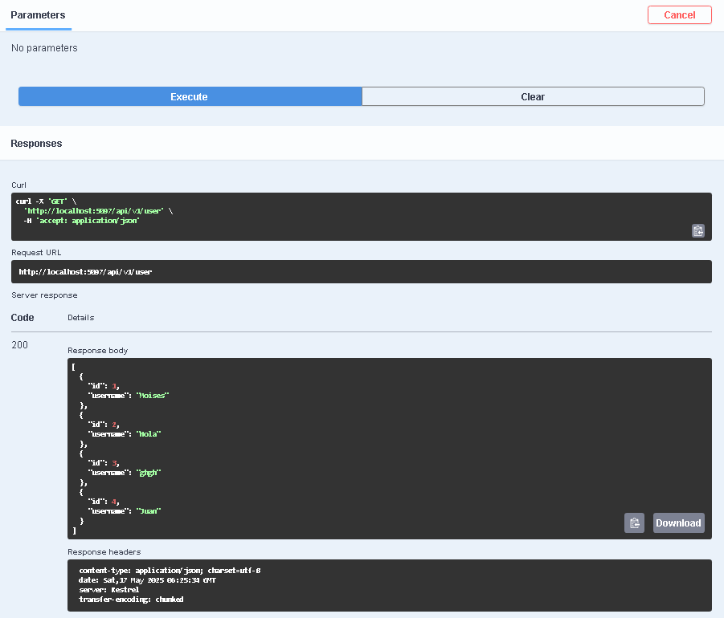</td>
		</tr>
	</tbody>
</table>

Profiles Endpoints: 

<table border="1">
	<tbody>
		<tr>
			<td>Método</td>
			<td>GET {profileId}</td>
		</tr>
		<tr>
			<td>Parámetros</td>
			<td>profileId: id del perfil</td>
		</tr>
		<tr>
			<td>Resultado</td>
			<td>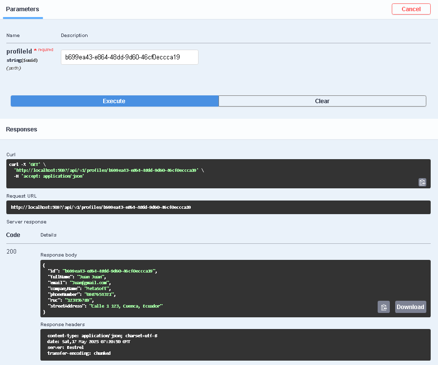</td>
		</tr>
	</tbody>
</table>

<table border="1">
	<tbody>
		<tr>
			<td>Método</td>
			<td>DELETE {profileId}</td>
		</tr>
		<tr>
			<td>Parámetros</td>
			<td>profileId: id del perfil</td>
		</tr>
		<tr>
			<td>Resultado</td>
			<td>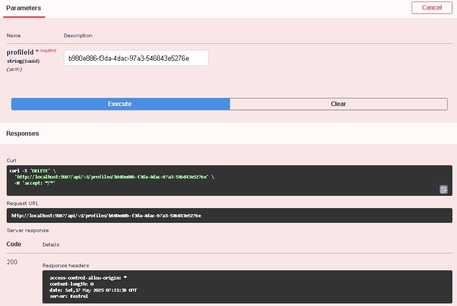</td>
		</tr>
	</tbody>
</table>

<table border="1">
	<tbody>
		<tr>
			<td>Método</td>
			<td>GET</td>
		</tr>
		<tr>
			<td>Parámetros</td>
			<td>Ninguno</td>
		</tr>
		<tr>
			<td>Resultado</td>
			<td>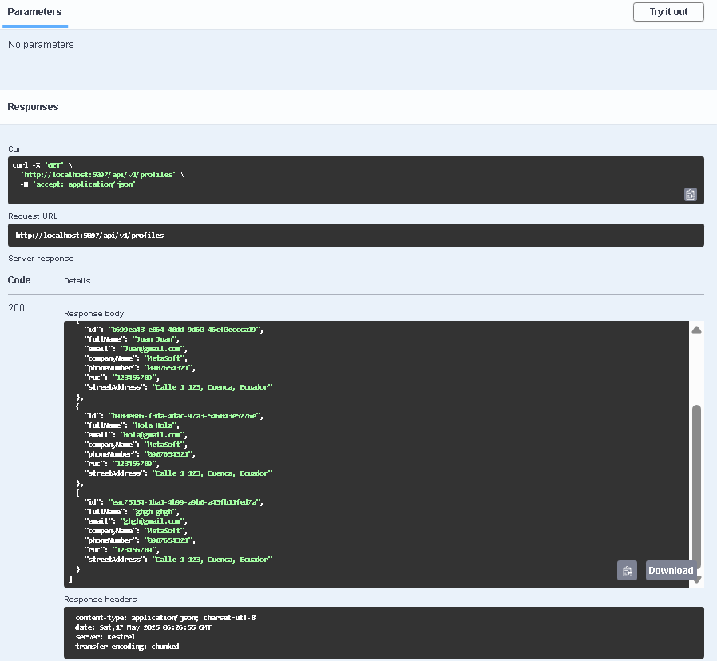</td>
		</tr>
	</tbody>
</table>

<table border="1">
	<tbody>
		<tr>
			<td>Método</td>
			<td>GET {userId}</td>
		</tr>
		<tr>
			<td>Parámetros</td>
			<td>userId: id del usuario</td>
		</tr>
		<tr>
			<td>Resultado</td>
			<td>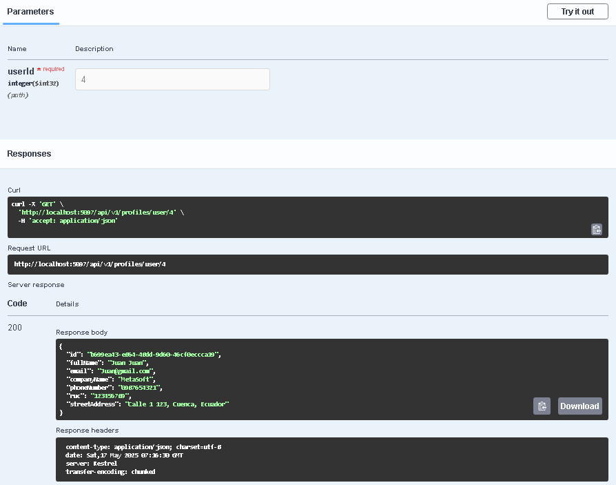</td>
		</tr>
	</tbody>
</table>

Batch Endpoints: 

<table border="1">
	<tbody>
		<tr>
			<td>Método</td>
			<td>GET {batchId}</td>
		</tr>
		<tr>
			<td>Parámetros</td>
			<td>batchId: id del lote</td>
		</tr>
		<tr>
			<td>Resultado</td>
			<td>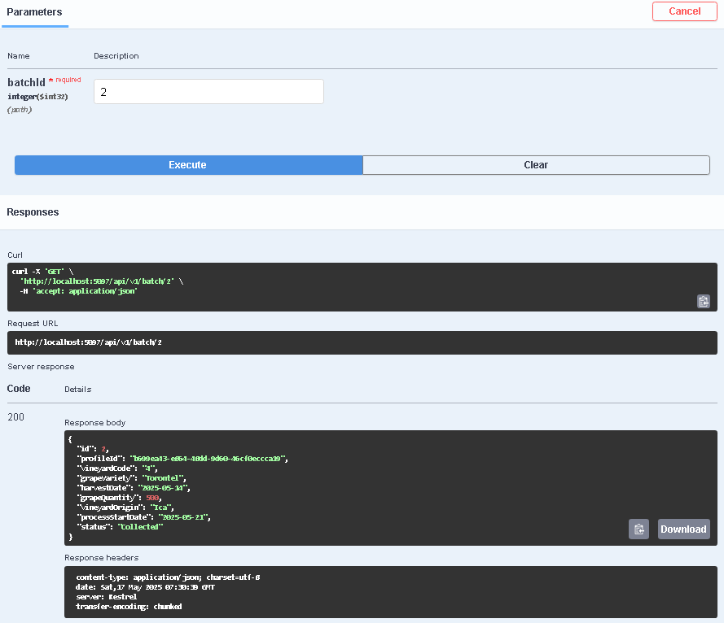</td>
		</tr>
	</tbody>
</table>

<table border="1">
	<tbody>
		<tr>
			<td>Método</td>
			<td>DELETE {batchId}</td>
		</tr>
		<tr>
			<td>Parámetros</td>
			<td>batchId: id del lote</td>
		</tr>
		<tr>
			<td>Resultado</td>
			<td>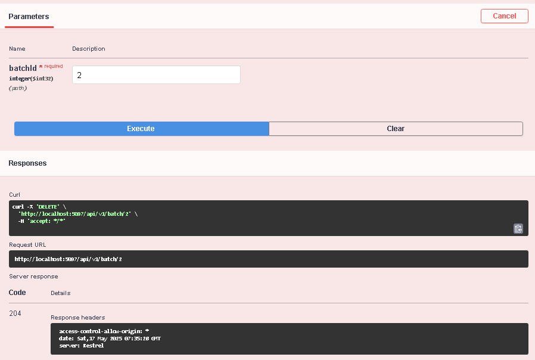</td>
		</tr>
	</tbody>
</table>

<table border="1">
	<tbody>
		<tr>
			<td>Método</td>
			<td>PUT {batchId}</td>
		</tr>
		<tr>
			<td>Parámetros</td>
			<td>batchId: id del lote  
            Body: vineyardCode, grapeVariety, harvestDate, grapeQuantity, vineyardOrigin, processStartDate</td>
		</tr>
		<tr>
			<td>Resultado</td>
			<td>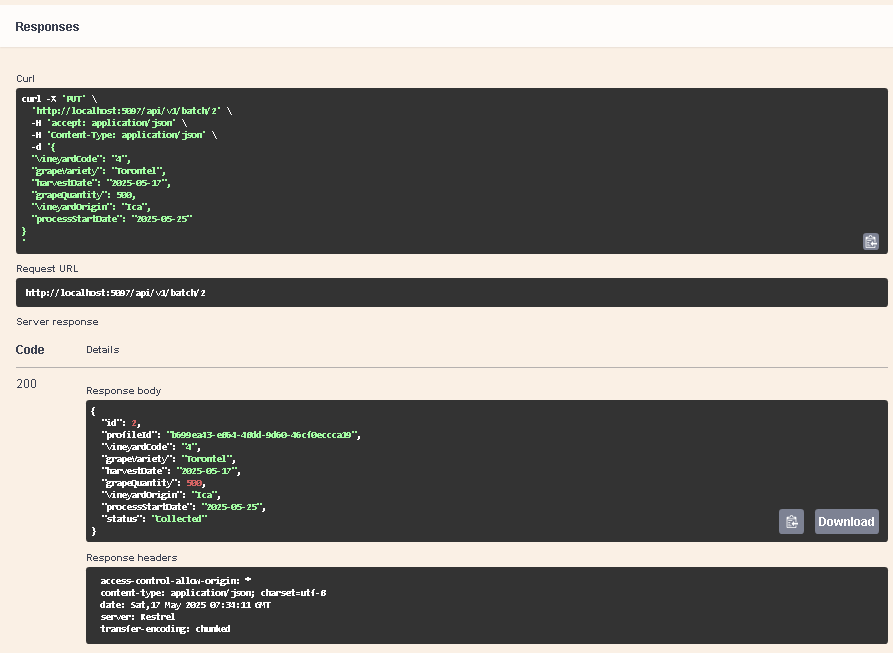</td>
		</tr>
	</tbody>
</table>

<table border="1">
	<tbody>
		<tr>
			<td>Método</td>
			<td>POST {profileId}</td>
		</tr>
		<tr>
			<td>Parámetros</td>
			<td>profileId: id del perfil  
            Body: vineyardCode, grapeVariety, harvestDate, grapeQuantity, vineyardOrigin, processStartDate</td>
		</tr>
		<tr>
			<td>Resultado</td>
			<td>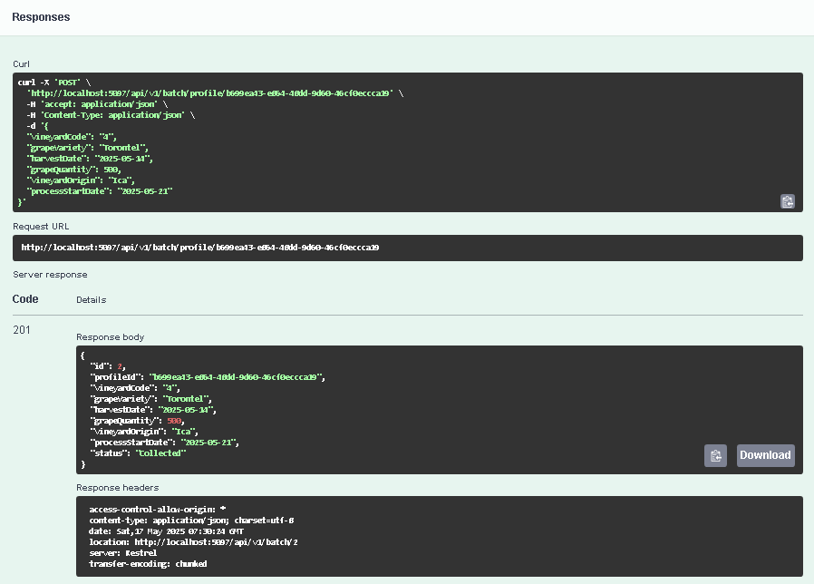</td>
		</tr>
	</tbody>
</table>

<table border="1">
	<tbody>
		<tr>
			<td>Método</td>
			<td>GET {profileId}</td>
		</tr>
		<tr>
			<td>Parámetros</td>
			<td>profileId: id del perfil</td>
		</tr>
		<tr>
			<td>Resultado</td>
			<td>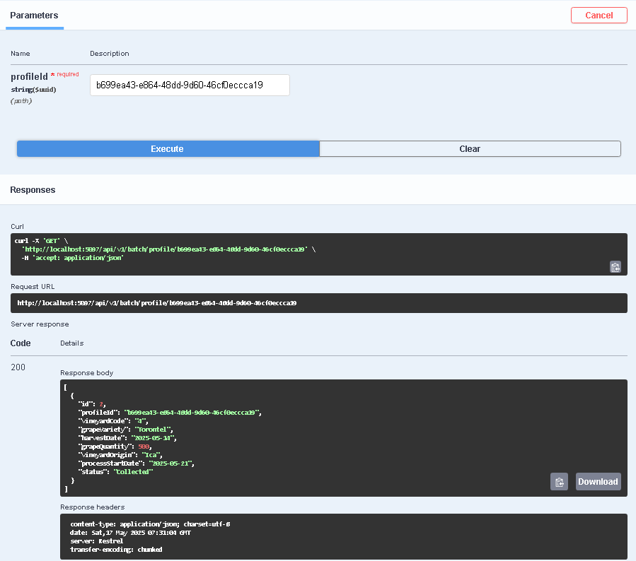</td>
		</tr>
	</tbody>
</table>

<table border="1">
	<tbody>
		<tr>
			<td>Método</td>
			<td>GET</td>
		</tr>
		<tr>
			<td>Parámetros</td>
			<td>Ninguno</td>
		</tr>
		<tr>
			<td>Resultado</td>
			<td>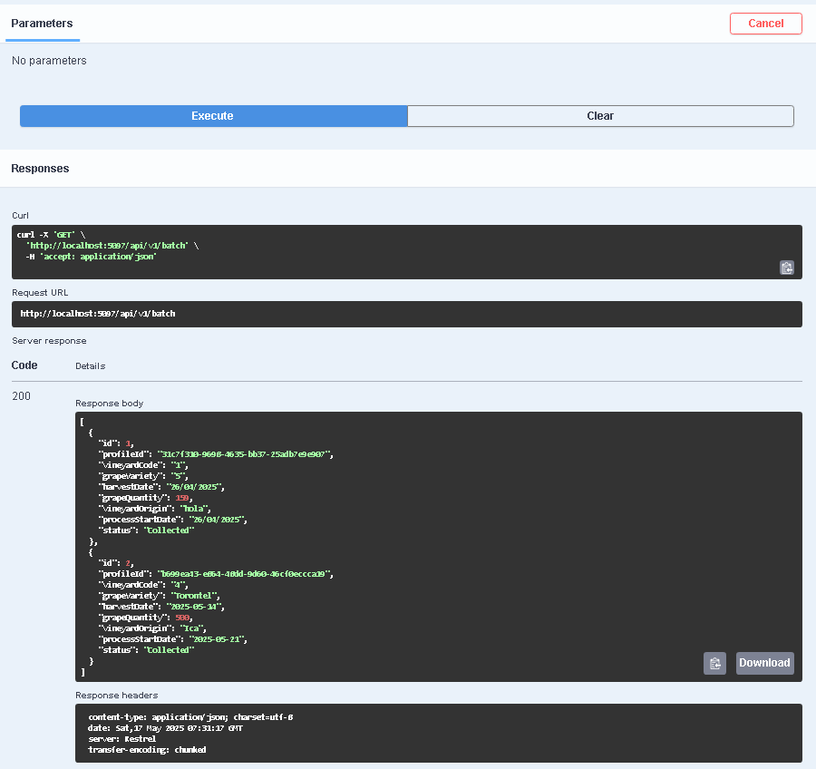</td>
		</tr>
	</tbody>
</table>

WinemakingProcessByBatch Endpoints: 
Fermentation 

<table border="1">
	<tbody>
		<tr>
			<td>Método</td>
			<td>GET {batchId}</td>
		</tr>
		<tr>
			<td>Parámetros</td>
			<td>batchId: id del lote</td>
		</tr>
		<tr>
			<td>Resultado</td>
			<td>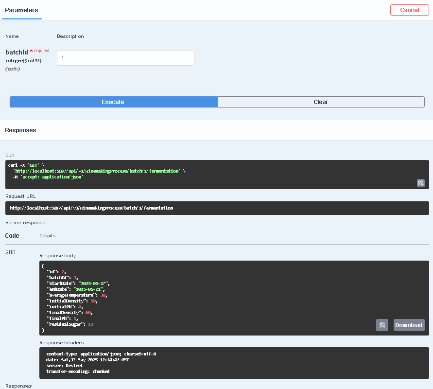</td>
		</tr>
	</tbody>
</table>

<table border="1">
	<tbody>
		<tr>
			<td>Método</td>
			<td>POST {batchId}</td>
		</tr>
		<tr>
			<td>Parámetros</td>
			<td>batchId: id del lote  
            Body: startDate, endDate, averageTemperature, initialDensity, initialPh, finalDensity, finalPh, residualSugar</td>
		</tr>
		<tr>
			<td>Resultado</td>
			<td>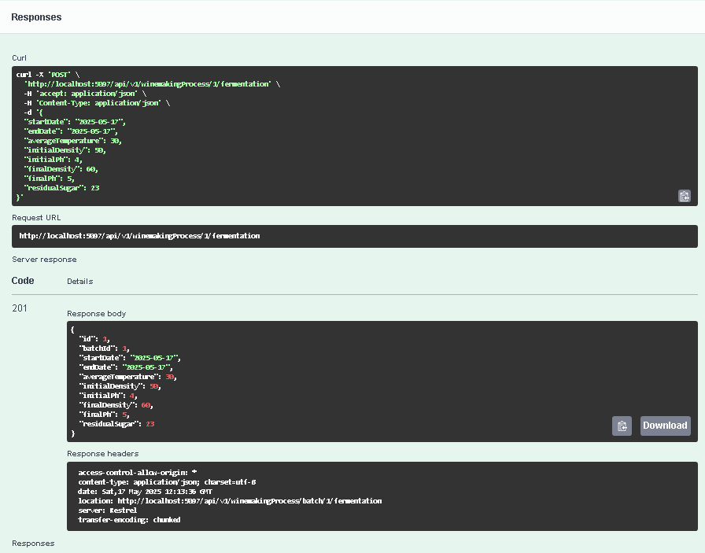</td>
		</tr>
	</tbody>
</table>

<table border="1">
	<tbody>
		<tr>
			<td>Método</td>
			<td>DELETE {batchId}</td>
		</tr>
		<tr>
			<td>Parámetros</td>
			<td>batchId: id del lote</td>
		</tr>
		<tr>
			<td>Resultado</td>
			<td>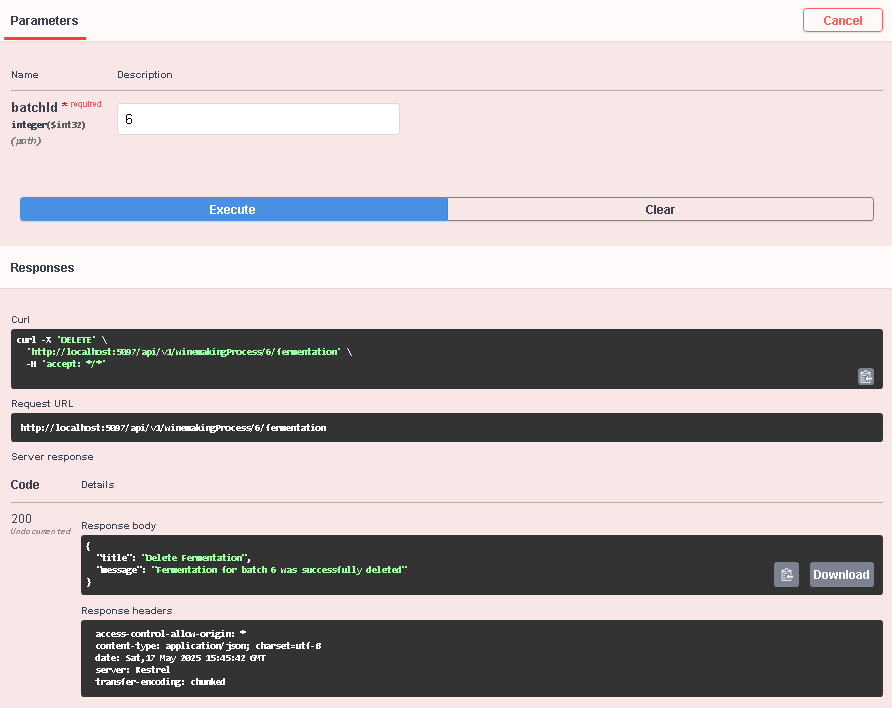</td>
		</tr>
	</tbody>
</table>

<table border="1">
	<tbody>
		<tr>
			<td>Método</td>
			<td>PUT {batchId}</td>
		</tr>
		<tr>
			<td>Parámetros</td>
			<td>batchId: id del lote  
            Body: startDate, endDate, averageTemperature, initialDensity, initialPh, finalDensity, finalPh, residualSugar</td>
		</tr>
		<tr>
			<td>Resultado</td>
			<td>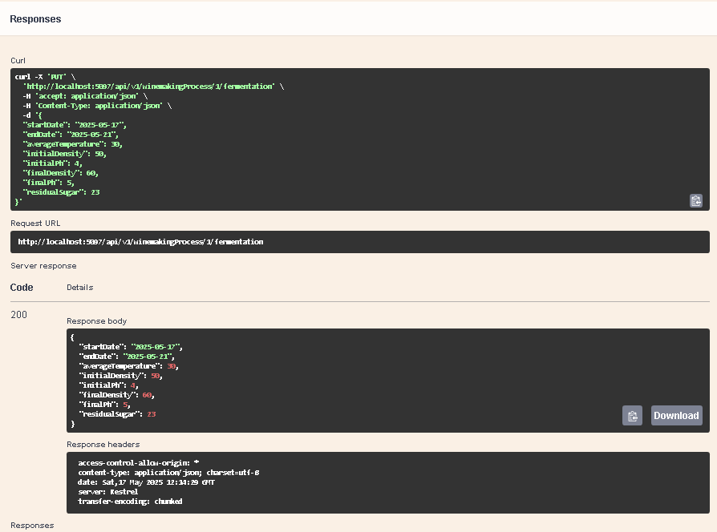</td>
		</tr>
	</tbody>
</table>

Clarification 

<table border="1">
	<tbody>
		<tr>
			<td>Método</td>
			<td>GET {batchId}</td>
		</tr>
		<tr>
			<td>Parámetros</td>
			<td>batchId: id del lote</td>
		</tr>
		<tr>
			<td>Resultado</td>
			<td>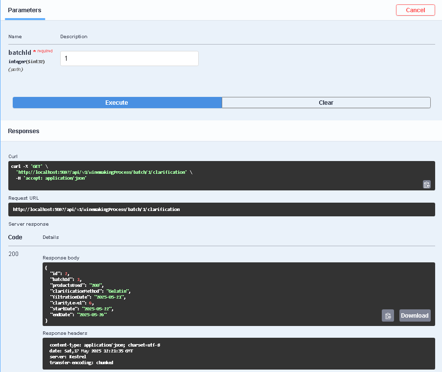</td>
		</tr>
	</tbody>
</table>

<table border="1">
	<tbody>
		<tr>
			<td>Método</td>
			<td>POST {batchId}</td>
		</tr>
		<tr>
			<td>Parámetros</td>
			<td>batchId: id del lote  
            Body: productUsed, clarificationMethod, filtrationDate, clarityLevel, startDate, endDate</td>
		</tr>
		<tr>
			<td>Resultado</td>
			<td>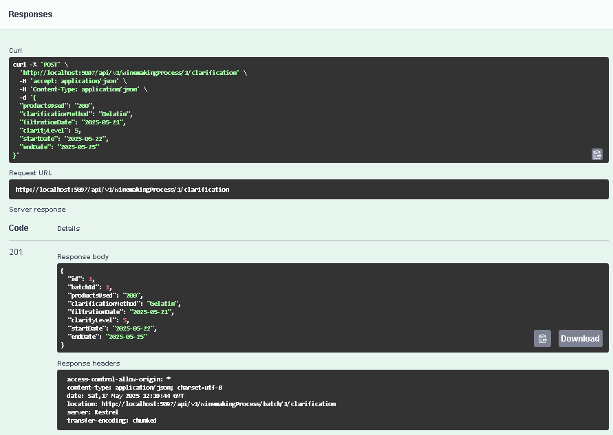</td>
		</tr>
	</tbody>
</table>

<table border="1">
	<tbody>
		<tr>
			<td>Método</td>
			<td>DELETE {batchId}</td>
		</tr>
		<tr>
			<td>Parámetros</td>
			<td>batchId: id del lote</td>
		</tr>
		<tr>
			<td>Resultado</td>
			<td>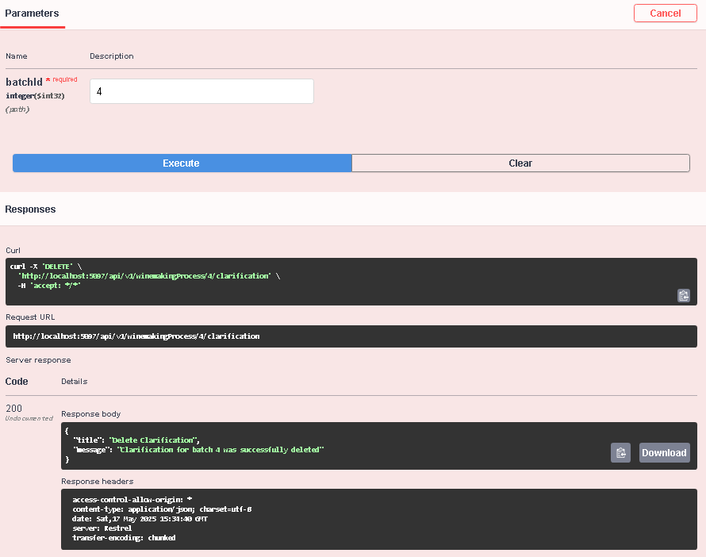</td>
		</tr>
	</tbody>
</table>

<table border="1">
	<tbody>
		<tr>
			<td>Método</td>
			<td>PUT {batchId}</td>
		</tr>
		<tr>
			<td>Parámetros</td>
			<td>batchId: id del lote  
            Body: productUsed, clarificationMethod, filtrationDate, clarityLevel, startDate, endDate</td>
		</tr>
		<tr>
			<td>Resultado</td>
			<td></td>
		</tr>
	</tbody>
</table>

Pressing 

<table border="1">
	<tbody>
		<tr>
			<td>Método</td>
			<td>GET {batchId}</td>
		</tr>
		<tr>
			<td>Parámetros</td>
			<td>batchId: id del lote</td>
		</tr>
		<tr>
			<td>Resultado</td>
			<td>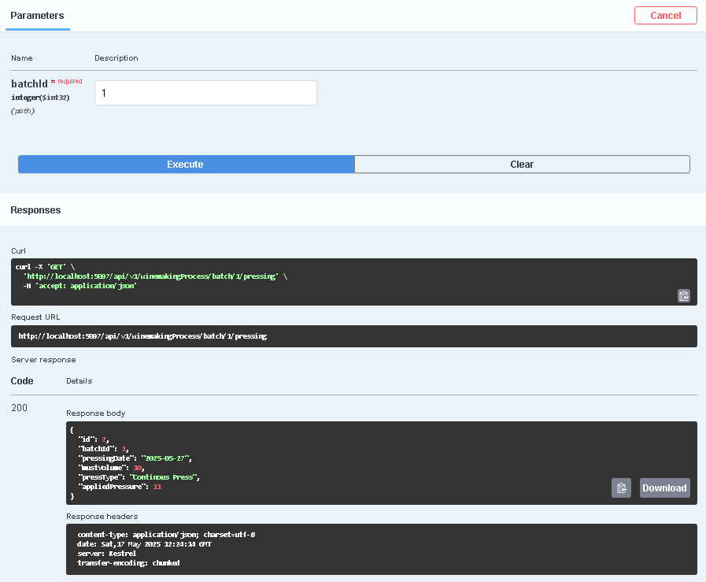</td>
		</tr>
	</tbody>
</table>

<table border="1">
	<tbody>
		<tr>
			<td>Método</td>
			<td>POST {batchId}</td>
		</tr>
		<tr>
			<td>Parámetros</td>
			<td>batchId: id del lote  
            Body: pressingDate, mustVolume, pressType, appliedPressure</td>
		</tr>
		<tr>
			<td>Resultado</td>
			<td>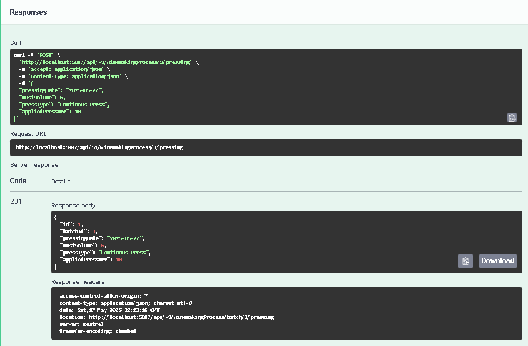</td>
		</tr>
	</tbody>
</table>

<table border="1">
	<tbody>
		<tr>
			<td>Método</td>
			<td>DELETE {batchId}</td>
		</tr>
		<tr>
			<td>Parámetros</td>
			<td>batchId: id del lote</td>
		</tr>
		<tr>
			<td>Resultado</td>
			<td>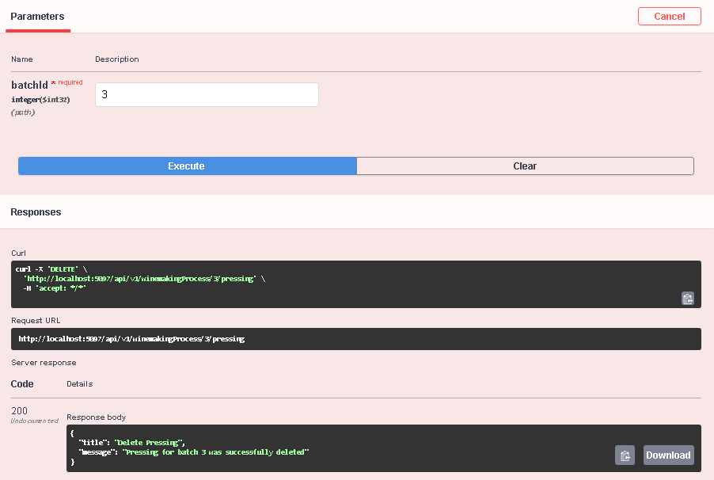</td>
		</tr>
	</tbody>
</table>

<table border="1">
	<tbody>
		<tr>
			<td>Método</td>
			<td>PUT {batchId}</td>
		</tr>
		<tr>
			<td>Parámetros</td>
			<td>batchId: id del lote  
            Body: pressingDate, mustVolume, pressType, appliedPressure</td>
		</tr>
		<tr>
			<td>Resultado</td>
			<td></td>
		</tr>
	</tbody>
</table>

Aging 

<table border="1">
	<tbody>
		<tr>
			<td>Método</td>
			<td>GET {batchId}</td>
		</tr>
		<tr>
			<td>Parámetros</td>
			<td>batchId: id del lote</td>
		</tr>
		<tr>
			<td>Resultado</td>
			<td>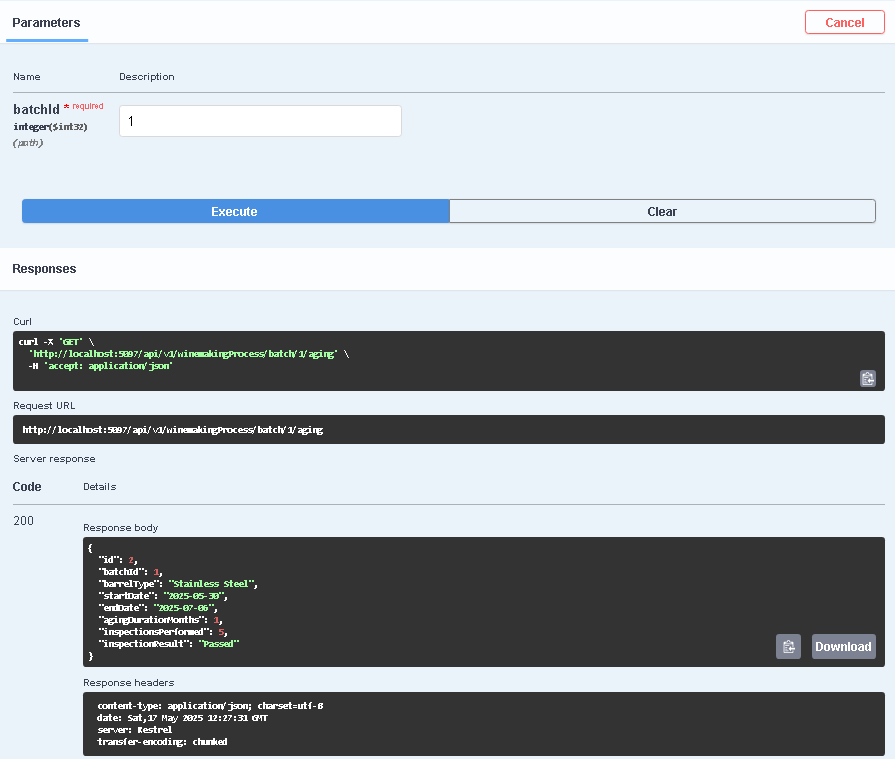</td>
		</tr>
	</tbody>
</table>

<table border="1">
	<tbody>
		<tr>
			<td>Método</td>
			<td>POST {batchId}</td>
		</tr>
		<tr>
			<td>Parámetros</td>
			<td>batchId: id del lote  
            Body: barrelType, startDate, endDate, agingDurationMonths, inspectionsPerformed, inspectionResult</td>
		</tr>
		<tr>
			<td>Resultado</td>
			<td>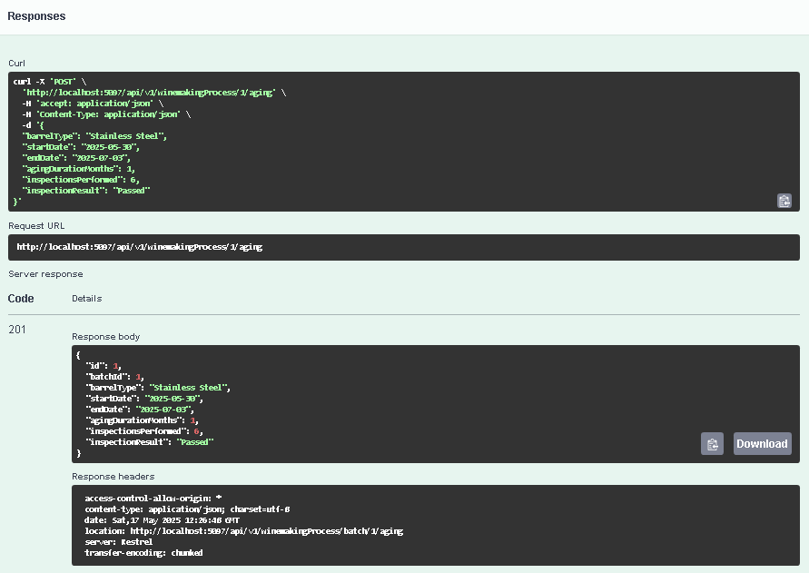</td>
		</tr>
	</tbody>
</table>

<table border="1">
	<tbody>
		<tr>
			<td>Método</td>
			<td>DELETE {batchId}</td>
		</tr>
		<tr>
			<td>Parámetros</td>
			<td>batchId: id del lote</td>
		</tr>
		<tr>
			<td>Resultado</td>
			<td>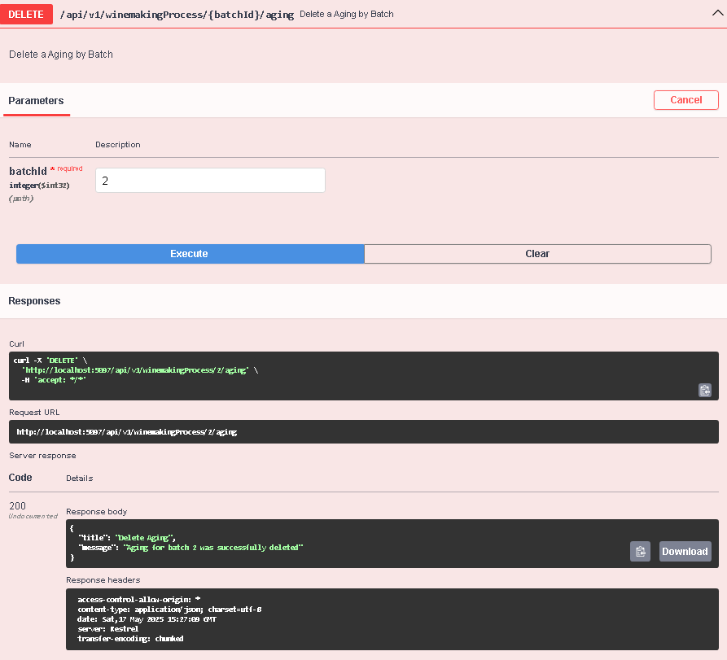</td>
		</tr>
	</tbody>
</table>

<table border="1">
	<tbody>
		<tr>
			<td>Método</td>
			<td>PUT {batchId}</td>
		</tr>
		<tr>
			<td>Parámetros</td>
			<td>batchId: id del lote  
            Body: barrelType, startDate, endDate, agingDurationMonths, inspectionsPerformed, inspectionResult</td>
		</tr>
		<tr>
			<td>Resultado</td>
			<td>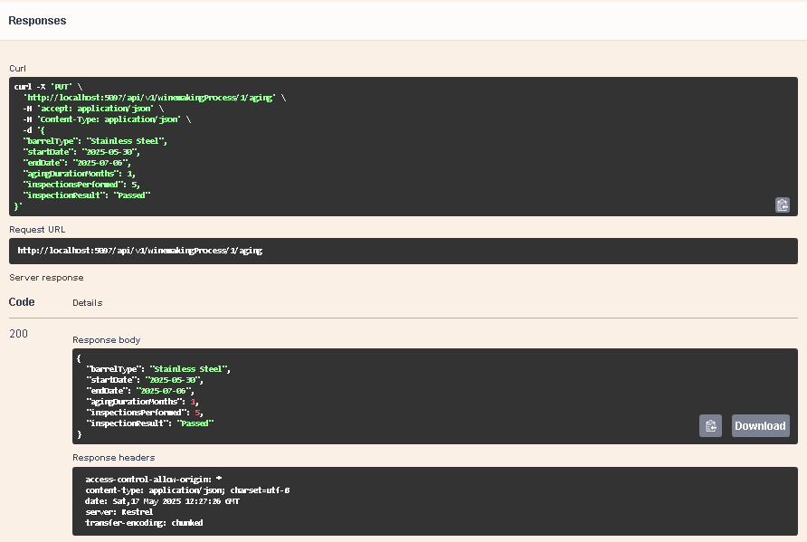</td>
		</tr>
	</tbody>
</table>

Bottling 

<table border="1">
	<tbody>
		<tr>
			<td>Método</td>
			<td>GET {batchId}</td>
		</tr>
		<tr>
			<td>Parámetros</td>
			<td>batchId: id del lote</td>
		</tr>
		<tr>
			<td>Resultado</td>
			<td>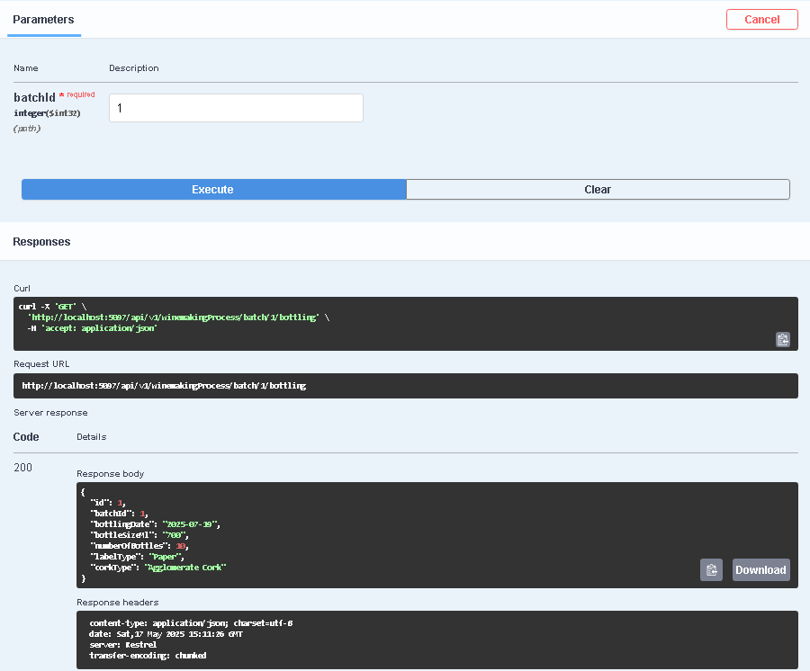</td>
		</tr>
	</tbody>
</table>

<table border="1">
	<tbody>
		<tr>
			<td>Método</td>
			<td>POST {batchId}</td>
		</tr>
		<tr>
			<td>Parámetros</td>
			<td>batchId: id del lote  
            Body: bottlingDate, bottleSizeMl, numberOfBottles, labelType, corkType</td>
		</tr>
		<tr>
			<td>Resultado</td>
			<td>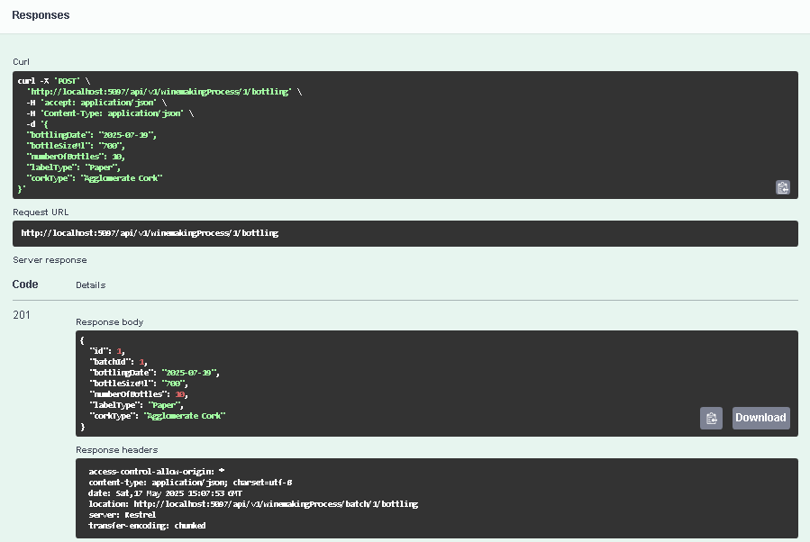</td>
		</tr>
	</tbody>
</table>

<table border="1">
	<tbody>
		<tr>
			<td>Método</td>
			<td>DELETE {batchId}</td>
		</tr>
		<tr>
			<td>Parámetros</td>
			<td>batchId: id del lote</td>
		</tr>
		<tr>
			<td>Resultado</td>
			<td>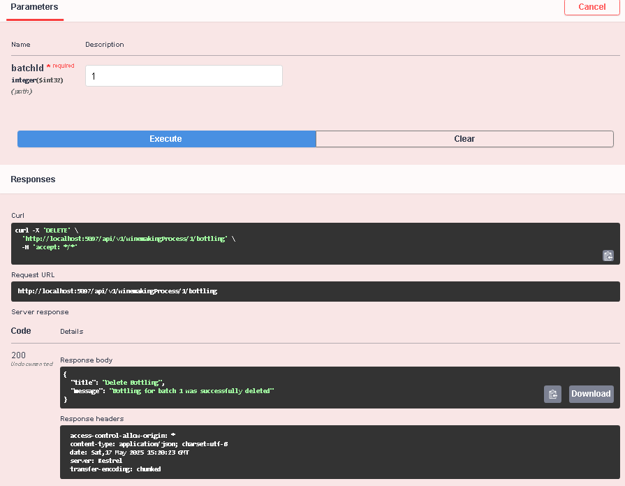</td>
		</tr>
	</tbody>
</table>

### 5.2.8. Team Collaboration Insights
En esta sección se muestra la colaboración de los integrantes del equipo en el desarrollo del producto digital. Se puede ver el trabajo de cada integrante el cual es notable según sus habilidades y conocimientos en el área de la tecnología.

Landing Page:

Frontend Web Application:

Frontend Mobile Application:

Backend:

## 5.3. Video About-the-Product

