# Capítulo VI: Product Verification & Validation

## 6.1. Testing suites & validation

## 6.1.1. Core Entities Unit Tests.

Los Core Entities Unit Tests son esenciales en el desarrollo de software, ya que garantizan la calidad y
correcto funcionamiento de las entidades centrales, previniendo errores y facilitando el mantenimiento
del código.

User Tests:

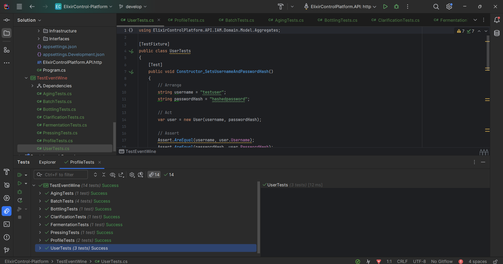

Profile Tests:

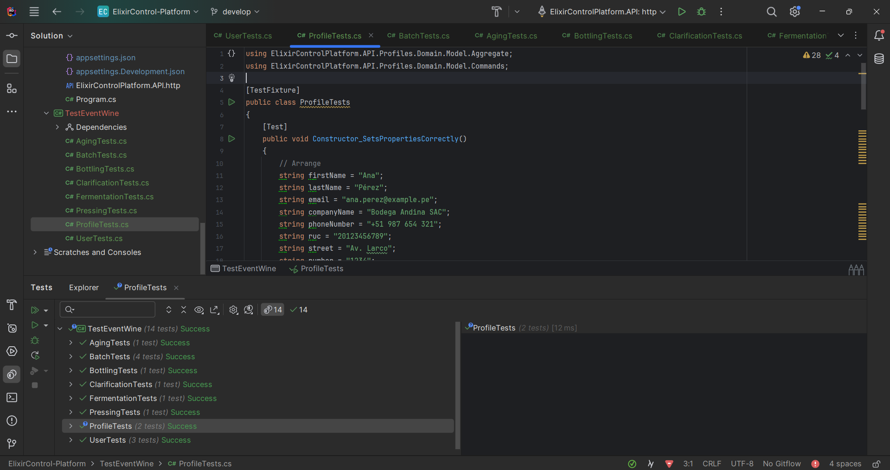

Batch Tests:

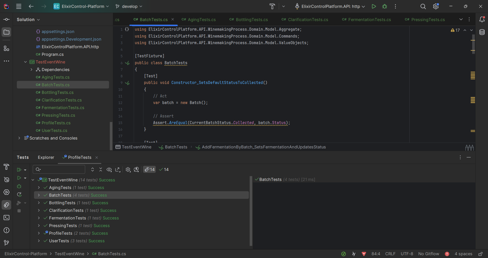

Fermentation Tests:

Clarification Tests:

Pressing Tests:

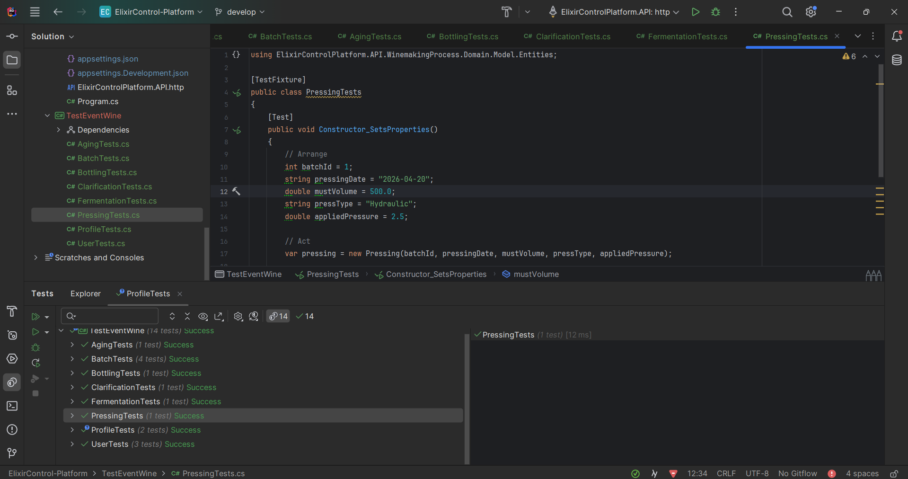

Aging Tests:

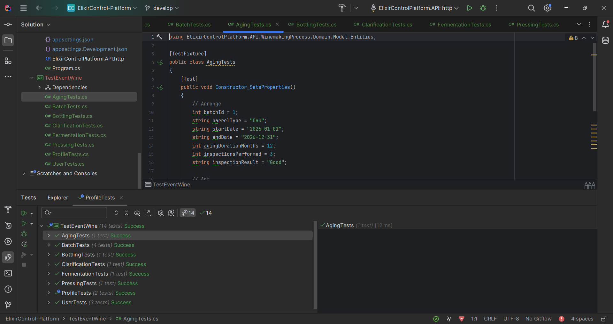

Bottling Tests:

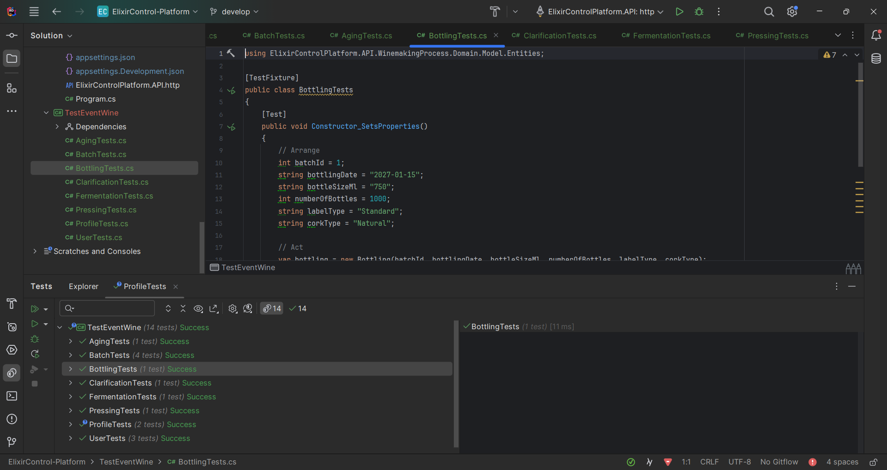

## 6.1.2. Core Integration Tests.

Las Core Integration Tests son fundamentales para asegurar que los controladores interactúen
correctamente con otros componentes del sistema, como servicios y bases de datos. Al evaluar escenarios
de error, estas pruebas garantizan que el sistema maneje adecuadamente situaciones inesperadas y
responda con los códigos de estado correctos. Esto mejora la experiencia del usuario, facilita la
depuración y contribuye a desarrollar un software confiable y de alta calidad.

Profile Controller:

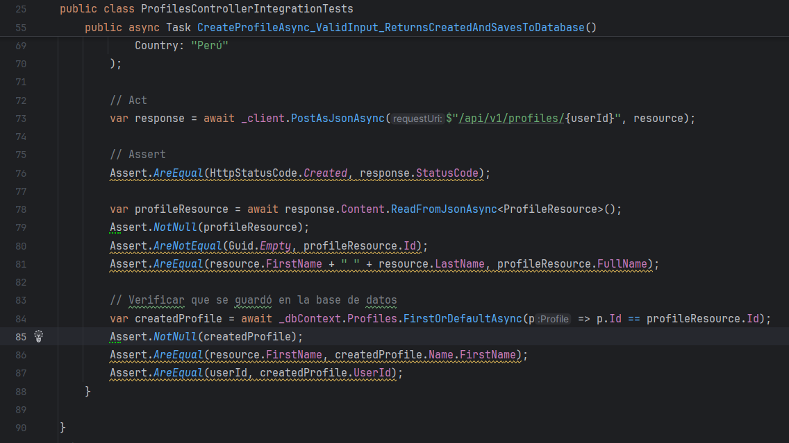

Batch Controller:

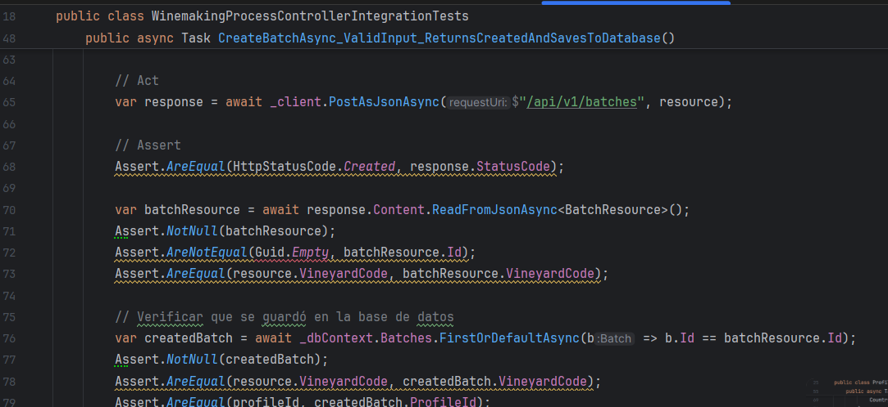

## 6.1.3. Core Behavior-Driven Development

Durante esta etapa, el equipo aplicó técnicas de Behavior-Driven Development (BDD) para definir y verificar el comportamiento esperado de la solución desde la perspectiva del usuario final. Se utilizaron historias de usuario previamente definidas y se transformaron en escenarios concretos expresados en lenguaje Gherkin, permitiendo una comunicación clara entre equipo técnico y no técnico.

Para la implementación se utilizó la herramienta SpecFlow, integrada con el framework de pruebas NUnit, lo que facilitó la escritura y ejecución de pruebas automatizadas alineadas a los criterios de aceptación de cada historia.

A continuación, se presentan las historias de usuario validadas con BDD y sus respectivos escenarios implementados:

| User Story         | Descripción                                                             | Escenarios BDD Implementados                                                                 |
|--------------------|-------------------------------------------------------------------------|-----------------------------------------------------------------------------------------------|
| **US04 – Fermentación** | Registro y control del estado de fermentación de un lote               | - Finalización exitosa de la fermentación - Error en el registro de tiempo                |
| **US05 – Clarificación** | Registro del uso de agentes clarificantes y finalización del proceso   | - Agentes clarificantes añadidos - Finalización exitosa de clarificación                  |
| **US06 – Prensado**     | Registro del inicio y resultados del proceso de prensado               | - Inicio del prensado - Error durante registro - Registro de jugo extraído             |
| **US07 – Añejamiento**  | Documentación del inicio, errores y finalización del añejamiento       | - Inicio del añejamiento - Error al guardar condiciones - Registro de finalización     |
| **US08 – Embotellado**  | Registro de producción embotellada y errores durante el proceso        | - Inicio del embotellado - Error al registrar lote - Registro de finalización          |

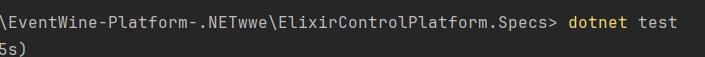

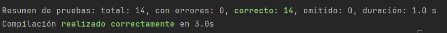

Cada uno de estos escenarios fue ejecutado exitosamente mediante dotnet test, garantizando que el sistema responde correctamente ante flujos esperados y excepcionales. Este enfoque BDD permitió validar no solo funcionalidades individuales, sino también la coherencia del flujo de producción del vino en cada etapa.

## 6.1.4. Core System Tests.

Tests en Selenium:

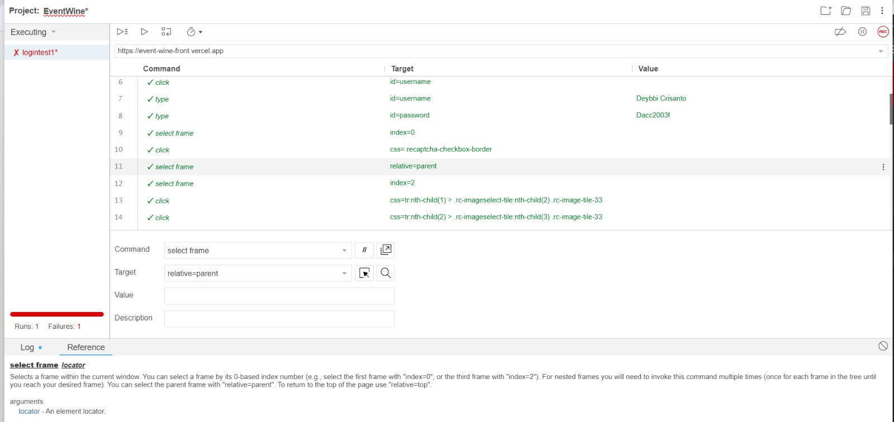

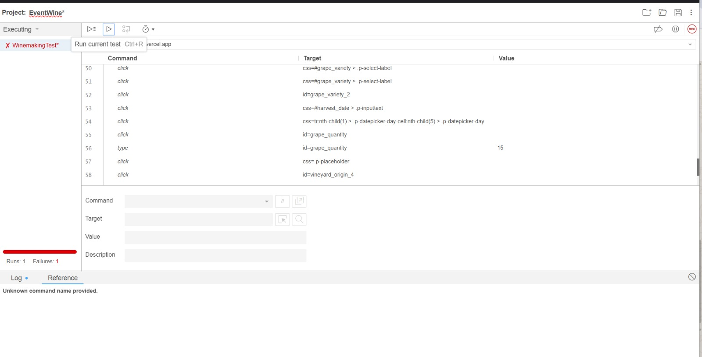

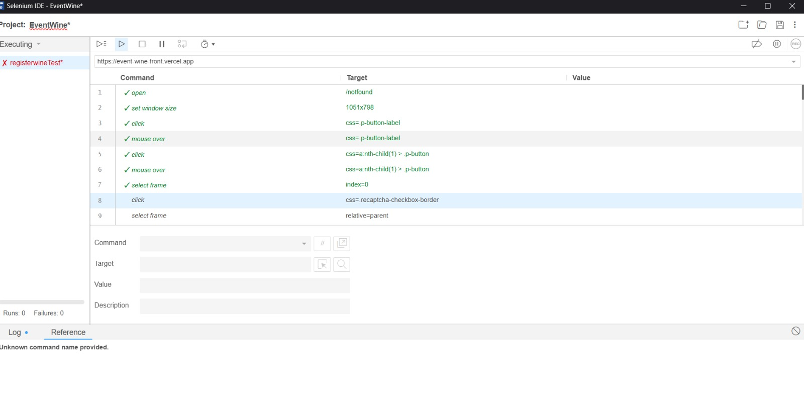

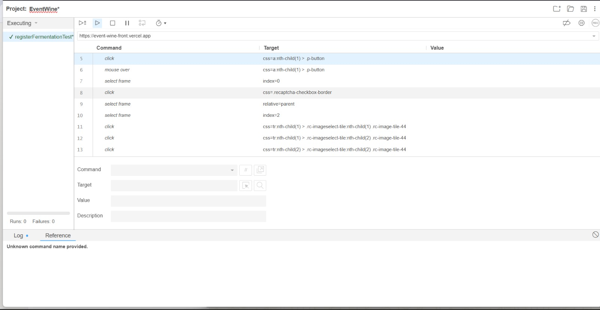

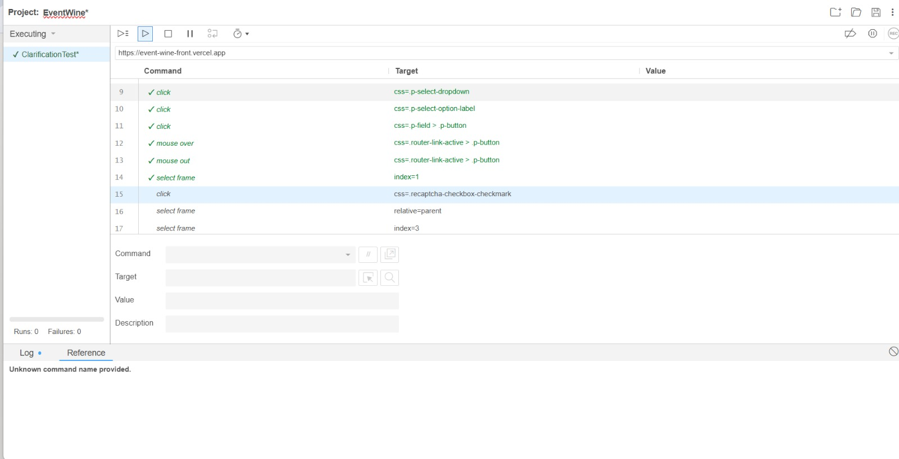

Tests en Lighthouse:

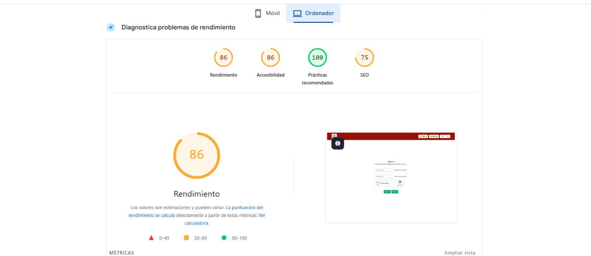

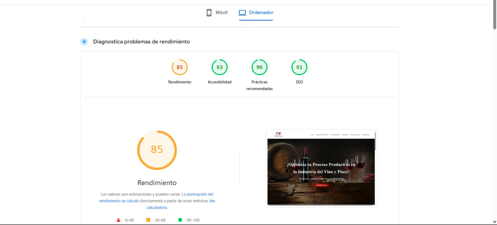

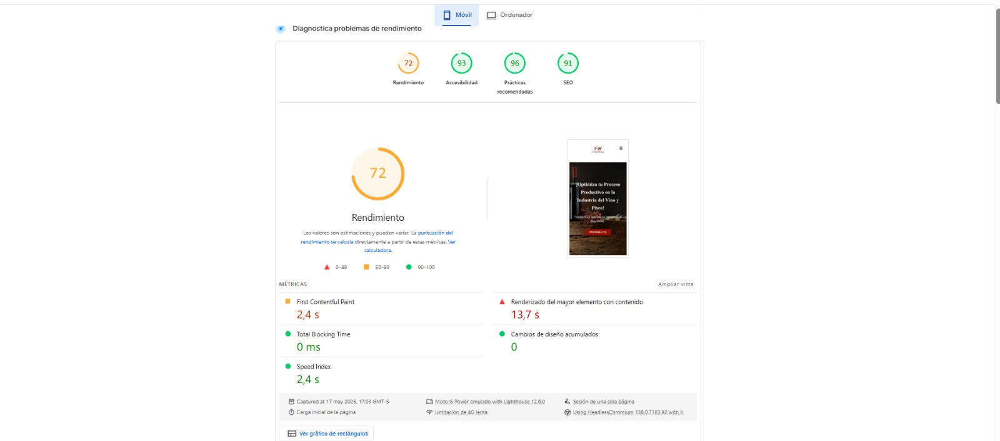

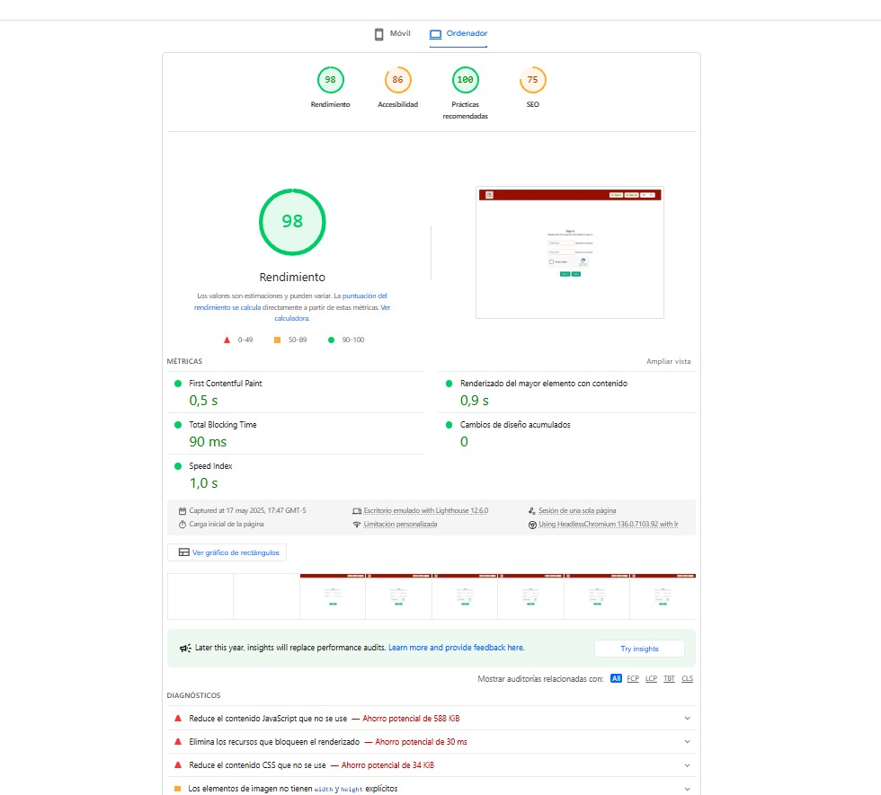

## 6.2. Static testing & Verification
### 6.2.1. Static Code Analysis
#### 6.2.1.1. Coding standard & Code conventions.
#### 6.2.1.2. Code Quality & Code Security.
### 6.2.2. Reviews
## 6.3. Validation Interviews.
### 6.3.1. Diseño de entrevistas

A continuación se presentan las preguntas de **validación** utilizadas durante las entrevistas con productores de vino. Estas se dividen en dos bloques: uno enfocado en la **landing page** y otro en la **aplicación web**, con el propósito de evaluar la comprensión, usabilidad y coherencia de cada parte con el flujo de trabajo de los usuarios.

#### Preguntas sobre la Landing Page

- Al navegar por primera vez en EventWine, ¿logras identificar rápidamente cuál es su función principal?
- ¿La distribución de elementos en la landing page te permite ubicar fácilmente las opciones que necesitas?
- ¿El vocabulario técnico utilizado corresponde con los términos que manejas en tu proceso cotidiano?
- ¿Percibes uniformidad en el diseño de la página de inicio con el resto del sistema?
- ¿Hay elementos que esperarías encontrar en cierta ubicación pero están en otra parte?

#### Preguntas sobre la Aplicación Web

- ¿El orden de las etapas productivas (lotes, fermentación, clarificación, etc.) refleja tu secuencia real de trabajo?
- ¿La forma de registrar datos de cada proceso te resulta intuitiva comparada con tus métodos actuales?
- ¿Puedes identificar claramente cómo acceder a la información histórica de tus producciones anteriores?
- ¿Notas cuando el sistema está procesando información o guardando cambios que realizas?
- ¿Te resulta evidente cuándo has completado exitosamente una tarea o registro?
- ¿El proceso para crear tu cuenta y acceder al sistema te parece directo?
- ¿Percibes uniformidad en el diseño mientras navegas entre diferentes secciones?
- ¿Qué aspecto de la plataforma consideras que podría generar mayor dificultad a productores como tú?
- ¿Cuál sería la modificación más importante que harías para mejorar tu experiencia de uso?

### 6.3.2. Registro de Entrevistas.

**Segmento Objetivo: Productor de Vino**

<u>Entrevita01</u>  

**Nombres:** Rusbell  

**Apellidos:** Verde Porras

**Edad:** 30 años

**Ciudad:** Ica

**Evidencia de la reunión:**
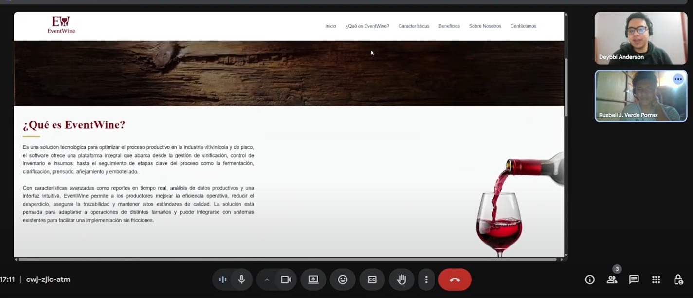
Enlace de entrevista: [https://youtu.be/XHuBVR8w830](https://youtu.be/XHuBVR8w830)

**Resumen de la entrevista :**

Rusbell Verde Porras, productor de vino con más de 10 años de experiencia, compartió sus impresiones sobre la plataforma EventWine. En primer lugar, destacó que la landing page le resultó clara, fácil de navegar y coherente en su diseño y terminología. Esta familiaridad con los términos técnicos utilizados le permitió sentirse cómodo desde el inicio, facilitando su interacción con la herramienta.

Durante su experiencia con la aplicación web, Rusbell valoró positivamente el orden lógico con el que están organizadas las etapas del proceso productivo. Mencionó que los formularios son sencillos de completar y permiten registrar información de manera rápida y eficiente, lo cual es clave para optimizar el trabajo diario en la bodega. Además, señaló que la opción de exportar datos a Excel funciona correctamente, lo que le ayuda a gestionar mejor la información almacenada.

Sin embargo, también identificó algunas áreas de mejora. Entre ellas, sugirió reforzar la retroalimentación visual al guardar cambios, ya que en algunos casos no quedaba claro si una acción se había completado correctamente. También recomendó mostrar de forma más evidente el estado del sistema durante los procesos, para brindar mayor seguridad al usuario. En cuanto al diseño visual, propuso mejorar la combinación de colores de ciertos elementos para lograr una estética más armónica. Asimismo, consideró importante incluir mensajes de confirmación antes de ejecutar acciones importantes, como la eliminación de registros, con el fin de evitar errores accidentales.

En resumen, Rusbell expresó que EventWine es una plataforma práctica, funcional y con gran potencial para facilitar el trabajo de los productores de vino. Reconoció que, con las mejoras sugeridas, la herramienta podría perfeccionarse aún más y ofrecer una experiencia de usuario aún más robusta y atractiva.

### 6.3.3. Evaluaciones según heurísticas.
## 6.4. Auditoría de Experiencias de Usuario.
### 6.4.1. Auditoría realizada.
#### 6.4.1.1. Información del grupo auditado.

- Nombre del responsable de auditoría: ***EventWine***
- Especialización: Especialistas en diseño de interfaces (UI), accesibilidad web y
  evaluación de experiencias inclusivas.
- Fecha de auditoría: 14/06/2025 - 21/06/2025
- Herramientas utilizadas:
    - Selenium, para simular interacciones de usuario y detectar posibles problemas en los flujos de navegación.
    - Lighthouse, para evaluar el rendimiento, la accesibilidad, las mejores prácticas y el SEO de la interfaz.
    - WebPageTest, para medir tiempos de carga y rendimiento desde diferentes ubicaciones y dispositivos.
    - RedLine13, utilizada para pruebas de carga y rendimiento en escenarios de alto tráfico.
    - Otras herramientas complementarias conocidas fueron empleadas para obtener una visión integral del comportamiento y la experiencia del usuario.
#### 6.4.1.2. Cronograma de auditoría realizada.
| Fecha      | Actividad                                                                         | Responsable     |
| ---------- | --------------------------------------------------------------------------------- | --------------- |
| 14/06/2025 | Evaluación de accesibilidad automática con Lighthouse y WebPageTest               | Deybbi Crisanto |
| 14/06/2025 | Simulación de navegación con lector de pantalla (NVDA)                            | Moises Donayre  |
| 15/06/2025 | Análisis de estructura de navegación y flujos críticos                            | Gustavo Huanca  |
| 15/06/2025 | Revisión de formularios: validaciones, mensajes de error y campos obligatorios    | July Paico      |
| 16/06/2025 | Verificación del contraste de colores y jerarquía visual según estándares WCAG    | Jesús Paucar    |
| 16/06/2025 | Evaluación de consistencia de íconos, botones y etiquetas en diferentes vistas    | Moises Donayre  |
| 17/06/2025 | Pruebas de cambio de idioma (i18n) y cobertura de traducciones EN/ES              | July Paico      |
| 17/06/2025 | Revisión de tiempos de carga y rendimiento (RedLine13 y WebPageTest)              | Gustavo Huanca  |
| 18/06/2025 | Detección de errores de diseño en pantallas de registro, login y módulos internos | Jesús Paucar    |
| 18/06/2025 | Documentación de hallazgos críticos y clasificación por severidad                 | Deybbi Crisanto |
| 19/06/2025 | Elaboración de propuestas de mejora visual, estructural y de contenido            | July Paico      |
| 19/06/2025 | Sesión de revisión interna de observaciones y ajustes sugeridos                   | Moises Donayre  |
| 20/06/2025 | Redacción del informe final con capturas, evidencias y criterios heurísticos      | Gustavo Huanca  |
| 20/06/2025 | Presentación oficial de hallazgos y entregables al equipo de desarrollo y cliente | Deybbi Crisanto |
#### 6.4.1.3. Contenido de auditoría realizada.
| #   | Problema                                                                                                                                                       | Escala de severidad | Heurística/Principio violado(a)                                   |
| --- | -------------------------------------------------------------------------------------------------------------------------------------------------------------- | ------------------- | ----------------------------------------------------------------- |
| 1   | Los textos de botones como "Ver Detalle" o "Registrar" presentan bajo contraste con el fondo, dificultando su visualización para usuarios con visión reducida. | 3                   | Accesibilidad; Estética y diseño minimalista                      |
| 2   | El mismo modelo y placa de vehículo se repite varias veces (ej. ABC123), lo que puede causar confusión al usuario.                                             | 3                   | Consistencia y estándares                                         |
| 3   | Algunas imágenes de perfil no cargan o muestran íconos rotos (ej. avatar en la sección de perfil), lo que afecta la percepción de calidad.                     | 2                   | Estética y diseño minimalista; Visibilidad del estado del sistema |
| 4   | En el formulario de registro de vehículo, los campos de ID no tienen validación ni etiquetas explicativas, lo que puede confundir al usuario.                  | 3                   | Ayuda y documentación; Prevención de errores                      |
| 5   | No se indica visualmente qué campos son obligatorios en formularios como "Editar Perfil" o "Registrar Vehículo".                                               | 2                   | Prevención de errores; Estética y diseño minimalista              |
| 6   | La información de los reportes no se puede filtrar o buscar, lo cual dificulta la eficiencia en sistemas con grandes volúmenes de datos.                       | 2                   | Flexibilidad y eficiencia de uso                                  |
| 7   | No existe retroalimentación al guardar cambios en el perfil, como un mensaje de éxito o error.                                                                 | 2                   | Visibilidad del estado del sistema                                |
| 8   | Algunos textos y componentes están desalineados visualmente (ej. títulos de tarjetas de reporte), afectando la estética general del sistema.                   | 1                   | Estética y diseño minimalista                                     |
### 6.4.2. Auditoría recibida.
#### 6.4.2.1. Información del grupo auditor.
El grupo auditor estuvo conformado por especialistas en experiencia de usuario, accesibilidad y rendimiento web. Contaban con conocimientos en herramientas como Selenium, Lighthouse y WebPageTest, lo que permitió realizar una evaluación técnica y centrada en el usuario, garantizando resultados precisos y relevantes para la mejora del sistema.
- Nombre del responsable de auditoría: ***LosTesters***
- Especialización: Especialistas en diseño de interfaces (UI), accesibilidad web y
  evaluación de experiencias inclusivas.
- Fecha de auditoría: 14/06/2025 - 21/06/2025
- Herramientas utilizadas:
    - Selenium, para simular interacciones de usuario y detectar posibles problemas en los flujos de navegación.
    - Lighthouse, para evaluar el rendimiento, la accesibilidad, las mejores prácticas y el SEO de la interfaz.
    - WebPageTest, para medir tiempos de carga y rendimiento desde diferentes ubicaciones y dispositivos.
    - RedLine13, utilizada para pruebas de carga y rendimiento en escenarios de alto tráfico.
    - Otras herramientas complementarias conocidas fueron empleadas para obtener una visión integral del comportamiento y la experiencia del usuario.
#### 6.4.2.2. Cronograma de auditoría recibida.
| Fecha      | Actividad                                                                | Responsable        |
| ---------- | ------------------------------------------------------------------------ | ------------------ |
| 14/06/2025 | Análisis de resultados y redacción del informe preliminar                | Fabrizio Sanchez   |
| 14/06/2025 | Revisión cruzada del informe y validación de hallazgos                   | Juan Cueto         |
| 14/06/2025 | Presentación de resultados y recomendaciones de mejora al equipo cliente | Flavio Trigueros   |
| 15/06/2025 | Revisión del diseño visual con base en los hallazgos                     | Aldhair Valenzuela |
| 16/06/2025 | Implementación de ajustes de accesibilidad                               | Piero Tarazona     |
| 17/06/2025 | Optimización del rendimiento basada en métricas de Lighthouse            | Juan Cueto         |
| 18/06/2025 | Pruebas de regresión automatizadas con Selenium                          | Juan Cueto         |
| 19/06/2025 | Validación final con usuarios                                            | Fabrizio Sanchez   |
| 20/06/2025 | Recopilación de feedback posterior a ajustes                             | Flavio Trigueros   |
| 21/06/2025 | Elaboración del informe final de auditoría                               | Aldhair Valenzuela |
#### 6.4.2.3. Contenido de auditoría recibida.
| #   | Problema                                                                                                                                              | Escala de severidad | Heurística/Principio violado(a)                                  |
| --- | ----------------------------------------------------------------------------------------------------------------------------------------------------- | ------------------- | ---------------------------------------------------------------- |
| 1   | El contraste entre el texto rojo oscuro y el fondo negro en la pantalla principal dificulta la lectura, especialmente para usuarios con baja visión.  | 3                   | Accesibilidad; Estética y diseño minimalista                     |
| 2   | El logo y los botones en el header se ven muy pequeños en resoluciones altas, lo que afecta su visibilidad y comprensión.                             | 2                   | Estética y diseño minimalista; Consistencia y estándares         |
| 3   | Los botones de navegación como “Sign In” y “Home” no tienen etiquetas accesibles (aria-label), lo cual dificulta su uso con lectores de pantalla.   | 4                   | Accesibilidad; Ayuda y documentación                             |
| 4   | La interfaz de los módulos (fermentación, clarificación, etc.) no mantiene una jerarquía visual clara entre las secciones, generando confusión.       | 2                   | Consistencia y estándares                                        |
| 5   | No hay retroalimentación visual (loading, confirmación) al presionar botones como “Export” o “New”, lo que puede generar incertidumbre en el usuario. | 3                   | Visibilidad del estado del sistema; Prevención de errores        |
| 6   | Las validaciones de los formularios no explican con claridad qué se requiere, solo indican que un campo es obligatorio sin mayor contexto.            | 2                   | Prevención de errores; Ayuda y documentación                     |
| 7   | No se observa un modo claro para modificar o visualizar en detalle los registros ingresados, lo que limita la flexibilidad del sistema.               | 2                   | Flexibilidad y eficiencia de uso; Control y libertad del usuario |
| 8   | El cambio de idioma (EN/ES) no aplica a todo el contenido de la página, afectando la coherencia para usuarios que no dominan ambos idiomas.           | 3                   | Consistencia y estándares; Flexibilidad y eficiencia de uso      |
| 9   | No se permite cambiar el tamaño del texto ni se detecta compatibilidad con funciones de zoom del navegador, afectando la accesibilidad.               | 4                   | Accesibilidad                                                    |
| 10  | Algunos formularios (como el de registro) presentan criterios visuales muy estrictos para contraseñas, pero no incluyen ayuda contextual al respecto. | 3                   | Prevención de errores; Ayuda y documentación                     |

### DESCRIPCIÓN DE PROBLEMAS

#### PROBLEMA #1: Contraste insuficiente entre texto y fondo
- **Severidad:** 3
- **Heurística violada:** Accesibilidad; Estética y diseño minimalista
- **Problema:**  
  El texto en rojo oscuro sobre el fondo negro en la pantalla principal tiene un contraste por debajo del ratio mínimo recomendado de 4.5:1, lo cual dificulta su lectura para usuarios con baja visión.  
  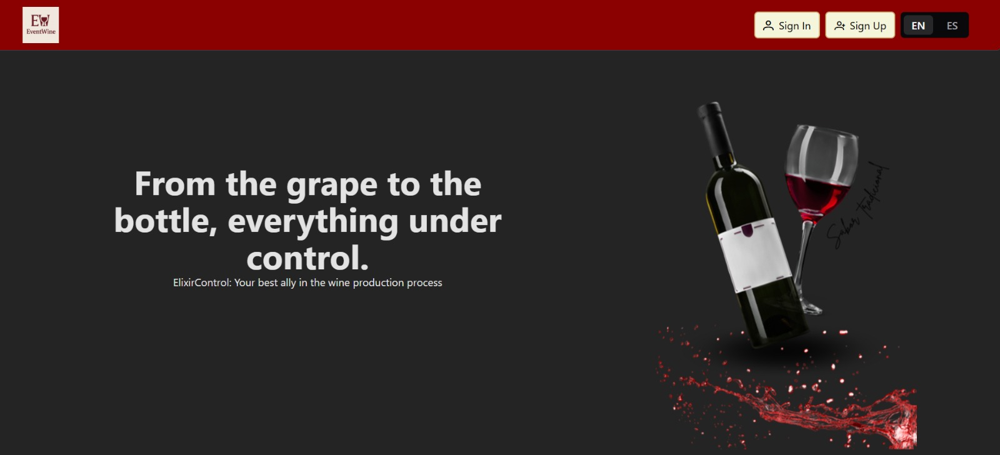
- **Recomendación:**  
  Ajustar los colores CSS para alcanzar al menos 4.5:1 (por ejemplo, usar un rojo más brillante o un fondo más claro) y actualizar las variables de paleta en todo el sistema.

---

#### PROBLEMA #2: Tamaño reducido de logo y botones en el header
- **Severidad:** 2
- **Heurística violada:** Estética y diseño minimalista; Consistencia y estándares
- **Problema:**  
  En resoluciones altas, el logo y los botones del encabezado (header) se muestran muy pequeños, lo que reduce su visibilidad y dificulta la navegación.  
  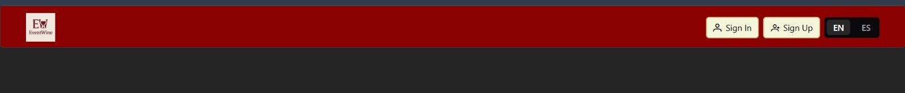
- **Recomendación:**  
  Redefinir dimensiones usando unidades relativas (`rem`, `vw`) y media queries para escalar adecuadamente en pantallas grandes.

---

#### PROBLEMA #3: Falta de etiquetas accesibles en botones de navegación
- **Severidad:** 4
- **Heurística violada:** Accesibilidad; Ayuda y documentación
- **Problema:**  
  Los botones “Sign In” y “Home” carecen de atributos `aria-label`, por lo que los lectores de pantalla no pueden describir su función correctamente.  
  
- **Recomendación:**  
  Añadir `aria-label="Iniciar sesión"` y `aria-label="Inicio"` (u otras descripciones apropiadas) a cada elemento interactivo, y validar con herramientas de accesibilidad.

---

#### PROBLEMA #4: Jerarquía visual poco clara en módulos
- **Severidad:** 2
- **Heurística violada:** Consistencia y estándares
- **Problema:**  
  Los módulos (fermentación, clarificación, etc.) no distinguen visualmente sus secciones mediante tamaños de título o espaciados adecuados, generando confusión al usuario.  
  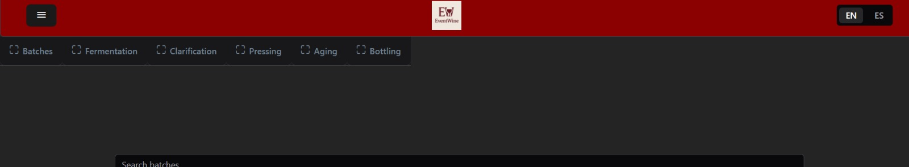
- **Recomendación:**  
  Definir estilos tipográficos claros (H1–H4) y usar contenedores con sombra suave y bordes redondeados para separar cada módulo.

---

### PROBLEMA #5: Falta de retroalimentación visual al interactuar
- **Severidad:** 3
- **Heurística violada:** Visibilidad del estado del sistema; Prevención de errores
- **Problema:**  
  Al pulsar “Export” o “New” no aparece ningún indicador de carga ni confirmación, lo que deja al usuario inseguro sobre si la acción se está procesando.  
  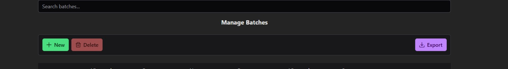
- **Recomendación:**  
  Implementar spinners o skeletons en los botones durante las peticiones y mostrar notificaciones toast al completar o fallar la operación.

---

#### PROBLEMA #6: Mensajes de validación de formularios demasiado genéricos
- **Severidad:** 2
- **Heurística violada:** Prevención de errores; Ayuda y documentación
- **Problema:**  
  Los formularios sólo indican “Campo obligatorio” sin detallar qué debe ingresarse ni el formato esperado, lo cual confunde al usuario.  
  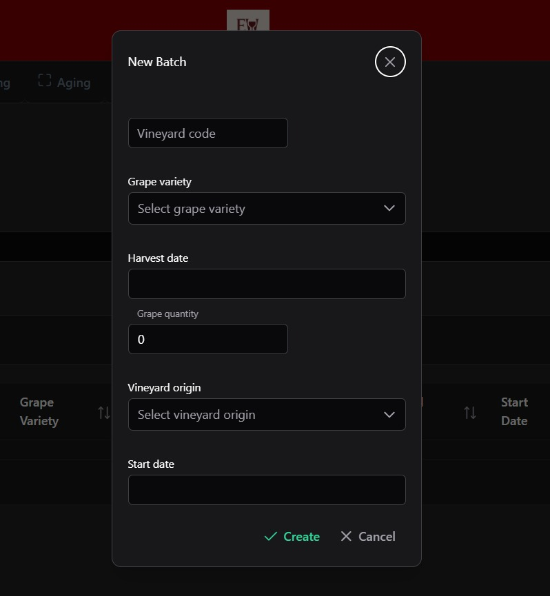
- **Recomendación:**  
  Mostrar mensajes específicos (“Debe indicar su nombre completo”, “Ingrese un correo válido”), y validar en tiempo real resaltando el campo con borde y descripción.

---

#### PROBLEMA #7: Imposibilidad de editar o ver detalles de registros
- **Severidad:** 2
- **Heurística violada:** Flexibilidad y eficiencia de uso; Control y libertad del usuario
- **Problema:**  
  No existe opción clara para modificar o expandir la información de un registro ya ingresado, obligando al usuario a eliminar y recrear entradas.
- **Recomendación:**  
  Añadir botones “Ver detalles” y “Editar” en cada fila, y diseñar vistas o modales para mostrar y actualizar registros.

---

#### PROBLEMA #8: Cambio de idioma incompleto
- **Severidad:** 3
- **Heurística violada:** Consistencia y estándares; Flexibilidad y eficiencia de uso
- **Problema:**  
  El selector EN/ES no traduce todos los textos (etiquetas, botones y mensajes), dejando mezclas de idiomas que confunden al usuario.  
  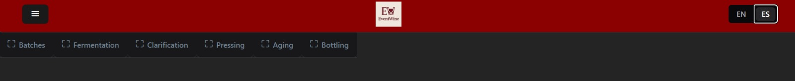
- **Recomendación:**  
  Revisar y completar los archivos de internacionalización (i18n) para cada componente, y automatizar pruebas que verifiquen el recambio de idioma.

---

#### PROBLEMA #9: Incompatibilidad con zoom y cambio de tamaño de texto
- **Severidad:** 4
- **Heurística violada:** Accesibilidad
- **Problema:**  
  El uso de unidades fijas (px) impide que el usuario pueda aumentar el tamaño del texto o hacer zoom sin romper el diseño, dificultando la lectura.
- **Recomendación:**  
  Emplear unidades relativas (`em`, `rem`) y probar la interfaz a distintos niveles de zoom (110 %, 125 %, 150 %) para garantizar adaptabilidad.

---

#### PROBLEMA #10: Ausencia de ayuda contextual en criterios de contraseña
- **Severidad:** 3
- **Heurística violada:** Prevención de errores; Ayuda y documentación
- **Problema:**  
  Los formularios de registro imponen reglas estrictas de contraseña (longitud, caracteres especiales) sin indicarlas ni mostrar un indicador de fortaleza.
- **Recomendación:**  
  Añadir tooltips o texto explicativo junto al campo detallando requisitos (mín. 8 caracteres, mayúsculas, números) y una barra de fortaleza en tiempo real.

#### 6.4.2.4. Resumen de modificaciones para subsanar hallazgos

1. **Contraste de texto y fondo**
    - Actualizar paleta de colores para alcanzar un ratio mínimo de 4.5:1 (WCAG 2.1 AA).
    - Ajustar variables CSS globales para aplicar los nuevos tonos en todas las vistas.

2. **Tamaño de logo y botones en el header**
    - Definir dimensiones en unidades relativas (`rem`, `vw`).
    - Añadir media queries que aumenten el tamaño en pantallas de alta resolución.

3. **Etiquetas accesibles en botones de navegación**
    - Insertar `aria-label` descriptivos en “Sign In”, “Home” y demás controles sin texto visible.
    - Validar la correcta lectura con NVDA/VoiceOver.

4. **Jerarquía visual de módulos**
    - Establecer una escala tipográfica (H1–H4) con espaciados coherentes.
    - Aplicar tarjetas con sombra suave y bordes redondeados para separar secciones.

5. **Retroalimentación visual al interactuar**
    - Implementar spinners o skeleton loaders en botones “Export” y “New” durante operaciones.
    - Mostrar notificaciones toast al finalizar la acción (éxito o error).

6. **Mensajes de validación de formularios**
    - Sustituir “Campo obligatorio” por mensajes específicos (p. ej. “Ingrese su correo electrónico válido”).
    - Habilitar validación en tiempo real con resaltado del campo y leyenda explicativa.

7. **Edición y visualización de registros**
    - Añadir botones “Ver detalles” y “Editar” en cada elemento listado.
    - Crear vistas o modales para mostrar y actualizar la información del registro.

8. **Alcance completo del cambio de idioma**
    - Revisar y completar todos los archivos de internacionalización (i18n).
    - Automatizar pruebas que verifiquen la traducción EN/ES en cada componente.

9. **Soporte de zoom y cambio de tamaño de texto**
    - Remplazar unidades fijas (px) por relativas (`em`, `rem`).
    - Probar la interfaz a zoom 110 %, 125 % y 150 % para asegurar adaptabilidad.

10. **Ayuda contextual para criterios de contraseña**
    - Añadir tooltip o texto explicativo junto al campo de contraseña con requisitos claros.
    - Integrar una barra de fortaleza de contraseña que responda en tiempo real.  
