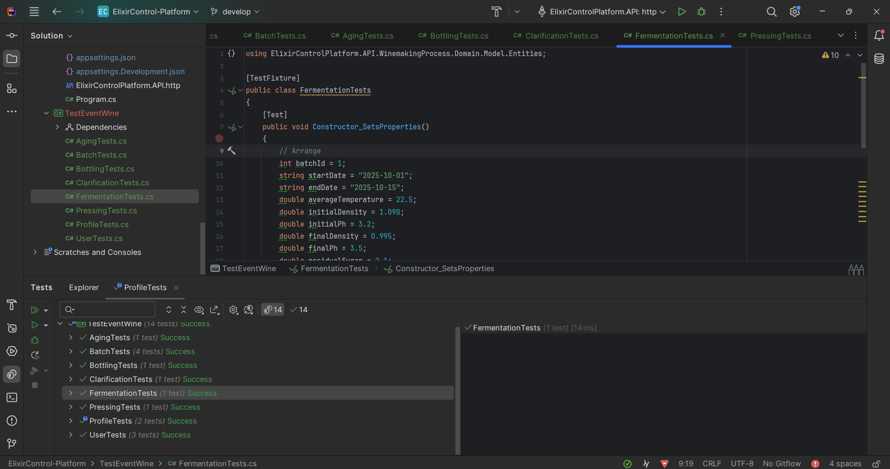
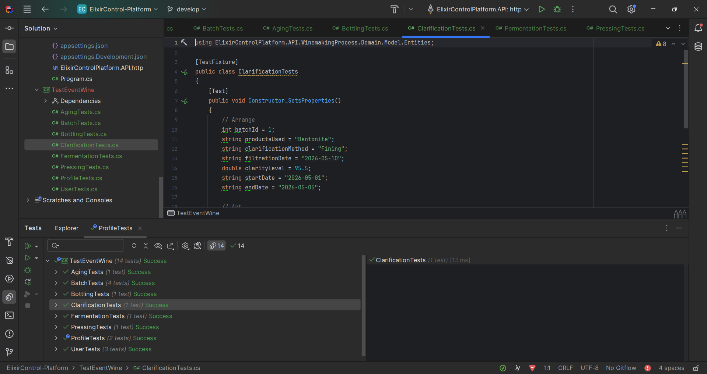

# Capítulo VI: Product Verification & Validation

## 6.1. Testing suites & validation

## 6.1.1. Core Entities Unit Tests.

Los Core Entities Unit Tests son esenciales en el desarrollo de software, ya que garantizan la calidad y
correcto funcionamiento de las entidades centrales, previniendo errores y facilitando el mantenimiento
del código.

User Tests:

Profile Tests:

Batch Tests:

Fermentation Tests:

Clarification Tests:

Pressing Tests:

Aging Tests:

Bottling Tests:

## 6.1.2. Core Integration Tests.

Las Core Integration Tests son fundamentales para asegurar que los controladores interactúen
correctamente con otros componentes del sistema, como servicios y bases de datos. Al evaluar escenarios
de error, estas pruebas garantizan que el sistema maneje adecuadamente situaciones inesperadas y
responda con los códigos de estado correctos. Esto mejora la experiencia del usuario, facilita la
depuración y contribuye a desarrollar un software confiable y de alta calidad.

Profile Controller:

Batch Controller:

## 6.1.3. Core Behavior-Driven Development

Durante esta etapa, el equipo aplicó técnicas de Behavior-Driven Development (BDD) para definir y verificar el comportamiento esperado de la solución desde la perspectiva del usuario final. Se utilizaron historias de usuario previamente definidas y se transformaron en escenarios concretos expresados en lenguaje Gherkin, permitiendo una comunicación clara entre equipo técnico y no técnico.

Para la implementación se utilizó la herramienta SpecFlow, integrada con el framework de pruebas NUnit, lo que facilitó la escritura y ejecución de pruebas automatizadas alineadas a los criterios de aceptación de cada historia.

A continuación, se presentan las historias de usuario validadas con BDD y sus respectivos escenarios implementados:

| User Story         | Descripción                                                             | Escenarios BDD Implementados                                                                 |
|--------------------|-------------------------------------------------------------------------|-----------------------------------------------------------------------------------------------|
| **US04 – Fermentación** | Registro y control del estado de fermentación de un lote               | - Finalización exitosa de la fermentación - Error en el registro de tiempo                |
| **US05 – Clarificación** | Registro del uso de agentes clarificantes y finalización del proceso   | - Agentes clarificantes añadidos - Finalización exitosa de clarificación                  |
| **US06 – Prensado**     | Registro del inicio y resultados del proceso de prensado               | - Inicio del prensado - Error durante registro - Registro de jugo extraído             |
| **US07 – Añejamiento**  | Documentación del inicio, errores y finalización del añejamiento       | - Inicio del añejamiento - Error al guardar condiciones - Registro de finalización     |
| **US08 – Embotellado**  | Registro de producción embotellada y errores durante el proceso        | - Inicio del embotellado - Error al registrar lote - Registro de finalización          |

Cada uno de estos escenarios fue ejecutado exitosamente mediante dotnet test, garantizando que el sistema responde correctamente ante flujos esperados y excepcionales. Este enfoque BDD permitió validar no solo funcionalidades individuales, sino también la coherencia del flujo de producción del vino en cada etapa.

## 6.1.4. Core System Tests.

Tests en Selenium:

Tests en Lighthouse:

## 6.2. Static testing & Verification
### 6.2.1. Static Code Analysis
#### 6.2.1.1. Coding standard & Code conventions.
#### 6.2.1.2. Code Quality & Code Security.
### 6.2.2. Reviews
## 6.3. Validation Interviews.
### 6.3.1. Diseño de Entrevistas.
### 6.3.2. Registro de Entrevistas.
### 6.3.3. Evaluaciones según heurísticas.
## 6.4. Auditoría de Experiencias de Usuario.
### 6.4.1. Auditoría realizada.
#### 6.4.1.1. Información del grupo auditado.
#### 6.4.1.2. Cronograma de auditoría realizada.
#### 6.4.1.3. Contenido de auditoría realizada.
### 6.4.2. Auditoría recibida.
#### 6.4.2.1. Información del grupo auditor.
#### 6.4.2.2. Cronograma de auditoría recibida.
#### 6.4.2.3. Contenido de auditoría recibida.
#### 6.4.2.4. Resumen de modificaciones para subsanar hallazgos.
