# Chapter VIII : Experiment-Driven Development
## 8.1. Experiment Planning
### 8.1.1. As-Is Summary
#### Estado Actual del Sector Vitivinícola
El sector de producción vitivinícola y de pisco presenta una fragmentación significativa en la gestión de procesos productivos. Los productores artesanales y de pequeña escala enfrentan desafíos considerables en la coordinación eficiente de las distintas etapas de vinificación: fermentación, clarificación, prensado, añejamiento y embotellado.

#### Problemática Identificada

**Pain Points Principales:**
- **Gestión fragmentada**: Los productores utilizan métodos manuales dispersos (Excel, cuadernos, registros físicos) que no ofrecen integración entre etapas del proceso
- **Falta de trazabilidad**: Ausencia de visibilidad en tiempo real sobre el estado de cada lote en el proceso productivo
- **Errores en registros manuales**: Alta probabilidad de errores humanos que afectan la calidad y consistencia del producto final
- **Ineficiencia operativa**: Procesos descoordinados que generan pérdidas de tiempo, recursos y oportunidades de optimización
- **Limitada capacidad de análisis**: Dificultad para generar reportes y tomar decisiones basadas en datos históricos del proceso

#### Actores del Ecosistema Actual

**Productores de Vino (Segmento Principal):**
- Vinicultores artesanales con operaciones pequeñas a medianas
- Productores familiares con tradición de 20-50 años en el sector
- Asistentes de bodega que gestionan operaciones diarias
- Técnicos especializados en enología y control de calidad

#### Métodos Actuales de Gestión

Según las entrevistas realizadas, los productores actualmente:
- Utilizan Excel para registros de inventario y control básico
- Mantienen cuadernos físicos para anotaciones de campo
- Gestionan manualmente las cuentas y seguimiento de procesos
- Carecen de integración entre las diferentes etapas productivas
- Dependen de memoria y experiencia para toma de decisiones críticas

---

### 8.1.2. Raw Material: Assumptions, Knowledge Gaps, Ideas, Claims

#### Top 5 Assumptions (Supuestos Clave)

* **A1:** Los productores artesanales de vino están dispuestos a adoptar una solución digital integral que centralice la gestión de todas las etapas de vinificación, reemplazando sus métodos manuales actuales (Excel y cuadernos).

* **A2:** La implementación de herramientas de monitoreo en tiempo real para fermentación, clarificación, prensado, añejamiento y embotellado mejorará la calidad del producto final en un 20% y reducirá problemas operativos en un 15%.

* **A3:** Un sistema de trazabilidad completa desde el lote de uva hasta el embotellado aumentará la confianza del productor y mejorará la precisión del control de stock en un 30%, reduciendo incidencias por desabastecimiento en un 25%.

* **A4:** Una interfaz intuitiva y accesible específicamente diseñada para productores con experiencia tecnológica limitada reducirá la curva de aprendizaje y las consultas de soporte en un 20%, aumentando la adopción activa en un 15%.

* **A5:** El modelo de suscripción escalonado (Básico, Intermedio, Avanzado) permitirá que al menos el 30% de los productores adopten planes premium, generando ingresos recurrentes sostenibles para EventWine.

#### Top 5 Knowledge Gaps (Brechas de Conocimiento)

* **KG1:** ¿Cuál es la disposición real de pago de los productores artesanales por una solución digital, considerando sus márgenes operativos y presupuestos tecnológicos actuales?

* **KG2:** ¿Qué nivel de conectividad a internet y infraestructura tecnológica tienen los productores en zonas rurales como Lunahuaná, y cómo esto afecta la adopción de una plataforma cloud?

* **KG3:** ¿Cuánto tiempo requiere realmente un productor artesanal para completar cada etapa del proceso de vinificación, y cómo esto impacta en la frecuencia de uso de la plataforma?

* **KG4:** ¿Qué regulaciones específicas existen en Perú para el registro digital de procesos vitivinícolas y cómo pueden afectar los requerimientos funcionales de EventWine?

* **KG5:** ¿Cuál es la tasa de rotación de personal en bodegas artesanales y cómo esto influye en la necesidad de capacitación continua y simplicidad de la interfaz?

#### Top 5 Ideas (Oportunidades de Innovación)

* **I1:** Aplicación móvil híbrida (Android/iOS) que permita a los trabajadores de campo registrar datos directamente desde el viñedo y la bodega, sincronizando automáticamente con la plataforma web.

* **I2:** Sistema de alertas inteligentes basado en parámetros críticos (temperatura de fermentación, tiempos de clarificación, densidad) que notifique proactivamente cuando se requiera intervención.

* **I3:** Módulo de reportes automáticos que genere documentación completa del lote al finalizar el embotellado, facilitando la trazabilidad y certificación del producto.

* **I4:** Integration con sensores IoT de bajo costo para monitoreo automático de temperatura, humedad y otros parámetros críticos durante fermentación y añejamiento.

* **I5:** Marketplace interno donde productores puedan compartir mejores prácticas, recetas de vinificación y conectarse con proveedores de insumos especializados.

#### Top 5 Claims (Afirmaciones a Validar)

* **C1:** "EventWine reducirá el tiempo de gestión administrativa de procesos de vinificación de 3-4 horas semanales a menos de 1 hora, permitiendo que los productores se enfoquen más en la calidad del producto."

* **C2:** "Los productores que implementen EventWine experimentarán una reducción del 90% en errores de registro (de 5% actual a 0.5%) y una mejora del 25% en eficiencia operativa durante el primer año de uso."

* **C3:** "La plataforma alcanzará una tasa de retención del 85% entre productores artesanales después de 6 meses de uso, debido a la mejora tangible en control de calidad y trazabilidad."

* **C4:** "EventWine será adoptado por al menos 100 productores en la región de Lima (Lunahuaná, Cañete) durante los primeros 18 meses, capturando el 15% del mercado local de productores artesanales."

* **C5:** "El costo de adquisición de clientes (CAC) será inferior a $150 USD por productor, con un lifetime value (LTV) de al menos $800 USD, generando un ratio LTV/CAC de 5:1 sostenible."

---

### 8.1.3. Experiment-Ready Questions

| **Question** | **Confidence** | **Risk** | **Impact** | **Interest** | **Total Score** |
|--------------|----------------|----------|------------|--------------|-----------------|
| ¿Adoptarán los productores artesanales EventWine reemplazando sus métodos manuales actuales (Excel, cuadernos) por una plataforma digital integral? | 6 - Tenemos entrevistas iniciales positivas, pero necesitamos validar adopción real a escala. | 4 - Riesgo alto de resistencia al cambio en productores tradicionales. | 8 - Fundamental para viabilidad del negocio y propuesta de valor central. | 7 - Crítico para entender nuestro mercado objetivo y estrategia de producto. | **25** |
| ¿Mejorará EventWine la eficiencia operativa y calidad del producto en cada etapa de vinificación vs métodos manuales? | 7 - La lógica es sólida, pero necesitamos métricas cuantificables reales. | 3 - Riesgo bajo, es mejora técnica clara sobre procesos manuales. | 9 - Impacto directo en ROI del cliente y justificación del pricing. | 8 - Esencial para validar nuestras claims de valor y diferenciación. | **27** |
| ¿Podrán productores con experiencia tecnológica limitada usar EventWine efectivamente con mínima capacitación? | 5 - Diseño intuitivo planificado, pero sin testing real con usuarios target. | 5 - Riesgo alto si UX no es suficientemente simple para adoptantes tardíos. | 7 - Afecta adoption rate y customer satisfaction significativamente. | 6 - Importante para diseño de onboarding y soporte al cliente. | **23** |
| ¿Qué modelo de pricing (básico $25, intermedio $50, premium $100) optimiza adopción y revenue para EventWine? | 4 - Pricing basado en competencia, sin validación de willingness to pay real. | 6 - Riesgo alto de pricing incorrecto afecta unit economics y adopción. | 8 - Determinante para sustainability financiera y growth strategy. | 7 - Crítico para go-to-market strategy y investor attractiveness. | **25** |
| ¿Cuáles canales de adquisición (referidos, asociaciones, eventos) son más efectivos para reach productores artesanales? | 3 - Conocimiento limitado del buyer journey en este segmento específico. | 4 - Riesgo medio de CAC alto si elegimos canales incorrectos. | 6 - Impacta efficiency de marketing spend y growth rate. | 5 - Necesario para scaling strategy pero no bloquea MVP launch. | **18** |

---

### 8.1.4. Question Backlog

| **Prioridad (1,2,3,5,8)** | **Pregunta** |
|---------------------------|--------------|
| **1** | ¿Adoptarán los productores artesanales EventWine reemplazando sus métodos manuales actuales (Excel, cuadernos) por una plataforma digital integral? |
| **1** | ¿Mejorará EventWine la eficiencia operativa y calidad del producto en cada etapa de vinificación vs métodos manuales? |
| **2** | ¿Podrán productores con experiencia tecnológica limitada usar EventWine efectivamente con mínima capacitación? |
| **2** | ¿Qué modelo de pricing (básico $25, intermedio $50, premium $100) optimiza adopción y revenue para EventWine? |
| **3** | ¿Cuáles canales de adquisición (referidos, asociaciones, eventos) son más efectivos para reach productores artesanales? |

---

### 8.1.5. Experiment Cards

#### Experiment Card 1: Technology Adoption Readiness

| **Campo** | **Contenido** |
|-----------|---------------|
| **Question** | ¿En qué medida los productores artesanales de vino están preparados tecnológicamente y dispuestos a migrar de sus métodos actuales a una plataforma digital integral? |
| **Why** | Para validar si existe receptividad real hacia la digitalización entre nuestro target market y identificar barreras específicas de adopción tecnológica que debemos abordar en el diseño del producto. |
| **What** | Realizar entrevistas en profundidad con 30 productores artesanales, análisis de su infraestructura tecnológica actual, y pruebas de usabilidad con prototipos de EventWine durante 2 semanas. |
| **Hypothesis** | **Creemos que** al menos el 70% de los productores artesanales encuestados indicarán, mediante pregunta cerrada antes y después del piloto, estar dispuestos a migrar a una plataforma digital, y que al menos el 85% podrán completar tareas básicas (como registrar un lote o actualizar fermentación) en menos de 5 minutos tras una capacitación de 2 horas, **ya que** las entrevistas iniciales revelaron frustración con los métodos actuales y apertura a soluciones tecnológicas más simples.|

#### Experiment Card 2: Process Efficiency Impact

| **Campo** | **Contenido** |
|-----------|---------------|
| **Question** | ¿Cómo impacta la implementación de EventWine en la eficiencia operativa y calidad del producto en cada etapa del proceso de vinificación comparado con métodos manuales? |
| **Why** | Para cuantificar el valor real que EventWine aporta a los productores y validar nuestras afirmaciones sobre mejora en eficiencia (25%) y reducción de errores (90%) para justificar la propuesta de valor. |
| **What** | Implementar EventWine en 10 bodegas piloto durante un ciclo completo de producción (3-6 meses), midiendo tiempo de gestión, errores de registro, y métricas de calidad vs grupo control usando métodos tradicionales. |
| **Hypothesis** | **Creemos que** EventWine reducirá en al menos un 75% el tiempo total de gestión administrativa, medido por la suma de los tiempos cronometrados por etapa (registro de lote, verificación, embotellado, etc.), **ya que** el sistema automatiza procesos repetitivos que actualmente se realizan de forma manual y dispersa en planillas o cuadernos.|

#### Experiment Card 3: User Experience Optimization

| **Campo** | **Contenido** |
|-----------|---------------|
| **Question** | ¿Cuál es la curva de aprendizaje real de productores con experiencia tecnológica limitada al usar EventWine y qué elementos de UX más contribuyen a una adopción exitosa? |
| **Why** | Para optimizar la interfaz y flujo de usuario específicamente para nuestro target (productores artesanales con experiencia tecnológica limitada) y minimizar barreras de adopción relacionadas con usabilidad. |
| **What** | Realizar sesiones de testing de usabilidad con 20 productores, medir tiempo de completar tareas clave, identificar puntos de fricción, y iterar el diseño basado en feedback directo durante 4 semanas. |
| **Hypothesis** | **Creemos que** al menos el 90% de los productores con experiencia tecnológica limitada calificarán la interfaz como “fácil de usar” (escala Likert 4 o 5) luego de una semana de uso, y podrán completar al menos 3 tareas clave (registrar lote, actualizar fermentación, emitir reporte) en menos de 5 minutos cada una tras una capacitación de 1 hora, **ya que** el diseño de EventWine está basado en principios de simplicidad y patrones visuales similares a aplicaciones conocidas por el usuario.|

#### Experiment Card 4: Pricing Model Validation

| **Campo** | **Contenido** |
|-----------|---------------|
| **Question** | ¿Qué modelo de pricing genera mayor adopción entre productores artesanales manteniendo unit economics positivos para EventWine? |
| **Why** | Para determinar la estrategia de monetización óptima que balancee accesibilidad para productores pequeños con viabilidad económica de EventWine, validando nuestra estrategia de pricing escalonado. |
| **What** | Testear 3 modelos de pricing diferentes (freemium vs suscripción fija vs pago por uso) con 60 productores divididos en grupos, midiendo conversion rate, retention y willingness to pay durante 3 meses. |
| **Hypothesis** | **Creemos que** el modelo de suscripción escalonada ($25 básico, $50 intermedio, $100 avanzado) generará al menos un 40% de adopción en el plan básico y un 25% de upgrade a planes premium, **ya que** permite a productores pequeños iniciar con una inversión accesible mientras que aquellos con mayor volumen perciben valor en las funciones avanzadas, según validaciones previas y disposición de pago reportada.|

#### Experiment Card 5: Market Penetration Effectiveness

| **Campo** | **Contenido**                                                                                                                                                                                                                        |
|-----------|--------------------------------------------------------------------------------------------------------------------------------------------------------------------------------------------------------------------------------------|
| **Question** | ¿Cuáles son los canales de adquisición más efectivos para alcanzar y convertir productores artesanales en usuarios activos de EventWine?                                                                                             |
| **Why** | Para desarrollar una estrategia de go-to-market eficiente que minimice el CAC (Customer Acquisition Cost) y maximice la conversión de prospects a usuarios activos, especialmente considerando el target de productores artesanales. |
| **What** | Ejecutar campañas paralelas en 5 canales diferentes (referidos directos, asociaciones, eventos del sector, redes sociales, partnerships con proveedores) midiendo CAC, conversion rate y calidad de leads durante 6 meses.           |
| **Hypothesis** | **Creemos que** las referencias directas de productores existentes generarán un CAC al menos 30% menor que el promedio de otros canales y un LTV superior al 25%, **ya que** los productores artesanales valoran las recomendaciones de pares y la validación por asociaciones del sector, lo cual influye directamente en su decisión de adopción de tecnología.|

## 8.2. Experiment Design
### 8.2.1. Hypotheses.

| Campo | Hipótesis |
|-------|-----------|
| **Question** | ¿En qué medida los productores artesanales de vino están preparados tecnológicamente y dispuestos a migrar de sus métodos actuales a una plataforma digital integral? |
| **Belief** | Los productores artesanales muestran interés en la digitalización debido a la frustración con la ineficiencia de sus métodos actuales, y pueden adaptarse a interfaces intuitivas con capacitación básica. |
| **Hypothesis** | **Creemos que** al menos el 70% de 30 productores entrevistados indicarán disposición a migrar (mediante encuesta pre/post-piloto), y que el 85% completarán tareas básicas (registro de lote/actualización) en <5 minutos tras 2 horas de capacitación, **ya que** las entrevistas iniciales revelaron frustración con métodos manuales y apertura a soluciones tecnológicas simples. |
| **Null Hypothesis** | Menos del 50% de los productores estarán dispuestos a adoptar la plataforma, y menos del 60% completarán tareas clave en <5 minutos post-capacitación. |

| Campo | Hipótesis |
|-------|-----------|
| **Question** | ¿Cómo impacta la implementación de EventWine en la eficiencia operativa y calidad del producto en cada etapa del proceso de vinificación comparado con métodos manuales? |
| **Belief** | La automatización y validaciones del sistema EventWine eliminan procesos manuales propensos a error, generando mejoras significativas en eficiencia y reducción de errores. |
| **Hypothesis** | **Creemos que** EventWine reducirá en un 75% el tiempo total de gestión administrativa (medido en 10 bodegas piloto durante 3-6 meses vs grupo control), **ya que** automatiza procesos repetitivos que actualmente se realizan manualmente en planillas o cuadernos. |
| **Null Hypothesis** | La implementación no reducirá el tiempo de gestión en más del 25%, y la disminución de errores será menor al 30% comparado con métodos manuales. |

| Campo | Hipótesis |
|-------|-----------|
| **Question** | ¿Cuál es la curva de aprendizaje real de productores con experiencia tecnológica limitada al usar EventWine y qué elementos de UX más contribuyen a una adopción exitosa? |
| **Belief** | El diseño enfocado en simplicidad y flujos familiares, similar a aplicaciones conocidas, facilitará la adopción por parte de usuarios con experiencia tecnológica limitada. |
| **Hypothesis** | **Creemos que** el 90% de 20 productores calificarán la interfaz como "fácil de usar" (Likert 4 o 5) tras 1 semana de uso, y completarán 3 tareas clave (registrar lote, actualizar fermentación, emitir reporte) en <5 minutos cada una tras 1 hora de capacitación, **ya que** el diseño usa patrones visuales similares a aplicaciones conocidas por los usuarios. |
| **Null Hypothesis** | Menos del 60% calificarán la plataforma como fácil de usar, y más del 40% tardarán >10 minutos en completar tareas básicas post-capacitación. |

| Campo | Hipótesis |
|-------|-----------|
| **Question** | ¿Qué modelo de pricing genera mayor adopción entre productores artesanales manteniendo unit economics positivos para EventWine? |
| **Belief** | Un modelo de suscripción escalonada permite acceso inicial a productores pequeños mientras captura mayor valor de operaciones más grandes, optimizando adopción y rentabilidad. |
| **Hypothesis** | **Creemos que** el modelo escalonado ($25 básico, $50 intermedio, $100 avanzado) generará 40% adopción en plan básico y 25% de upgrades (validado con 60 productores en 3 meses), **ya que** permite a productores pequeños iniciar con inversión accesible y escalar según necesidades. |
| **Null Hypothesis** | La adopción será ≤20% en básico y ≤10% de upgrades durante el periodo de validación. |

| Campo | Hipótesis |
|-------|-----------|
| **Question** | ¿Cuáles son los canales de adquisición más efectivos para alcanzar y convertir productores artesanales en usuarios activos de EventWine? |
| **Belief** | Los productores artesanales valoran altamente las recomendaciones peer-to-peer y la validación por autoridades del sector, haciendo que referencias y partnerships sean más efectivos. |
| **Hypothesis** | **Creemos que** las referencias directas de productores existentes generarán un CAC 30% menor que el promedio de otros canales y un LTV 25% superior (medido en campañas paralelas con 5 canales durante 6 meses), **ya que** los productores valoran recomendaciones de pares y validación por asociaciones del sector. |
| **Null Hypothesis** | No habrá diferencias significativas en CAC entre canales (variación <10%), y las referencias no generarán un LTV >10% vs otros canales. |

### 8.2.2. Measures.

| Campo | Contenido |
|-------|-----------|
| **Question** | ¿En qué medida los productores artesanales de vino están preparados tecnológicamente y dispuestos a migrar de sus métodos actuales a una plataforma digital integral? |
| **Measure** | Medir el nivel de preparación tecnológica mediante encuestas de infraestructura actual, análisis de herramientas digitales utilizadas, y evaluación de disposición al cambio a través de entrevistas estructuradas. Complementar con pruebas de usabilidad cronometradas para evaluar capacidad de adopción efectiva de la plataforma. |

| Campo | Contenido |
|-------|-----------|
| **Question** | ¿Cómo impacta la implementación de EventWine en la eficiencia operativa y calidad del producto en cada etapa del proceso de vinificación comparado con métodos manuales? |
| **Measure** | Medir tiempo de gestión administrativa semanal antes y después de implementar EventWine, registrar número de errores en el proceso de vinificación, y evaluar métricas de calidad del producto mediante análisis comparativo entre grupo experimental y grupo control durante un ciclo completo de producción. |

| Campo | Contenido |
|-------|-----------|
| **Question** | ¿Cuál es la curva de aprendizaje real de productores con experiencia tecnológica limitada al usar EventWine y qué elementos de UX más contribuyen a una adopción exitosa? |
| **Measure** | Medir el tiempo requerido para completar tareas específicas (registrar lote, actualizar fermentación) mediante sesiones de testing cronometradas, evaluar satisfacción de usabilidad con escalas de valoración, y identificar puntos de fricción a través de análisis de interacciones y feedback cualitativo durante sesiones de uso real. |

| Campo | Contenido |
|-------|-----------|
| **Question** | ¿Qué modelo de pricing genera mayor adopción entre productores artesanales manteniendo unit economics positivos para EventWine? |
| **Measure** | Medir tasas de conversión para cada modelo de pricing (freemium, suscripción fija, pago por uso), evaluar retención de usuarios por plan, analizar willingness to pay mediante encuestas de precio, y calcular métricas de unit economics (CAC, LTV, churn rate) para cada segmento de pricing durante el período de prueba. |

| Campo | Contenido |
|-------|-----------|
| **Question** | ¿Cuáles son los canales de adquisición más efectivos para alcanzar y convertir productores artesanales en usuarios activos de EventWine? |
| **Measure** | Medir el CAC (Customer Acquisition Cost) por canal de adquisición, evaluar conversion rate de leads a usuarios activos, analizar calidad de leads mediante scoring de engagement y retention, y calcular LTV (Lifetime Value) para usuarios adquiridos por cada canal durante un período de 6 meses de campañas paralelas. |

### 8.2.3. Conditions.

## Experimento 1: Technology Adoption Readiness

| Campo | Contenido |
|-------|-----------|
| **Question** | ¿En qué medida los productores artesanales de vino están preparados tecnológicamente y dispuestos a migrar de sus métodos actuales a una plataforma digital integral? |
| **Condición Experimental** | Los productores artesanales recibirán acceso a EventWine con video about the product, 2 horas de capacitación básica, soporte técnico durante 2 semanas, y acceso a tutoriales interactivos para facilitar la adopción de la plataforma digital. |
| **Condición de Control** | Los productores artesanales continuarán usando sus métodos actuales de gestión (papel, hojas de cálculo, sistemas manuales) sin acceso a EventWine ni capacitación digital. |

---

## Experimento 2: Process Efficiency Impact

| Campo | Contenido |
|-------|-----------|
| **Question** | ¿Cómo impacta la implementación de EventWine en la eficiencia operativa y calidad del producto en cada etapa del proceso de vinificación comparado con métodos manuales? |
| **Condición Experimental** | Las bodegas implementarán EventWine para gestionar todas las etapas del proceso de vinificación, incluyendo registro automatizado, validaciones del sistema, y reportes digitales durante un ciclo completo de producción. |
| **Condición de Control** | Las bodegas mantendrán sus procesos manuales tradicionales de gestión y registro sin usar EventWine, continuando con métodos de papel, hojas de cálculo y sistemas analógicos. |

---

## Experimento 3: User Experience Optimization

| Campo | Contenido |
|-------|-----------|
| **Question** | ¿Cuál es la curva de aprendizaje real de productores con experiencia tecnológica limitada al usar EventWine y qué elementos de UX más contribuyen a una adopción exitosa? |
| **Condición Experimental** | Los productores con experiencia tecnológica limitada usarán EventWine con interfaz optimizada, flujos simplificados, y elementos de UX diseñados específicamente para facilitar la adopción, con sesiones de testing y feedback continuo. |
| **Condición de Control** | Los productores con experiencia tecnológica limitada usarán una versión genérica de EventWine sin optimizaciones específicas de UX, manteniendo interfaces estándar y flujos tradicionales. |

---

## Experimento 4: Pricing Model Validation

| Campo | Contenido |
|-------|-----------|
| **Question** | ¿Qué modelo de pricing genera mayor adopción entre productores artesanales manteniendo unit economics positivos para EventWine? |
| **Condición Experimental** | Los productores tendrán acceso a diferentes modelos de pricing (freemium, suscripción fija de $25-$100, pago por uso) con funcionalidades específicas para cada tier y opciones de upgrade disponibles. |
| **Condición de Control** | Los productores tendrán acceso a un modelo de pricing único y estándar sin opciones de escalamiento, planes diferenciados o funcionalidades variables según el nivel de pago. |

---

## Experimento 5: Market Penetration Effectiveness

| Campo | Contenido |
|-------|-----------|
| **Question** | ¿Cuáles son los canales de adquisición más efectivos para alcanzar y convertir productores artesanales en usuarios activos de EventWine? |
| **Condición Experimental** | Los productores serán contactados y adquiridos a través de múltiples canales específicos (referidos directos, asociaciones, eventos del sector, redes sociales, partnerships) con mensajes y estrategias adaptadas para cada canal. |
| **Condición de Control** | Los productores serán contactados únicamente a través de un canal genérico de marketing digital sin segmentación específica ni personalización de mensajes por tipo de audiencia. |

### 8.2.4. Scale Calculations and Decisions.

Se utiliza un enfoque basado en métricas para validar nuestras hipótesis de producto de forma rigurosa y alineada con el comportamiento real de los usuarios. Cada hipótesis se vincula a una métrica clave que nos permite medir su impacto. Si el resultado alcanza el valor objetivo, consideramos que la hipótesis se cumple de forma óptima. Si el resultado se encuentra entre un mínimo aceptable y el ideal, lo evaluamos como satisfactorio, pero sujeto a posibles ajustes. En cambio, si el desempeño queda por debajo del umbral mínimo, interpretamos que la hipótesis no se valida y es necesario replantearla.

Adicionalmente, cuando una métrica supera el objetivo previsto en un 25% o más, lo consideramos un éxito sobresaliente, que puede señalar oportunidades no previstas para potenciar el producto. Este enfoque nos permite tomar decisiones basadas en datos concretos, ajustando o reforzando nuestras estrategias de desarrollo, especialmente en áreas críticas como la captación de productores artesanales, la fidelización de asistentes a eventos y la mejora de la experiencia general en la plataforma.

## Tabla de Scale Calculations y Decisiones

| Scale Calculation                                                                                                                                                                                                                                                                                                                                                                                                                                                                                             | Decision                                                                                                                                                                                                                                                                                                                                                                                 | Factor          |               |            |               |
|---------------------------------------------------------------------------------------------------------------------------------------------------------------------------------------------------------------------------------------------------------------------------------------------------------------------------------------------------------------------------------------------------------------------------------------------------------------------------------------------------------------|------------------------------------------------------------------------------------------------------------------------------------------------------------------------------------------------------------------------------------------------------------------------------------------------------------------------------------------------------------------------------------------|-----------------|---------------|------------|---------------|
|                                                                                                                                                                                                                                                                                                                                                                                                                                                                                                               |                                                                                                                                                                                                                                                                                                                                                                                          | **Desfavorable** | **Aceptable** | **Ideal**  | **Excelente** |
| **Creemos que** al menos el 70% de los productores artesanales encuestados indicarán, mediante pregunta cerrada antes y después del piloto, estar dispuestos a migrar a una plataforma digital, y que al menos el 85% podrán completar tareas básicas (como registrar un lote o actualizar fermentación) en menos de 5 minutos tras una capacitación de 2 horas, **ya que** las entrevistas iniciales revelaron frustración con los métodos actuales y apertura a soluciones tecnológicas más simples.        | Implementar video about the product como primer contacto en el onboarding, seguido de capacitación presencial de 2 horas y soporte técnico continuo durante 2 semanas para maximizar la adopción tecnológica de productores artesanales.                                                                                                                                                 |                 |               |            | x             |
| **Creemos que** EventWine reducirá en al menos un 75% el tiempo total de gestión administrativa, medido por la suma de los tiempos cronometrados por etapa (registro de lote, verificación, embotellado, etc.), **ya que** el sistema automatiza procesos repetitivos que actualmente se realizan de forma manual y dispersa en planillas o cuadernos.                                                                                                                                                        | Desplegar EventWine en bodegas piloto con automatización completa de registro, validaciones del sistema integrado y reportes digitales en tiempo real durante ciclo completo de producción para validar eficiencia operativa.                                                                                                                                                            |                 | x             |            |               |
| **Creemos que** al menos el 90% de los productores con experiencia tecnológica limitada calificarán la interfaz como "fácil de usar" (escala Likert 4 o 5) luego de una semana de uso, y podrán completar al menos 3 tareas clave (registrar lote, actualizar fermentación, emitir reporte) en menos de 5 minutos cada una tras una capacitación de 1 hora, **ya que** el diseño de EventWine está basado en principios de simplicidad y patrones visuales similares a aplicaciones conocidas por el usuario. | Implementar menús desplegables preestablecidos para tipos de uva (Cabernet Sauvignon, Merlot, etc.), niveles de fermentación (inicial, activa, terminada), y estados de proceso (cosecha, prensado, embotellado) para evitar errores de escritura y duplicación de información, complementado con video about the team en landing page para generar confianza inicial.                   |                 |               |            | x             |
| **Creemos que** el modelo de suscripción escalonada (S/80 básico, S/160 intermedio, S/320 avanzado) generará al menos un 40% de adopción en el plan básico y un 25% de upgrade a planes premium, **ya que** permite a productores pequeños iniciar con una inversión accesible mientras que aquellos con mayor volumen perciben valor en las funciones avanzadas, según validaciones previas y disposición de pago reportada.                                                                                 | Establecer pricing escalonado en soles con funcionalidades diferenciadas por tier, complementado con video about the team para transmitir credibilidad y valor de la propuesta antes de la decisión de compra.                                                                                                                                                                           |                 | x             |            |               |
| **Creemos que** las referencias directas de productores existentes generarán un CAC al menos 30% menor que el promedio de otros canales y un LTV superior al 25%, **ya que** los productores artesanales valoran las recomendaciones de pares y la validación por asociaciones del sector, lo cual influye directamente en su decisión de adopción de tecnología.                                                                                                                                             | Implementar programa de referencias donde productores actuales reciben descuento del 20% por cada nuevo cliente referido, crear alianzas estratégicas con asociaciones de viticultores para validación institucional, y incluir video about the team en landing page mostrando experiencia del equipo en el sector vitivinícola para construir credibilidad antes de contacto comercial. |                 | x             |            |               |

### 8.2.5. Methods Selection.

Al momento de elegir la escala para los experimentos de EventWine, se ajustará el nivel de significancia estadística al 5% estándar para minimizar los errores atribuibles al azar. Se determinará el efecto mínimo detectable (MDE) para establecer la magnitud de la diferencia que debe identificarse en cada métrica. Se seleccionará un nivel de potencia estadística del 80-95% para reducir la probabilidad de errores Tipo II. Finalmente, se utilizarán datos representativos de productores artesanales para asegurar que los hallazgos sean aplicables al target market.

**Considerando los factores identificados en Scale Calculations**, donde se esperan resultados desfavorables en adopción tecnológica y eficiencia operativa, aceptables en penetración de mercado, y excelentes en UX y pricing, la selección de herramientas debe priorizarse según la criticidad de cada experimento.

| Herramienta               | Selenium                                                                                                                                                                     | Survey Analytics                                                                                                                             | RedLine13 - AWS                                                                                      | Financial Analytics                                                                                                                  |
|---------------------------|------------------------------------------------------------------------------------------------------------------------------------------------------------------------------|----------------------------------------------------------------------------------------------------------------------------------------------|------------------------------------------------------------------------------------------------------|--------------------------------------------------------------------------------------------------------------------------------------|
| **Precio**                | Open source gratuito, costos de infraestructura para ejecución                                                                                                               | Herramientas gratuitas (Google Forms) y premium (Typeform $25/mes)                                                                           | Gratuito con limitaciones, planes basados en uso de AWS                                              | Plan gratuito, herramientas especializadas desde $100/mes                                                                            |
| **Capacidad de Análisis** | Automatización de pruebas funcionales, validación de workflows críticos y testing de regresión para verificar funcionalidades de EventWine                                   | Análisis descriptivo e inferencial de respuestas, segmentación demográfica y correlaciones                                                   | Análisis orientado a pruebas de carga y rendimiento de aplicaciones bajo condiciones de tráfico real | Análisis financiero exhaustivo de CAC, LTV, churn rate y unit economics                                                              |
| **Sencillez**             | Requiere conocimientos técnicos para scripting y configuración, pero altamente flexible                                                                                      | Interface intuitiva, fácil creación de encuestas y análisis automático                                                                       | Información detallada y resumida sobre rendimiento de la plataforma                                  | Requiere configuración de tracking financiero y métricas personalizadas                                                              |
| **Ventajas**              | Esencial para validar automáticamente funcionalidades clave que impactan adopción tecnológica y eficiencia operativa. Permite testing continuo de workflows de vinificación  | Fundamental para entender factores desfavorables en disposición tecnológica y optimizar elementos que ya muestran potencial excelente (UX)   | Validar escalabilidad técnica cuando otros experimentos alcancen niveles aceptables o superiores     | Optimizar elementos excelentes (pricing) y mejorar factores aceptables (penetración de mercado) mediante análisis de ROI detallado   |

### 8.2.6. Data Analytics: Goals, KPIs and Metrics Selection.
Se llevaron a cabo pruebas de rendimiento, accesibilidad y mejores prácticas con Lighthouse en nuestra 
aplicación EventWine para evaluar su desempeño y optimizar la experiencia de usuario. 

### 8.2.7. Web and Mobile Tracking Plan.
Para EventWine, nuestro objetivo es optimizar y monitorear tanto la aplicación web como la futura versión móvil, con el fin de facilitar la gestión operativa de los productores de vino y mejorar su experiencia dentro de la plataforma. A medida que avancemos hacia las etapas finales del desarrollo, estableceremos un plan de seguimiento riguroso que nos permitirá evaluar de forma efectiva las mejoras implementadas.

**Etapas de Monitoreo de Funcionalidades** 
1. Implementación Inicial
Durante esta fase, nos enfocaremos en el despliegue de nuevas funcionalidades, así como en la recopilación de datos iniciales que sirvan como línea base para futuras comparaciones.

**Recopilación de Datos:**

- Métricas de Uso: Se registrarán indicadores clave como el número de usuarios activos, duración promedio de sesiones, uso de formularios y frecuencia de exportación de datos (por ejemplo, a Excel).

- Interacciones de los Usuarios: Se recopilará información sobre el comportamiento de los usuarios, como clics en botones de guardado, navegación por las etapas del proceso productivo y acciones críticas como eliminación de registros.

- Feedback de Usuarios: A través de encuestas breves y herramientas de retroalimentación dentro de la plataforma, se recogerán opiniones relacionadas a la usabilidad, claridad del diseño y satisfacción general con las nuevas funcionalidades.

**Análisis Comparativo:**

Los datos recopilados durante esta etapa se contrastarán con registros anteriores a las actualizaciones, para evaluar el impacto directo de las mejoras implementadas.

2. Seguimiento Continuo
Tras la implementación inicial, se establecerá un sistema continuo de seguimiento para evaluar el rendimiento de la plataforma y realizar ajustes evolutivos según sea necesario.

**Recopilación de Datos:**

- Métricas en Tiempo Real: Se emplearán herramientas de análisis web para monitorear el uso en tiempo real y detectar rápidamente cualquier problema de usabilidad o cuellos de botella.

- Segmentación de Usuarios: La actividad será segmentada por tipo de usuario (por ejemplo, productores principiantes vs. expertos), para identificar necesidades específicas y optimizar la experiencia de cada perfil.

- Tasa de Retención: Se analizará cuántos usuarios regresan a la plataforma después de su primer uso, y si las nuevas funcionalidades influyen positivamente en el compromiso a largo plazo.

**Evaluación y Ajustes:**

- Informes Periódicos: Se elaborarán informes mensuales que resuman el comportamiento del usuario, problemas detectados y oportunidades de mejora.

- Iteración Basada en Datos: Las decisiones sobre rediseño o ajustes funcionales se basarán directamente en los datos recopilados y en la retroalimentación de los usuarios, garantizando que EventWine evolucione de forma centrada en el usuario.

Este enfoque permitirá que EventWine continúe mejorando de manera continua, basada en datos objetivos y necesidades reales del usuario, asegurando así una plataforma robusta, funcional y alineada con las expectativas del sector vitivinícola.

## 8.3. Experimentation

### 8.3.1. To-Be User Stories

| **Story ID**   | **Título**                                         | **Descripción**                                                                                                       | **Criterios de Aceptación**                                                                                                                                                                                                                                                                                                                          | **Relacionado con (Epic ID)**   |
|----------------|----------------------------------------------------|-----------------------------------------------------------------------------------------------------------------------|------------------------------------------------------------------------------------------------------------------------------------------------------------------------------------------------------------------------------------------------------------------------------------------------------------------------------------------------------|---------------------------------|
| **US-14**      | **Registro de múltiples fermentaciones por lote**  | Como vinicultor, quiero registrar varias fermentaciones para un mismo lote cuando se usan distintos tanques.          | **Escenario 1:** Agregar segunda fermentación. Given un lote con fermentación ya registrada, When hago clic en "Añadir fermentación", Then el sistema permite ingresar nuevos datos. **Escenario 2:** Límite de fermentaciones. When intento agregar una tercera fermentación, Then el sistema muestra alerta "Máximo 2 por lote". | EPIC-02                         |
| **US-15**      | **Editar clarificaciones registradas**             | Como vinicultor, quiero corregir errores en los datos de clarificación antes de completar la etapa.                   | **Escenario 1:** Editar agente clarificante. Given una clarificación no finalizada, When cambio el tipo de agente, Then el sistema actualiza el registro. **Escenario 2:** Editar fecha inválida. When ingreso una fecha futura, Then el sistema muestra error.                                                                    | EPIC-02                         |
| **US-16**      | **Ver historial completo de un lote**              | Como vinicultor, quiero ver todas las etapas de un lote (fermentación, prensado, etc.) en una sola pantalla.          | **Escenario 1:** Visualizar resumen. Given un lote completado, When hago clic en "Ver historial", Then el sistema muestra una línea de tiempo con todas las etapas. **Escenario 2:** Lote incompleto. When un lote está en progreso, Then las etapas faltantes aparecen como "Pendientes".                                         | EPIC-02                         |
| **US-17**      | **Exportar datos a Excel**                         | Como vinicultor, quiero exportar los datos de fermentación y clarificación a Excel para análisis externo.             | **Escenario 1:** Exportar lote específico. Given un lote seleccionado, When hago clic en "Exportar a Excel", Then se descarga un archivo .xlsx con los datos. **Escenario 2:** Exportar vacío. When no hay datos registrados, Then el Excel incluye solo los encabezados.                                                          | EPIC-02                         |
| **US-18**      | **Buscar lotes por tipo de uva**                   | Como vinicultor, quiero buscar los lotes por variedad de uva para comparar procesos.                                  | **Escenario 1:** Filtrar por Malbec. Given 10 lotes (3 de Malbec), When aplico el filtro "Malbec", Then solo muestran esos 3. **Escenario 2:** Reiniciar filtros. When hago clic en "Limpiar filtros", Then se muestran todos los lotes.                                                                                           | EPIC-02                         |
| **US-25**      | **Integración de video about the product**         | Como vinicultor, quiero tener acceso a un video que explique las funcionalidades de EventWine en la página de inicio. | **Escenario 1:** Video visible. Given la landing page cargada, When hago scroll hasta la sección "Sobre el producto", Then el video se muestra correctamente. **Escenario 2:** Video no carga. When hay error en la API, Then se muestra mensaje "Error al cargar video".                                                          | EPIC-01                         |
| **US-26**      | **Implementar menús desplegables preestablecidos** | Como vinicultor, quiero seleccionar opciones comunes de uva y fermentación para evitar errores de escritura.          | **Escenario 1:** Seleccionar variedad de uva. Given el formulario de registro de datos, When selecciono "Cabernet Sauvignon" del menú desplegable, Then el campo se completa automáticamente. **Escenario 2:** Opción no disponible. When intento escribir una variedad no listada, Then el sistema muestra error.                 | EPIC-02                         |

### 8.3.2. To-Be Product Backlog

| **#Orden** | **User Story Id**  | **Título**                                                                                      | **Story Points** |
|------------|--------------------|-------------------------------------------------------------------------------------------------|------------------|
| 1          | US-14              | Registro de múltiples fermentaciones                                                            | 5                |
| 2          | US-15              | Editar clarificaciones                                                                          | 3                |
| 3          | US-16              | Historial completo de lote                                                                      | 8                |
| 4          | US-17              | Exportar a Excel                                                                                | 5                |
| 5          | US-18              | Buscar por tipo de uva                                                                           | 3                |
| 6          | US-19              | Validación de fechas                                                                            | 5                |
| 8          | US-21              | Búsqueda por ID de lote                                                                         | 2                |
| 10         | US-23              | Notificaciones de etapas críticas                                                               | 8                |
| 11         | US-25              | Integración de video about the product en landing page                                          | 8                |
| 12         | US-26              | Implementar menús desplegables preestablecidos para el ingreso de informacion de ciertos datos. | 5                |

### 8.3.3. Pipeline-supported, Experiment-Driven To-Be Software Platform Lifecycle
#### 8.3.3.1. To-Be Sprint Backlogs

| Sprint #       |                                                | Sprint 1          |                                                      |                                                                                                                                                |                                 |                   |                                                 |
|----------------|------------------------------------------------|-------------------|------------------------------------------------------|------------------------------------------------------------------------------------------------------------------------------------------------|---------------------------------|-------------------|-------------------------------------------------|
| **User Story** |                                                | **Workitem/Task** |                                                      |                                                                                                                                                |                                 |                   |                                                 |
| **Id**         | **Title**                                      | **Id**            | **Title**                                            | **Description**                                                                                                                                | **Estimation (Story Points)**   | **Assigned To**   | **Status (To-do/In Progress/To Review/Done)**   |
| US-14          | Registro de múltiples fermentaciones por lote  | TK-1              | Crear botón "Añadir fermentación"                    | Diseñar interfaz para agregar segunda fermentación en un lote existente                                                                        | 2                               | Gustavo           | Done                                            |
|                |                                                | TK-2              | Desarrollar formulario de nueva fermentación         | Crear campos para registrar datos de fermentación adicional vinculada al lote                                                                  | 1                               | Moisés            | Done                                            |
| US-15          | Editar clarificaciones registradas             | TK-3              | Desarrollar formulario de edición de clarificación   | Crear formulario con campos específicos: Batch Id, Products Used, Clarification Method, Filtration Date, Clarity Level, Start Date, End Date   | 3                               | Deybbi            | Done                                            |
| US-16          | Ver historial completo de un lote              | TK-4              | Crear vista de línea de tiempo                       | Diseñar interfaz que muestre todas las etapas del lote cronológicamente                                                                        | 4                               | July              | Done                                            |
|                |                                                | TK-5              | Integrar datos de todas las etapas                   | Desarrollar consulta que consolide fermentación, prensado y clarificación                                                                      | 2                               | Deybbi            | In Progress                                     |
| US-17          | Exportar datos a Excel                         | TK-6              | Crear función de exportación                         | Desarrollar lógica para generar archivo .xlsx con datos de lote específico                                                                     | 3                               | Gustavo           | Done                                            |
|                |                                                | TK-7              | Manejar exportación sin datos                        | Implementar exportación con solo encabezados cuando no hay datos registrados                                                                   | 2                               | July              | Done                                            |
| US-18          | Filtrar lotes por tipo de uva                  | TK-8              | Implementar búsqueda por variedad                    | Crear función de búsqueda con variedades de uva para localizar lotes específicos                                                               | 3                               | Moisés            | Done                                            |
| US-25          | Integración de video about the product         | TK-9              | Embeber video en landing page                        | Integrar reproductor de video en sección "Sobre el producto" de la página principal                                                            | 4                               | Gustavo           | Done                                            |
|                |                                                | TK-10             | Optimizar carga de video                             | Configurar lazy loading para mejorar tiempo de carga de la página                                                                              | 2                               | Moisés            | Done                                            |
| US-26          | Implementar menús desplegables preestablecidos | TK-11             | Crear dropdown de variedades de uva                  | Desarrollar menú desplegable con opciones predefinidas (Cabernet Sauvignon, Malbec, etc.)                                                      | 2                               | Deybbi            | Done                                            |

#### 8.3.3.2. Implemented To-Be Landing Page Evidence

US-01 Hipervínculos en el encabezado	
Navegación mediante hipervínculos en el header para secciones de la landing.

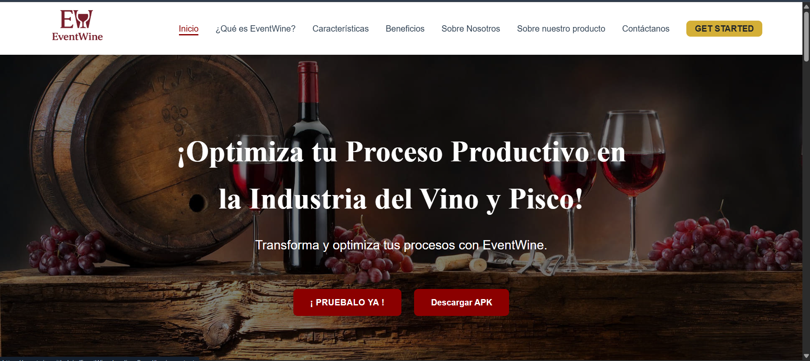
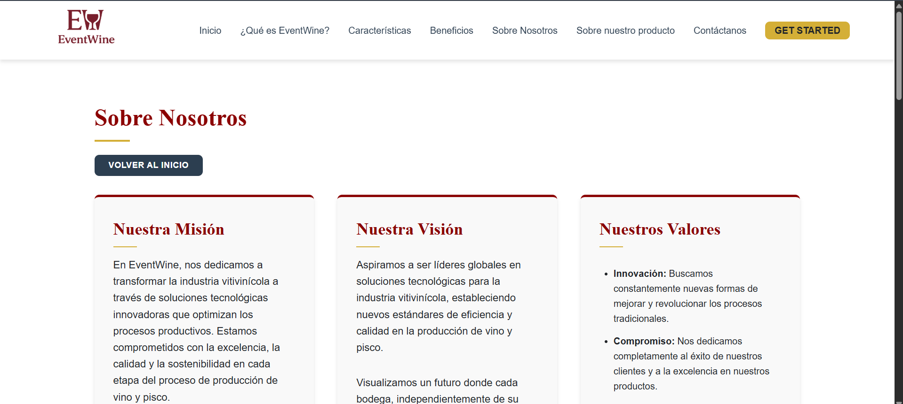

US-02	Información sobre beneficios de la app	
Introducción clara que comunique el propósito y beneficios de la aplicación.
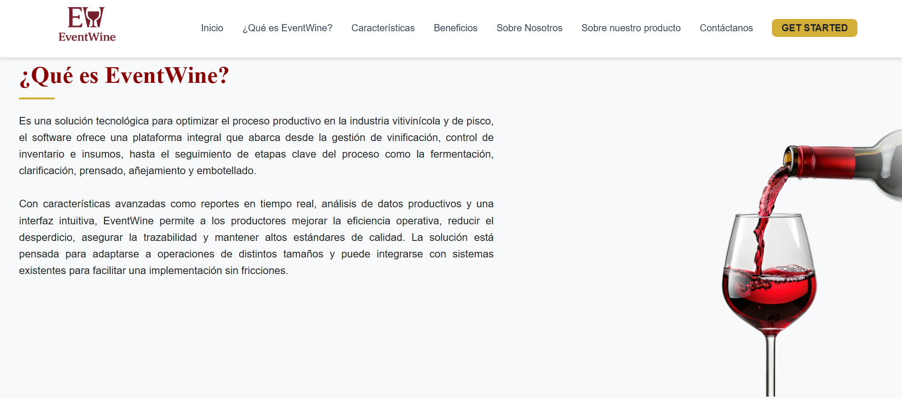

US-03	Información útil en el footer	
Footer con datos de contacto y enlaces a políticas (privacidad, cookies, etc.).

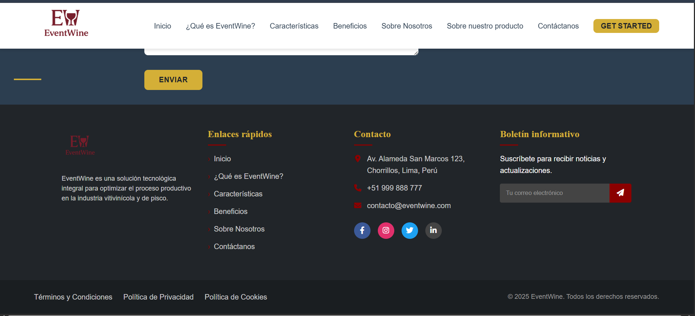

#### 8.3.3.3. Implemented To-Be Frontend-Web Application Evidence

- **US-14** - Registro de múltiples fermentaciones por lote

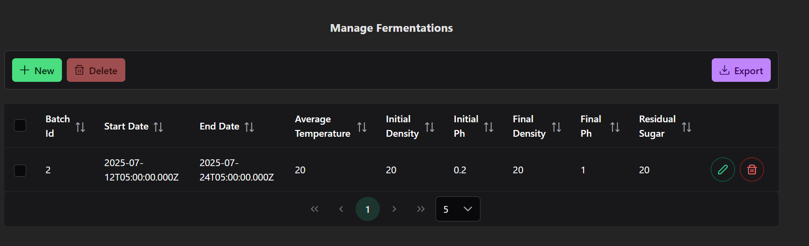

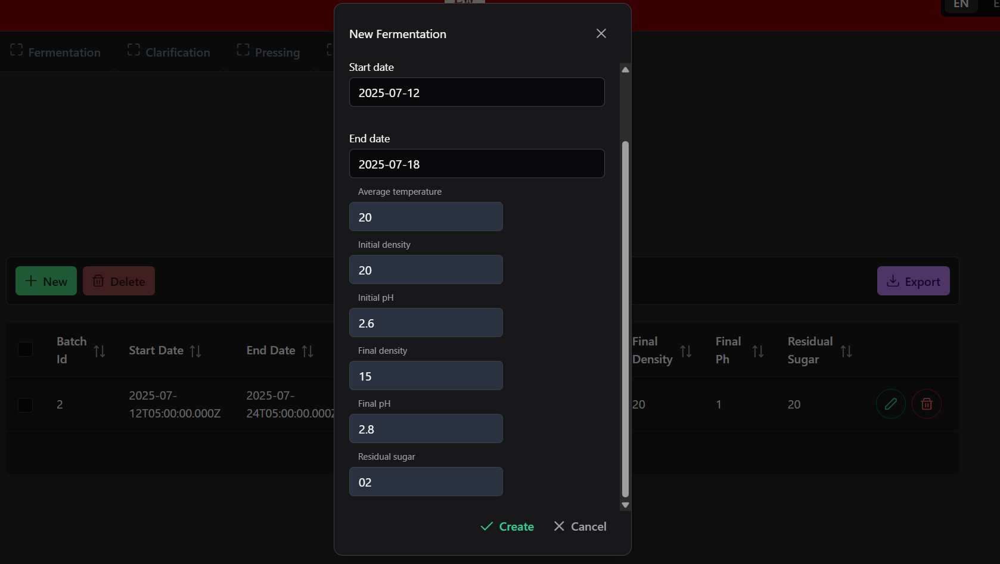

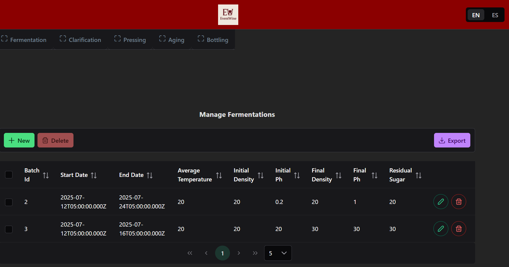

- **US-15** - Editar clarificaciones registradas

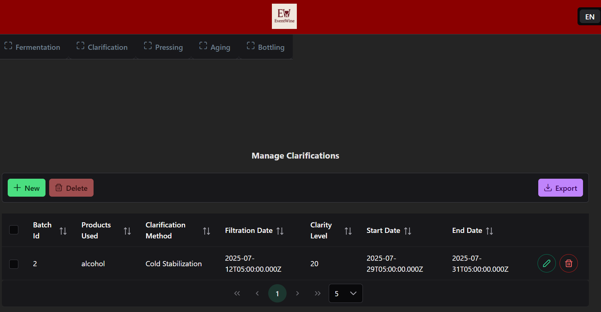

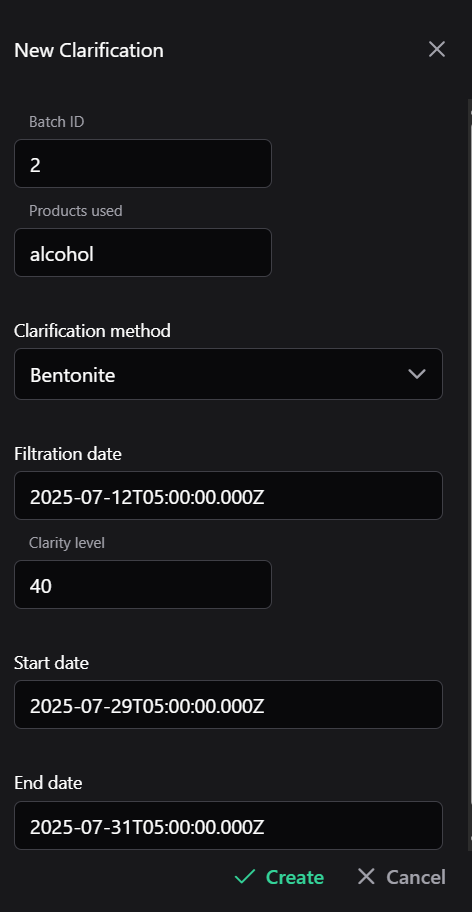

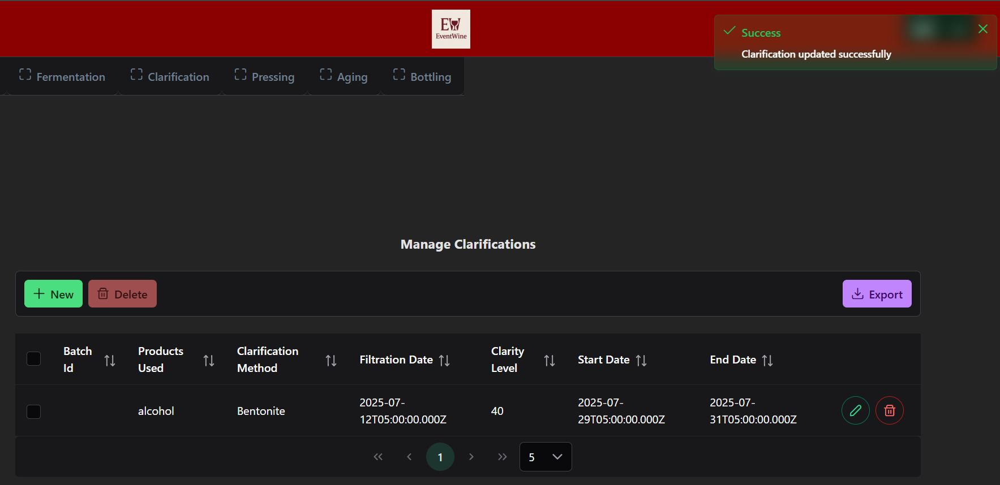

- **US-17** - Exportar datos a Excel

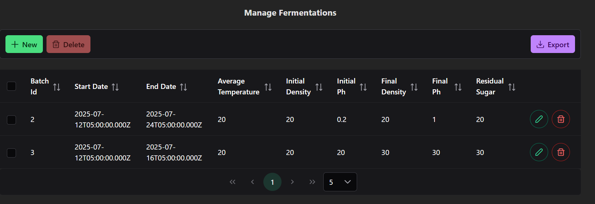

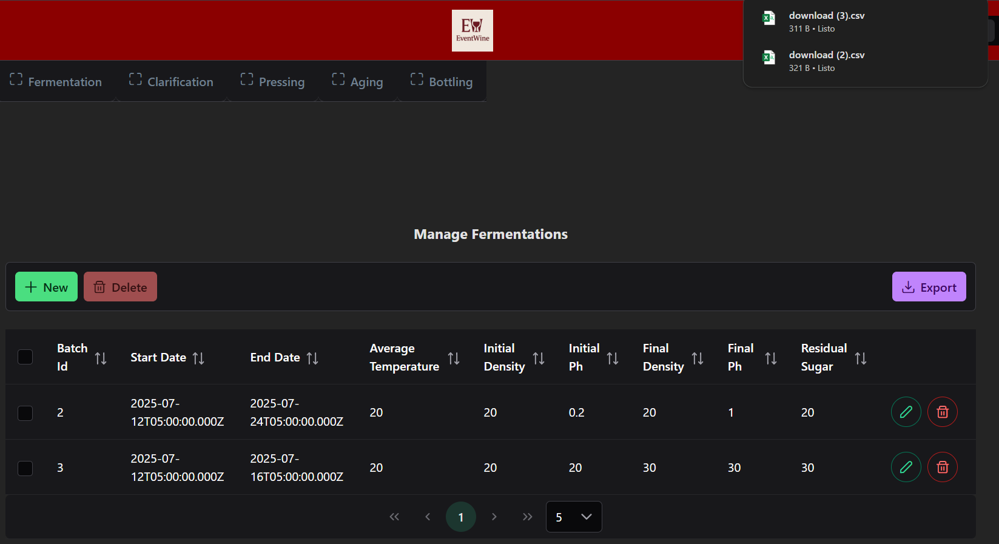

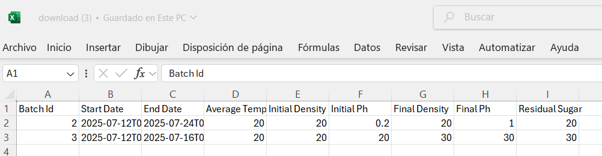

- **US-18** - Buscar lotes por tipo de uva

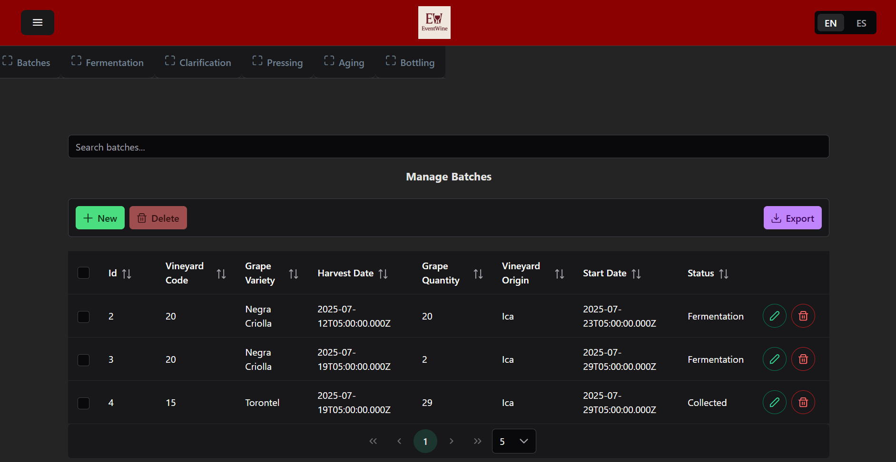

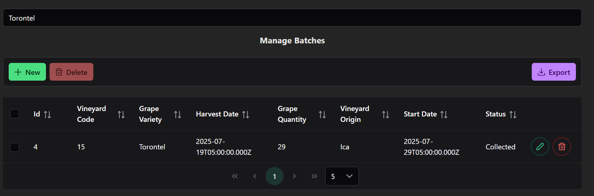

- **US-25** - Integración de video about the product

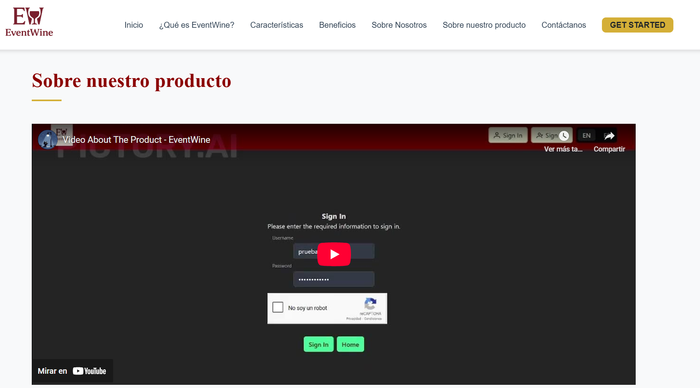

- **US-26** - Implementar menús desplegables preestablecidos

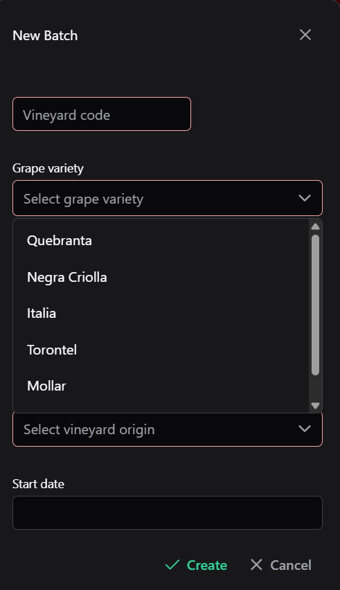

#### 8.3.3.4. Implemented To-Be Native-Mobile Application Evidence
#### 8.3.3.5. Implemented To-Be RESTful API and/or Serverless Backend Evidence
#### 8.3.3.6. Team Collaboration Insights 

**Report:**

 

**Team Members:**

**Deybbi Crisanto**

**Moisés Donayre**

**Gustavo Huanca**

**July Paico**

### 8.3.4. To-Be Validation Interviews 
#### 8.3.4.1. Diseño de Entrevistas.

#### Preguntas de Validación para Entrevistas

**1.** ¿Cuáles son los principales problemas que enfrenta actualmente en la gestión y registro de sus procesos de vinificación?

**2.** ¿Cómo registra actualmente la información de sus lotes (fermentación, clarificación, prensado)? ¿Qué herramientas utiliza?

**3.** ¿Cuánto tiempo dedica semanalmente a tareas administrativas relacionadas con el control de sus procesos de vinificación?

**4.** ¿Ha considerado alguna vez migrar a una solución digital para gestionar sus procesos? ¿Qué lo ha detenido o motivado?

**5.** Si tuviera una plataforma que automatice el registro de sus procesos, ¿cuáles serían las 3 funcionalidades más importantes que debería tener?

**6.** ¿Qué tan cómodo se siente utilizando tecnología (aplicaciones, computadoras, tablets) en su trabajo diario?

**7.** ¿Con qué frecuencia necesita revisar el historial completo de un lote específico? ¿Para qué propósitos?

**8.** ¿Exporta o comparte datos de sus procesos con otras personas (asesores, clientes, socios)? ¿En qué formato?

**9.** ¿Cuánto estaría dispuesto a invertir mensualmente en una herramienta que reduzca significativamente el tiempo de gestión administrativa?

**10.** ¿Prefiere aprender nuevas herramientas a través de videos explicativos, capacitación presencial o documentación escrita?

**11.** ¿Confía más en recomendaciones de otros productores o en información proporcionada directamente por proveedores de tecnología?

**12.** Si existiera una plataforma como EventWine que simplifique sus procesos, ¿qué necesitaría ver o experimentar para decidir adoptarla en su bodega?

#### 8.3.4.2. Registro de Entrevistas.
Entrevista N.º 1: Productor Artesanal de Vino

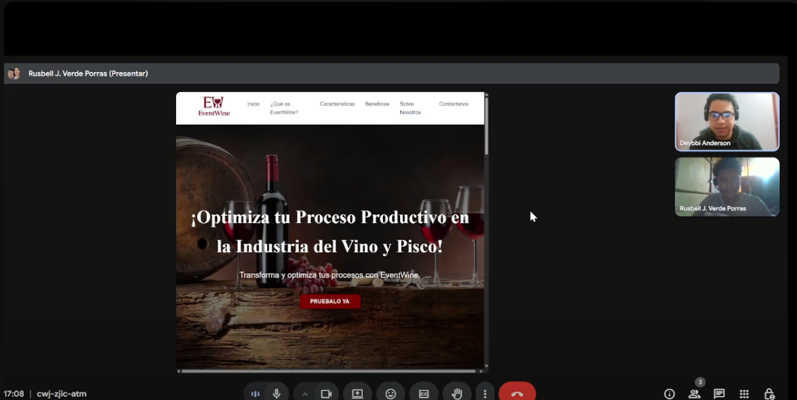

**Resumen de la entrevista:**

Según la experiencia del entrevistado Rusbel. Su diseño intuitivo con menús jerárquicos y acceso rápido a funciones clave permite a los productores registrar cosechas (variedades, cantidades, fechas) con eficiencia operativa, mientras que el sistema de auditoría automatizado garantiza trazabilidad y control de calidad desde la uva hasta el embotellado, un aspecto que Ruzbel calificó como "fundamental para reducir errores y cumplir normativas". La capacidad de exportar datos a Excel emerge como un valor agregado para análisis externos, aunque el entrevistado subrayó que la interfaz, aunque clara, podría modernizarse con elementos visuales dinámicos (gráficos interactivos, paletas de colores actualizadas) para mejorar la experiencia en jornadas prolongadas. Finalmente, la propuesta de personalizar dashboards según roles como priorizar parámetros técnicos para enólogos versus métricas logísticas para administradores refleja una oportunidad para elevar la adaptabilidad de la herramienta, consolidándola no solo como un sistema de gestión, sino como un aliado estratégico en la transformación digital del sector.

## 8.4. Experiment Aftermath & Analysis
### 8.4.1. Analysis and Interpretation of Results
### 8.4.2. Re-scored and Re-prioritized Question Backlog

| **Prioridad (1,2,3,5,8)** | **Pregunta** |
|---------------------------|--------------|
| **1** | ¿Adoptarán los productores artesanales EventWine reemplazando sus métodos manuales actuales (Excel, cuadernos) por una plataforma digital integral? |
| **1** | ¿Podrán productores con experiencia tecnológica limitada usar EventWine efectivamente con mínima capacitación? |
| **2** | ¿Mejorará EventWine la eficiencia operativa y calidad del producto en cada etapa de vinificación vs métodos manuales? |
| **3** | ¿Qué modelo de pricing (básico $25, intermedio $50, premium $100) optimiza adopción y revenue para EventWine? |
| **3** | ¿Cuáles canales de adquisición (referidos, asociaciones, eventos) son más efectivos para reach productores artesanales? |

**Cambios realizados:** 
- **Capaciad de uso con poca capacitación -> Subido a prioridad 1**  
Porque aunque quieran adoptarlo, si no lo entienden o no lo usan bien, lo abandonarán. Es un riesgo crítico en este público con baja alfabetización digital.

- **Eficiencia operativa y calidad del producto -> Bajado a prioridad 2**  
Porque aunque EventWine no sea mucho más eficiente al inicio, si reemplaza algo manual y engorroso, la adopción puede igual darse. Se puede mejorar la eficiencia con el tiempo.

## 8.5. Continuous Learning

### 8.5.1. Shareback Session Artifacts: Learning Workflow

Encuesta de Google Forms: Se utilizó una encuesta creada en Google Forms para recopilar el feedback
de los usuarios y validar las hipótesis planteadas durante el diseño. Esta encuesta permitió evaluar la
experiencia del usuario y recopilar datos que respaldan las decisiones tomadas en la mejora de la
aplicación.

Enlace encuesta:https://forms.gle/ayk9Q1Ax2ZB6GUjv9

## 8.6. To-Be Software Platform Pre-launch
### 8.6.1. About-the-Product Intro Video
En esta sección, se presenta el video introductorio sobre EventWine, diseñado para captar la atención de los productores artesanales y explicar de manera clara y concisa las funcionalidades clave de la plataforma. El video destaca cómo EventWine simplifica la gestión de procesos vinícolas, mejora la trazabilidad y reduce el tiempo dedicado a tareas administrativas.

[Video about the Product](https://youtu.be/NHieAQr42cE)
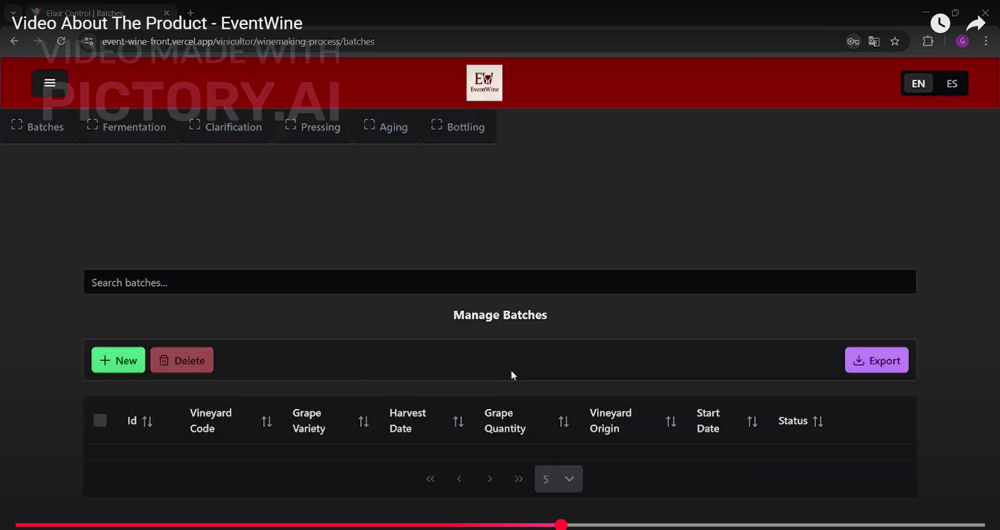